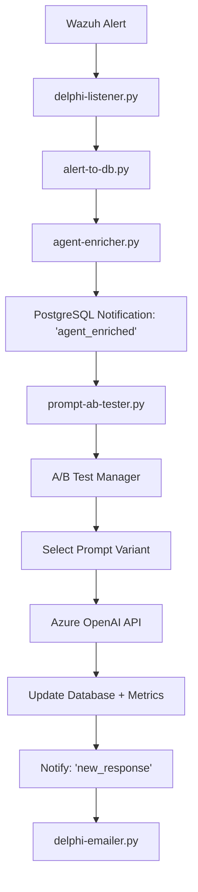

# Delphi Prompt A/B Testing System

## Overview

The Delphi A/B Testing System enables sophisticated testing of different system prompts to optimize AI response quality, efficiency, and cost-effectiveness. Instead of using the same prompt for every alert, this system randomly selects from configured prompt variants and tracks their performance.

## Architecture

### Components

1. **`prompt-ab-tester.py`** - Main A/B testing worker that replaces `llm-worker.py`
2. **`ab-test-config.json`** - Configuration file defining test parameters and variants
3. **`ab-test-analyzer.py`** - Analysis tool for evaluating test results
4. **`prompt-ab-tester.service`** - systemd service configuration

### How It Works



## Configuration

### Experiment Configuration (`ab-test-config.json`)

```json
{
  "name": "delphi_prompt_effectiveness_test",
  "description": "A/B/C testing of different system prompts",
  "enabled": true,
  "start_date": "2025-01-01T00:00:00Z", 
  "end_date": "2025-12-31T23:59:59Z",
  "sticky_sessions": true,
  "variants": [
    {
      "name": "cybersobar",
      "prompt_file": "cybersobar.txt",
      "weight": 0.4,
      "description": "ISOBAR framework for structured security communications"
    },
    {
      "name": "delphi_notify_long", 
      "prompt_file": "delphi-notify-long.txt",
      "weight": 0.3,
      "description": "Detailed user-friendly explanations"
    }
  ]
}
```

### Key Configuration Options

- **`enabled`**: Whether the experiment is active
- **`sticky_sessions`**: Users get consistent prompt variants based on agent/rule hash
- **`weights`**: Probability distribution for variant selection (must sum to 1.0)
- **`start_date/end_date`**: Experiment time boundaries

## Installation and Setup

### 1. Deploy Files

```bash
# Copy A/B testing worker
sudo cp prompt-ab-tester.py /usr/local/bin/
sudo chmod 750 /usr/local/bin/prompt-ab-tester.py
sudo chown stanley:stanley /usr/local/bin/prompt-ab-tester.py

# Copy analyzer
sudo cp ab-test-analyzer.py /usr/local/bin/
sudo chmod 750 /usr/local/bin/ab-test-analyzer.py
sudo chown stanley:stanley /usr/local/bin/ab-test-analyzer.py

# Copy systemd service
sudo cp prompt-ab-tester.service /etc/systemd/system/
sudo systemctl daemon-reload

# Copy configuration
sudo mkdir -p /opt/delphi
sudo cp ab-test-config.json /opt/delphi/
sudo chown stanley:stanley /opt/delphi/ab-test-config.json
```

### 2. Create Required Directories

```bash
sudo mkdir -p /var/log/stackstorm/ab-test-reports
sudo chown stanley:stanley /var/log/stackstorm/ab-test-reports
sudo mkdir -p /opt/eos/assets/system-prompts
```

### 3. Environment Variables

Add to `/opt/stackstorm/packs/delphi/.env`:

```bash
# A/B Testing Configuration
EXPERIMENT_CONFIG_FILE=/opt/delphi/ab-test-config.json
SYSTEM_PROMPTS_DIR=/opt/eos/assets/system-prompts
DEFAULT_PROMPT_FILE=/opt/system-prompt.txt

# Logging
AB_TEST_METRICS_FILE=/var/log/stackstorm/ab-test-metrics.log
AB_TEST_REPORTS_DIR=/var/log/stackstorm/ab-test-reports
```

### 4. Start Services

```bash
# Stop existing LLM worker (if running)
sudo systemctl stop llm-worker.service
sudo systemctl disable llm-worker.service

# Start A/B testing worker
sudo systemctl enable prompt-ab-tester.service
sudo systemctl start prompt-ab-tester.service

# Check status
sudo systemctl status prompt-ab-tester.service
```

## Monitoring and Analysis

### Real-time Monitoring

```bash
# Watch service logs
sudo journalctl -f -u prompt-ab-tester.service

# Monitor metrics file
tail -f /var/log/stackstorm/ab-test-metrics.log

# Check heartbeat
cat /var/log/stackstorm/prompt-ab-tester.heartbeat
```

### Performance Analysis

```bash
# Generate daily report
python3 /usr/local/bin/ab-test-analyzer.py --hours 24

# Compare two variants statistically
python3 /usr/local/bin/ab-test-analyzer.py --compare cybersobar delphi_notify_long

# Export results to CSV
python3 /usr/local/bin/ab-test-analyzer.py --export csv --hours 168

# Cost analysis
python3 /usr/local/bin/ab-test-analyzer.py --cost-per-1k-tokens 0.002
```

### Sample Analysis Output

```
DELPHI A/B TESTING SUMMARY REPORT
============================================================
Generated: 2025-06-24 20:30:00
Data Points Analyzed: 1,247

VARIANT PERFORMANCE:
------------------------------

 CYBERSOBAR:
   Requests: 498
   Success Rate: 97.8%
   Avg Response Time: 2.34s
   Avg Tokens/Request: 892.1

 DELPHI_NOTIFY_LONG:
   Requests: 374
   Success Rate: 96.5%
   Avg Response Time: 1.87s
   Avg Tokens/Request: 654.2

 COST ANALYSIS:
---------------
Total Cost: $1.2847
Avg Cost per Request: $0.0015

 RECOMMENDATIONS:
------------------
1. Best performing variant: 'cybersobar' (success rate: 97.8%)
2. Fastest variant: 'delphi_notify_long' (avg response time: 1.87s)
```

## Prompt Management Integration

The A/B testing system integrates with the Eos CLI prompt management:

```bash
# List available prompts for testing
eos delphi prompts list

# Create new test variant
eos delphi prompts create security-focused --description "Security-focused prompt variant"

# Validate prompt quality
eos delphi prompts validate security-focused

# Update experiment configuration to include new variant
# Edit /opt/delphi/ab-test-config.json
```

## Advanced Features

### Cohort Assignment

The system supports sticky sessions where users (identified by agent_id + rule_id hash) consistently receive the same prompt variant. This enables:

- Consistent user experience
- Accurate performance measurement
- Reduced confounding variables

### Statistical Analysis

When scipy/numpy are available, the analyzer provides:

- **T-tests** for statistical significance
- **P-values** for confidence assessment  
- **Effect size** calculations
- **Confidence intervals**

### Cost Optimization

Track and optimize costs across variants:

- Token usage per variant
- Cost per successful response
- ROI analysis
- Efficiency ratios

### Metrics Collection

Comprehensive metrics are logged including:

```json
{
  "timestamp": "2025-06-24T20:30:15Z",
  "alert_id": 12345,
  "variant_name": "cybersobar", 
  "success": true,
  "response_time": 2.34,
  "prompt_tokens": 456,
  "completion_tokens": 289,
  "total_tokens": 745,
  "agent_id": "agent_001",
  "rule_level": 8
}
```

## Troubleshooting

### Common Issues

1. **No variants being selected**
   - Check experiment configuration is valid JSON
   - Verify `enabled: true` in config
   - Ensure date ranges are current

2. **High error rates**
   - Check prompt file paths exist
   - Verify Azure OpenAI API credentials
   - Review prompt content for validity

3. **Inconsistent results**
   - Ensure sticky sessions are enabled
   - Check for configuration changes during test
   - Verify sufficient sample sizes

### Debugging Commands

```bash
# Test configuration loading
python3 -c "
import json
with open('/opt/delphi/ab-test-config.json') as f:
    config = json.load(f)
print('Config loaded successfully:', config['name'])
"

# Verify prompt files
ls -la /opt/eos/assets/system-prompts/

# Check database connectivity
python3 -c "
import psycopg2
from dotenv import load_dotenv
load_dotenv('/opt/stackstorm/packs/delphi/.env')
import os
conn = psycopg2.connect(os.getenv('PG_DSN'))
print('Database connection: SUCCESS')
"
```

## Migration from Standard LLM Worker

To migrate from the standard `llm-worker.py`:

1. **Backup current configuration**:
   ```bash
   sudo cp /opt/system-prompt.txt /opt/system-prompt.txt.backup
   ```

2. **Stop existing service**:
   ```bash
   sudo systemctl stop llm-worker.service
   sudo systemctl disable llm-worker.service
   ```

3. **Deploy A/B testing system** (follow installation steps above)

4. **Configure experiment** with current prompt as control variant

5. **Start new service**:
   ```bash
   sudo systemctl start prompt-ab-tester.service
   ```

6. **Monitor for 24-48 hours** to ensure stable operation

## Best Practices

### Experiment Design

- **Start with 2-3 variants** to establish baseline
- **Run for minimum 1 week** to account for daily variations  
- **Collect at least 100 samples per variant** for statistical validity
- **Change one variable at a time** for clear attribution

### Prompt Variants

- **Maintain consistent core functionality** across variants
- **Test specific aspects**: tone, length, structure, format
- **Document hypotheses** for each variant
- **Version control prompt changes**

### Monitoring

- **Set up alerts** for high error rates or performance degradation
- **Review results weekly** for trends and insights
- **Archive old experiments** before starting new ones
- **Document learnings** for future reference

## Security Considerations

- **Audit prompt content** for sensitive information disclosure
- **Monitor for adversarial inputs** that might game the system
- **Encrypt configuration files** if they contain sensitive data
- **Restrict file permissions** on prompt directories
- **Log all variant selections** for audit trails

## Performance Impact

The A/B testing system adds minimal overhead:

- **~50ms** additional latency for variant selection
- **~5% increase** in database operations for metrics logging
- **Same Azure OpenAI** API usage as standard worker
- **Configurable** metrics collection granularity

## Support and Maintenance

For issues or questions:

- **Logs**: `/var/log/stackstorm/prompt-ab-tester.log`
- **Metrics**: `/var/log/stackstorm/ab-test-metrics.log` 
- **Service status**: `systemctl status prompt-ab-tester.service`
- **Documentation**: https://wiki.cybermonkey.net.au/delphi/ab-testing