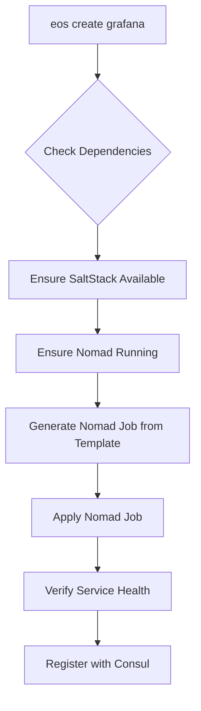
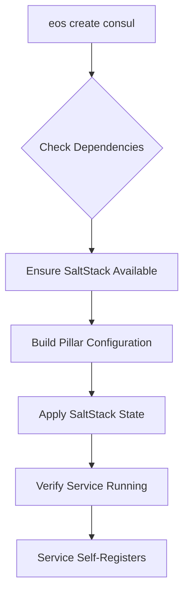

# SaltStack + Nomad Architecture Strategy

*Last Updated: 2025-01-20*

## Overview

Eos has adopted a dual-layer architecture that separates infrastructure management from application orchestration, providing users with a seamless experience while maintaining operational excellence under the hood.

## Architecture Layers

### Layer 1: Infrastructure Foundation (SaltStack)

**Responsibility**: System-level configuration, base packages, and infrastructure services

**Managed by SaltStack:**
- System packages (fail2ban, trivy, osquery, essential tools)
- Infrastructure services (Consul, Nomad, Vault, SaltStack itself)
- Host security configuration
- Network and system configuration
- Docker runtime installation (for Nomad)

**User Commands:**
```bash
eos create saltstack     # Base orchestration platform
eos create consul        # Service discovery
eos create nomad         # Container orchestrator  
eos create vault         # Secrets management
eos create fail2ban      # Host-level security
eos create trivy         # Security scanning
```

### Layer 2: Application Orchestration (Terraform → Nomad)

**Responsibility**: Container-based application lifecycle, scheduling, and service mesh

**Managed by Terraform → Nomad:**
- Infrastructure provisioning AND application deployment (unified state)
- Nomad job specifications managed as Terraform resources
- Cross-component dependency tracking (infrastructure → applications)
- Service discovery via Consul integration
- Load balancing and service mesh (Consul Connect)
- Container lifecycle, health checks, and recovery
- Resource allocation and scheduling with state management

**User Commands (Abstracted):**
```bash
eos create jenkins       # Deploys Jenkins via Nomad job
eos create grafana       # Deploys Grafana via Nomad job
eos create nextcloud     # Deploys Nextcloud via Nomad job
eos create mattermost    # Deploys Mattermost via Nomad job
```

## Key Architectural Decisions

### 1. Single Container Orchestrator Principle

**Decision**: Nomad is the sole container orchestrator. Docker Compose is phased out for application services.

**Rationale**: 
- Eliminates dual orchestration conflicts
- Provides unified service discovery via Consul
- Enables consistent networking with service mesh
- Supports future multi-node scaling

### 2. User Experience Abstraction

**Decision**: Users don't need to know about Nomad jobs, SaltStack states, or architectural layers.

**Implementation**:
- `eos create grafana` automatically determines if it's a system package (SaltStack) or application (Nomad)
- Behind the scenes, application services deploy Nomad jobs with proper configuration
- Infrastructure services use SaltStack states
- Users see consistent experience regardless of underlying implementation

### 3. Configuration Management Strategy

**SaltStack Pillar Data**: Infrastructure and system-level configuration
```yaml
# Example: /srv/pillar/consul.sls
consul:
  datacenter: production
  ui_enabled: true
  tls_enabled: true
```

**Nomad Job Templates**: Application-specific configuration
```hcl
# Example: /opt/eos/nomad/jobs/grafana.nomad
variable "admin_password" {
  type = string
  default = "{{ .AdminPassword }}"
}
```

### 4. Service Discovery Integration

**All services register with Consul**:
- Infrastructure services (Nomad, Vault) register directly
- Application services register via Nomad service blocks
- Unified service catalog accessible via Consul UI and API

## Migration Strategy

### Phase 1: Infrastructure Layer (SaltStack)
✅ **Complete**: HashiCorp stack (Consul, Nomad, Vault)
🔄 **In Progress**: Security tools (fail2ban, trivy, osquery)  
📋 **Planned**: System tools migration

### Phase 2: Application Layer (Nomad)
📋 **Planned**: Convert Docker Compose services to Nomad jobs
📋 **Planned**: Create abstracted user commands
📋 **Planned**: Implement automatic job deployment

### Phase 3: Enhanced Features
📋 **Future**: Multi-node cluster support
📋 **Future**: Advanced service mesh features  
📋 **Future**: Automated scaling policies

## Implementation Details

### Command Flow for Application Services



### Command Flow for Infrastructure Services



## Benefits

### For Users
- **Simplified Commands**: Single command deploys everything needed
- **Consistent Experience**: Same `eos create X` pattern for all services
- **Automatic Dependencies**: Infrastructure automatically provisioned
- **No Orchestration Knowledge Required**: Complexity hidden from users

### For Operations
- **Single Container Orchestrator**: No conflicts between systems
- **Unified Service Discovery**: All services in Consul registry
- **Consistent Networking**: CNI + Consul Connect service mesh
- **Resource Management**: Nomad-aware scheduling and allocation
- **Operational Simplicity**: Clear separation of concerns

### For Scaling
- **Multi-node Ready**: Nomad cluster can span multiple hosts
- **Service Mesh**: Built-in secure service communication
- **Load Balancing**: Native Nomad + Consul integration
- **Health Management**: Automatic failover and recovery

## Anti-Patterns to Avoid

### ❌ Don't Do This
- Running Docker Compose alongside Nomad on same host
- Manual container management outside of Nomad
- Direct systemd service management for applications
- Bypassing Consul for service discovery

### ✅ Do This Instead  
- Use Nomad for all container workloads
- Use SaltStack for infrastructure and system packages
- Register all services with Consul
- Use Nomad service mesh for inter-service communication

## Configuration Examples

### SaltStack State (Infrastructure)
```yaml
# /srv/salt/security/fail2ban.sls
fail2ban_package:
  pkg.installed:
    - name: fail2ban

fail2ban_config:
  file.managed:
    - name: /etc/fail2ban/jail.local
    - contents: |
        [sshd]
        enabled = true
        port = {{ pillar.get('ssh_port', '22') }}
```

### Nomad Job (Application)
```hcl
# /opt/eos/nomad/jobs/grafana.nomad
job "grafana" {
  datacenters = ["dc1"]
  type = "service"
  
  group "grafana" {
    network {
      port "http" { to = 3000 }
    }
    
    task "grafana" {
      driver = "docker"
      config {
        image = "grafana/grafana:latest"
        ports = ["http"]
      }
      
      service {
        name = "grafana"
        port = "http"
        check {
          type = "http"
          path = "/api/health"
          interval = "10s"
        }
      }
    }
  }
}
```

This architecture provides a solid foundation for scaling from single-node deployments to enterprise-grade multi-node clusters while maintaining simplicity for end users.