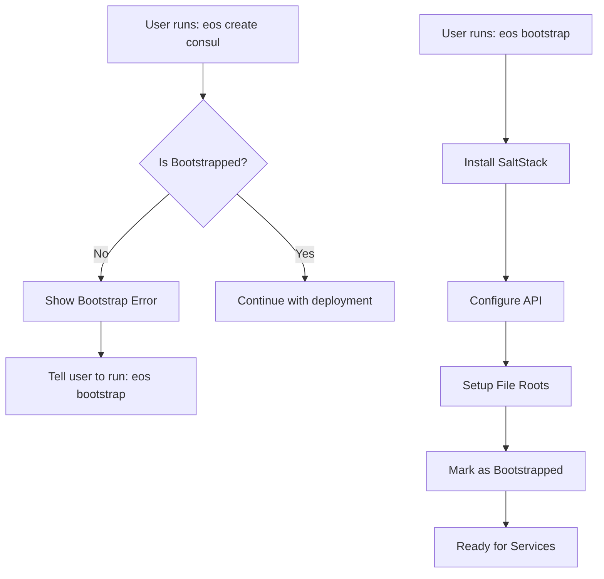

# Eos Bootstrap System Design

*Last Updated: 2025-01-25*

## Overview

The Eos bootstrap system ensures machines are properly prepared before deploying services. This prevents common errors like "Salt state files not found" and ensures a consistent, secure foundation for all deployments.

## Why Bootstrap is Required

Without proper bootstrapping, users encounter:
- Salt can't find state files
- API credentials aren't configured
- Services fail to deploy
- Inconsistent system states
- Security vulnerabilities

Bootstrap provides:
- Configuration management (SaltStack)
- Secure API communication
- Proper file system structure
- Network verification
- Security baseline

## Bootstrap Architecture

### 1. Bootstrap Check System

Every service deployment command checks bootstrap status:

```go
// In every create command
if err := bootstrap.RequireBootstrap(rc); err != nil {
    return err
}
```

### 2. Bootstrap Status Components

The system checks:
- **SaltStack Installation**: Configuration management system
- **Salt API Configuration**: REST API for remote management
- **File Roots Setup**: Paths to Eos state files
- **Network Configuration**: Basic connectivity
- **Security Configuration**: Firewall and basics

### 3. User Experience

When bootstrap is missing:
```
❌ ERROR: This system has not been bootstrapped!

The Eos bootstrap process prepares your system for:
  • Configuration management with SaltStack
  • Secure API communication
  • Service orchestration and deployment
  • Automated system management

Issues detected:
  ✗ SaltStack is not installed
  ✗ Salt API is not configured
  ✗ Salt file_roots are not properly configured

To bootstrap this system, run:
  sudo eos bootstrap

Or for a complete setup with all components:
  sudo eos bootstrap all
```

## Bootstrap Commands

### Core Bootstrap
```bash
sudo eos bootstrap core
```
- Installs SaltStack
- Configures Salt API
- Sets up file roots
- Minimal setup for Eos to function

### Complete Bootstrap
```bash
sudo eos bootstrap all
```
Includes everything in core plus:
- Storage operations monitoring
- Tailscale secure networking
- OSQuery system monitoring
- Ubuntu security hardening
- FIDO2 SSH authentication (optional)

### Component Bootstrap
```bash
sudo eos bootstrap salt      # Just SaltStack
sudo eos bootstrap vault     # Vault secrets management
sudo eos bootstrap nomad     # Container orchestration
sudo eos bootstrap osquery   # System monitoring
```

## What Bootstrap Does

### 1. SaltStack Installation
- Downloads and installs Salt
- Configures for masterless or master mode
- Sets up systemd services

### 2. API Configuration
- Generates SSL certificates
- Creates API user with secure password
- Configures REST endpoint
- Saves credentials to `/etc/eos/salt/api.env`

### 3. File Roots Setup
```yaml
file_roots:
  base:
    - /srv/salt
    - /srv/salt/eos
    - /opt/eos/salt/states
```
Creates symlinks:
- `/srv/salt/hashicorp` → `/opt/eos/salt/states/hashicorp`
- `/srv/salt/states` → `/opt/eos/salt/states`

### 4. System Preparation
- Creates necessary directories
- Sets proper permissions
- Verifies network connectivity
- Creates bootstrap marker

## Bootstrap Flow



## Security Considerations

### API Credentials
- Generated cryptographically secure password
- Stored with 0600 permissions
- Only root can read
- PAM authentication

### SSL/TLS
- Self-signed certificates by default
- Can be replaced with proper certs
- Protects API communication

### Network Security
- API binds to all interfaces
- Consider firewall rules
- Use Tailscale for secure remote access

## Idempotency

Bootstrap is safe to run multiple times:
- Checks existing installations
- Preserves configurations
- Updates only what's needed
- Use `--force` to override

## Integration with Services

All service deployments require bootstrap:
- Consul (service discovery)
- Vault (secrets management)
- Nomad (container orchestration)
- MinIO (object storage)
- Grafana (monitoring)
- And all others...

## Troubleshooting

### Bootstrap Failed
```bash
# Check logs
sudo journalctl -u salt-minion
sudo journalctl -u salt-api

# Re-run with debug
sudo eos bootstrap --debug
```

### Service Can't Deploy After Bootstrap
```bash
# Verify bootstrap status
sudo eos bootstrap status  # (if implemented)

# Check Salt states are accessible
salt-call --local state.show_sls hashicorp.consul

# Verify API
curl -k https://localhost:8000
```

### Reset Bootstrap
```bash
# Complete reset (destructive!)
sudo systemctl stop salt-minion salt-api
sudo apt-get purge salt-minion salt-api
sudo rm -rf /etc/salt /srv/salt /etc/eos/salt
sudo eos bootstrap
```

## Future Enhancements

1. **Bootstrap Status Command**
   ```bash
   eos bootstrap status
   ```
   Shows detailed bootstrap state

2. **Bootstrap Repair**
   ```bash
   eos bootstrap repair
   ```
   Fixes common issues automatically

3. **Remote Bootstrap**
   ```bash
   eos bootstrap remote <host>
   ```
   Bootstrap remote machines

4. **Bootstrap Profiles**
   ```bash
   eos bootstrap --profile=kubernetes
   ```
   Different configurations for use cases