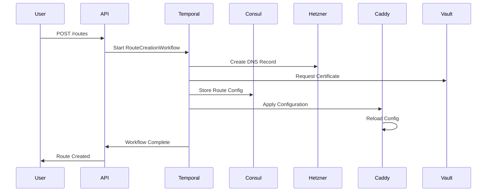
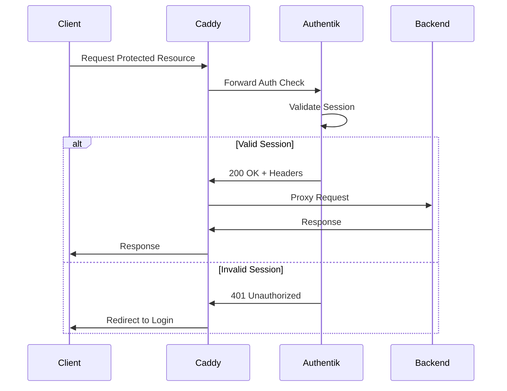

# Hecate Reverse Proxy Framework - Complete Implementation

*Last Updated: 2025-01-14*

This implementation provides all the files and configurations needed for the Hecate reverse proxy framework. Each file is ready to be placed in the eos repository under `modules/hecate/`.

## Directory Structure

```
modules/hecate/
├── README.md
├── terraform/
│   ├── main.tf
│   ├── variables.tf
│   ├── outputs.tf
│   ├── versions.tf
│   ├── modules/
│   │   ├── caddy-cluster/
│   │   ├── authentik-setup/
│   │   ├── hetzner-dns/
│   │   ├── network-isolation/
│   │   └── certificate-manager/
│   └── environments/
│       ├── dev/
│       ├── staging/
│       └── production/
├── nomad/
│   ├── jobs/
│   ├── packs/
│   └── policies/
├── salt/
│   ├── states/
│   ├── pillar/
│   └── orchestration/
├── temporal/
│   ├── workflows/
│   ├── activities/
│   ├── workers/
│   └── cmd/
├── benthos/
│   ├── configs/
│   └── templates/
├── api/
│   ├── handlers/
│   ├── models/
│   └── cmd/
├── scripts/
│   ├── eos-hecate.sh
│   └── utils/
├── configs/
│   └── examples/
└── docs/
    ├── architecture.md
    ├── deployment.md
    └── operations.md
```

## File Contents

### 1. README.md

```markdown
# Hecate Reverse Proxy Framework

A cloud-native, multi-tenant reverse proxy framework built on Caddy, Authentik, and Hetzner DNS, designed for secure, scalable, and automated proxy management.

## Features

- **Dynamic Route Management**: Create, update, and delete routes without downtime
- **Identity-Aware Proxy**: Deep integration with Authentik for SSO and authentication
- **Automated SSL**: Let's Encrypt integration with automatic certificate renewal
- **DNS Automation**: Hetzner DNS API integration for automatic record management
- **State Reconciliation**: GitOps workflow with automatic drift detection and correction
- **Multi-Tenant Isolation**: Complete namespace and network isolation between tenants
- **Zero-Downtime Operations**: Rolling updates and blue-green deployments
- **Secret Rotation**: Automated rotation of API keys and certificates
- **Compliance Automation**: Enforce security headers, TLS policies, and audit logging
- **Comprehensive Monitoring**: Built-in metrics, logging, and alerting

## Quick Start

```bash
# Initialize the Hecate framework
eos create hecate --init

# Create a new route
eos create hecate route --domain api.example.com --upstream backend:8080 --auth-policy employees

# Apply authentication policy
eos create hecate auth-policy --name employees --provider authentik --groups staff,admin

# Reconcile state from Git
eos update hecate reconcile --component routes --dry-run

# Rotate secrets
eos update hecate rotate-secrets --strategy dual-secret
```

## Architecture

Hecate implements a layered architecture:

1. **Ingress Layer**: Caddy handles HTTP/HTTPS traffic with dynamic configuration
2. **Authentication Layer**: Authentik provides SSO and policy enforcement
3. **Control Plane**: Temporal workflows orchestrate changes and ensure consistency
4. **Data Plane**: Consul stores configuration state, Vault manages secrets
5. **Infrastructure Layer**: Terraform provisions resources, Nomad schedules workloads

See [docs/architecture.md](docs/architecture.md) for detailed architecture documentation.

## Requirements

- Ubuntu 22.04/24.04 hosts
- Nomad 1.7+ cluster
- Consul 1.17+ for state management
- Vault 1.15+ for secrets
- Temporal 1.22+ for workflows
- NATS 2.10+ with JetStream
- Terraform 1.5+
- SaltStack 3006+
```

### 2. terraform/main.tf

```hcl
# modules/hecate/terraform/main.tf
# Main Terraform configuration for Hecate reverse proxy framework

terraform {
  required_version = ">= 1.5.0"
  
  backend "s3" {
    # Backend configuration provided during init
  }
}

locals {
  framework_name = var.framework_name
  environment    = var.environment
  
  common_tags = merge(var.tags, {
    Framework   = local.framework_name
    Environment = local.environment
    ManagedBy   = "terraform"
    Component   = "hecate"
  })
}

# Data sources for existing infrastructure
data "consul_nodes" "all" {}

data "nomad_namespace" "platform" {
  name = "platform"
}

# Network isolation module
module "network_isolation" {
  source = "./modules/network-isolation"
  
  framework_name = local.framework_name
  environment    = local.environment
  
  vpc_cidr           = var.vpc_cidr
  public_subnet_cidr = var.public_subnet_cidr
  private_subnet_cidr = var.private_subnet_cidr
  
  enable_ipv6 = var.enable_ipv6
  
  tags = local.common_tags
}

# Caddy cluster module
module "caddy_cluster" {
  source = "./modules/caddy-cluster"
  
  cluster_name = "${local.framework_name}-caddy"
  environment  = local.environment
  
  instance_count = var.caddy_instance_count
  instance_type  = var.caddy_instance_type
  
  # Network configuration
  network_id         = module.network_isolation.network_id
  subnet_ids         = module.network_isolation.public_subnet_ids
  security_group_ids = [module.network_isolation.caddy_security_group_id]
  
  # Caddy configuration
  caddy_version = var.caddy_version
  caddy_config  = var.caddy_config
  
  # Storage for certificates
  certificate_storage_backend = var.certificate_storage_backend
  certificate_storage_config  = var.certificate_storage_config
  
  # Monitoring
  enable_monitoring = var.enable_monitoring
  metrics_port      = var.caddy_metrics_port
  
  # Nomad integration
  nomad_datacenter = var.nomad_datacenter
  nomad_namespace  = "platform"
  
  # Consul integration for service discovery
  consul_service_name = "caddy"
  consul_service_tags = ["ingress", "reverse-proxy", local.environment]
  
  tags = merge(local.common_tags, {
    Service = "caddy"
  })
}

# Authentik setup module
module "authentik_setup" {
  source = "./modules/authentik-setup"
  
  deployment_name = "${local.framework_name}-authentik"
  environment     = local.environment
  
  # Database configuration
  database_host     = var.authentik_database_host
  database_name     = var.authentik_database_name
  database_user     = var.authentik_database_user
  database_password = var.authentik_database_password
  
  # Redis configuration
  redis_host     = var.authentik_redis_host
  redis_password = var.authentik_redis_password
  
  # Authentik configuration
  authentik_version    = var.authentik_version
  authentik_secret_key = var.authentik_secret_key
  authentik_error_reporting = var.authentik_error_reporting
  
  # Email configuration
  email_host     = var.authentik_email_host
  email_port     = var.authentik_email_port
  email_username = var.authentik_email_username
  email_password = var.authentik_email_password
  email_use_tls  = var.authentik_email_use_tls
  email_from     = var.authentik_email_from
  
  # Network configuration
  subnet_ids         = module.network_isolation.private_subnet_ids
  security_group_ids = [module.network_isolation.authentik_security_group_id]
  
  # Domain configuration
  authentik_domain = var.authentik_domain
  
  # Nomad job configuration
  nomad_job_count = var.authentik_instance_count
  nomad_resources = {
    cpu    = var.authentik_cpu
    memory = var.authentik_memory
  }
  
  tags = merge(local.common_tags, {
    Service = "authentik"
  })
}

# Hetzner DNS module
module "hetzner_dns" {
  source = "./modules/hetzner-dns"
  
  framework_name = local.framework_name
  environment    = local.environment
  
  # Hetzner API configuration
  hetzner_api_token = var.hetzner_api_token
  
  # DNS zones to manage
  dns_zones = var.dns_zones
  
  # Default TTL for records
  default_ttl = var.dns_default_ttl
  
  # Enable DNS monitoring
  enable_monitoring = var.enable_monitoring
  
  tags = local.common_tags
}

# Certificate manager module
module "certificate_manager" {
  source = "./modules/certificate-manager"
  
  framework_name = local.framework_name
  environment    = local.environment
  
  # ACME configuration
  acme_email      = var.acme_email
  acme_server     = var.acme_server
  acme_key_type   = var.acme_key_type
  
  # DNS challenge configuration
  dns_provider = "hetzner"
  dns_config = {
    api_token = var.hetzner_api_token
  }
  
  # Certificate storage
  storage_backend = "vault"
  storage_config = {
    vault_address = var.vault_address
    vault_path    = "secret/hecate/certificates"
  }
  
  # Renewal configuration
  renewal_window = var.certificate_renewal_window
  
  # Nomad job for cert-manager
  nomad_namespace = "platform"
  
  tags = local.common_tags
}

# API service deployment
resource "nomad_job" "hecate_api" {
  jobspec = templatefile("${path.module}/../nomad/jobs/api-service.nomad", {
    image_tag        = var.api_image_tag
    replicas         = var.api_replicas
    cpu              = var.api_cpu
    memory           = var.api_memory
    environment      = local.environment
    vault_policy     = vault_policy.hecate_api.name
    consul_service   = "hecate-api"
  })
  
  purge_on_destroy = true
}

# Temporal workers deployment
resource "nomad_job" "temporal_workers" {
  jobspec = templatefile("${path.module}/../nomad/jobs/temporal-workers.nomad", {
    image_tag    = var.temporal_worker_image_tag
    worker_count = var.temporal_worker_count
    cpu          = var.temporal_worker_cpu
    memory       = var.temporal_worker_memory
    environment  = local.environment
  })
  
  purge_on_destroy = true
}

# Benthos pipelines deployment
resource "nomad_job" "benthos_pipelines" {
  jobspec = templatefile("${path.module}/../nomad/jobs/benthos-pipelines.nomad", {
    image_tag   = var.benthos_image_tag
    environment = local.environment
  })
  
  purge_on_destroy = true
}

# Vault policies
resource "vault_policy" "hecate_api" {
  name = "hecate-api"
  
  policy = file("${path.module}/../vault/policies/hecate-api.hcl")
}

resource "vault_policy" "caddy" {
  name = "caddy"
  
  policy = file("${path.module}/../vault/policies/caddy.hcl")
}

resource "vault_policy" "authentik" {
  name = "authentik"
  
  policy = file("${path.module}/../vault/policies/authentik.hcl")
}

# Consul configuration entries
resource "consul_config_entry" "caddy_service_defaults" {
  kind = "service-defaults"
  name = "caddy"
  
  config_json = jsonencode({
    Protocol = "http"
    Expose = {
      Checks = true
    }
    UpstreamConfig = {
      Defaults = {
        ConnectTimeoutMs = 5000
      }
    }
  })
}

resource "consul_config_entry" "proxy_defaults" {
  kind = "proxy-defaults"
  name = "global"
  
  config_json = jsonencode({
    Config = {
      local_connect_timeout_ms = 5000
      handshake_timeout_ms     = 10000
    }
  })
}

# Output important values
output "caddy_load_balancer_dns" {
  value       = module.caddy_cluster.load_balancer_dns
  description = "DNS name of the Caddy load balancer"
}

output "authentik_url" {
  value       = "https://${var.authentik_domain}"
  description = "Authentik URL"
}

output "api_endpoint" {
  value       = "https://api.${var.base_domain}"
  description = "Hecate API endpoint"
}
```

### 3. terraform/variables.tf

```hcl
# modules/hecate/terraform/variables.tf
# Input variables for Hecate reverse proxy framework

variable "framework_name" {
  description = "Name of the Hecate framework deployment"
  type        = string
  default     = "hecate"
}

variable "environment" {
  description = "Environment name (dev, staging, production)"
  type        = string
  
  validation {
    condition     = contains(["dev", "staging", "production"], var.environment)
    error_message = "Environment must be dev, staging, or production."
  }
}

variable "base_domain" {
  description = "Base domain for all services"
  type        = string
}

# Network configuration
variable "vpc_cidr" {
  description = "CIDR block for the VPC"
  type        = string
  default     = "10.0.0.0/16"
}

variable "public_subnet_cidr" {
  description = "CIDR blocks for public subnets"
  type        = list(string)
  default     = ["10.0.1.0/24", "10.0.2.0/24"]
}

variable "private_subnet_cidr" {
  description = "CIDR blocks for private subnets"
  type        = list(string)
  default     = ["10.0.10.0/24", "10.0.11.0/24"]
}

variable "enable_ipv6" {
  description = "Enable IPv6 support"
  type        = bool
  default     = false
}

# Caddy configuration
variable "caddy_instance_count" {
  description = "Number of Caddy instances"
  type        = number
  default     = 3
}

variable "caddy_instance_type" {
  description = "Instance type for Caddy servers"
  type        = string
  default     = "t3.medium"
}

variable "caddy_version" {
  description = "Caddy version to deploy"
  type        = string
  default     = "2.7.6"
}

variable "caddy_config" {
  description = "Base Caddy configuration"
  type        = any
  default     = {}
}

variable "caddy_metrics_port" {
  description = "Port for Caddy metrics"
  type        = number
  default     = 9180
}

variable "certificate_storage_backend" {
  description = "Backend for certificate storage (vault, consul, s3)"
  type        = string
  default     = "vault"
}

variable "certificate_storage_config" {
  description = "Configuration for certificate storage backend"
  type        = map(string)
  default     = {}
}

# Authentik configuration
variable "authentik_instance_count" {
  description = "Number of Authentik instances"
  type        = number
  default     = 2
}

variable "authentik_version" {
  description = "Authentik version to deploy"
  type        = string
  default     = "2024.2.0"
}

variable "authentik_domain" {
  description = "Domain for Authentik"
  type        = string
}

variable "authentik_secret_key" {
  description = "Secret key for Authentik"
  type        = string
  sensitive   = true
}

variable "authentik_error_reporting" {
  description = "Enable error reporting in Authentik"
  type        = bool
  default     = false
}

variable "authentik_cpu" {
  description = "CPU allocation for Authentik"
  type        = number
  default     = 2000
}

variable "authentik_memory" {
  description = "Memory allocation for Authentik in MB"
  type        = number
  default     = 2048
}

# Database configuration for Authentik
variable "authentik_database_host" {
  description = "PostgreSQL host for Authentik"
  type        = string
}

variable "authentik_database_name" {
  description = "PostgreSQL database name for Authentik"
  type        = string
  default     = "authentik"
}

variable "authentik_database_user" {
  description = "PostgreSQL user for Authentik"
  type        = string
  default     = "authentik"
}

variable "authentik_database_password" {
  description = "PostgreSQL password for Authentik"
  type        = string
  sensitive   = true
}

# Redis configuration for Authentik
variable "authentik_redis_host" {
  description = "Redis host for Authentik"
  type        = string
}

variable "authentik_redis_password" {
  description = "Redis password for Authentik"
  type        = string
  sensitive   = true
  default     = ""
}

# Email configuration for Authentik
variable "authentik_email_host" {
  description = "SMTP host for Authentik"
  type        = string
}

variable "authentik_email_port" {
  description = "SMTP port for Authentik"
  type        = number
  default     = 587
}

variable "authentik_email_username" {
  description = "SMTP username for Authentik"
  type        = string
}

variable "authentik_email_password" {
  description = "SMTP password for Authentik"
  type        = string
  sensitive   = true
}

variable "authentik_email_use_tls" {
  description = "Use TLS for SMTP"
  type        = bool
  default     = true
}

variable "authentik_email_from" {
  description = "From address for Authentik emails"
  type        = string
}

# Hetzner DNS configuration
variable "hetzner_api_token" {
  description = "Hetzner API token"
  type        = string
  sensitive   = true
}

variable "dns_zones" {
  description = "DNS zones to manage"
  type        = list(string)
}

variable "dns_default_ttl" {
  description = "Default TTL for DNS records"
  type        = number
  default     = 300
}

# Certificate configuration
variable "acme_email" {
  description = "Email for ACME registration"
  type        = string
}

variable "acme_server" {
  description = "ACME server URL"
  type        = string
  default     = "https://acme-v02.api.letsencrypt.org/directory"
}

variable "acme_key_type" {
  description = "Key type for certificates (RSA or EC)"
  type        = string
  default     = "EC256"
}

variable "certificate_renewal_window" {
  description = "Days before expiry to renew certificates"
  type        = number
  default     = 30
}

# API service configuration
variable "api_image_tag" {
  description = "Docker image tag for Hecate API"
  type        = string
  default     = "latest"
}

variable "api_replicas" {
  description = "Number of API replicas"
  type        = number
  default     = 3
}

variable "api_cpu" {
  description = "CPU allocation for API service"
  type        = number
  default     = 1000
}

variable "api_memory" {
  description = "Memory allocation for API service in MB"
  type        = number
  default     = 1024
}

# Temporal worker configuration
variable "temporal_worker_image_tag" {
  description = "Docker image tag for Temporal workers"
  type        = string
  default     = "latest"
}

variable "temporal_worker_count" {
  description = "Number of Temporal workers"
  type        = number
  default     = 3
}

variable "temporal_worker_cpu" {
  description = "CPU allocation for Temporal workers"
  type        = number
  default     = 2000
}

variable "temporal_worker_memory" {
  description = "Memory allocation for Temporal workers in MB"
  type        = number
  default     = 2048
}

# Benthos configuration
variable "benthos_image_tag" {
  description = "Docker image tag for Benthos"
  type        = string
  default     = "4.25"
}

# Monitoring configuration
variable "enable_monitoring" {
  description = "Enable monitoring and metrics collection"
  type        = bool
  default     = true
}

# Infrastructure configuration
variable "nomad_datacenter" {
  description = "Nomad datacenter name"
  type        = string
  default     = "dc1"
}

variable "vault_address" {
  description = "Vault server address"
  type        = string
}

# Tagging
variable "tags" {
  description = "Additional tags to apply to all resources"
  type        = map(string)
  default     = {}
}
```

### 4. terraform/modules/caddy-cluster/main.tf

```hcl
# modules/hecate/terraform/modules/caddy-cluster/main.tf
# Caddy cluster deployment module

terraform {
  required_providers {
    nomad = {
      source  = "hashicorp/nomad"
      version = "~> 2.0"
    }
    consul = {
      source  = "hashicorp/consul"
      version = "~> 2.19"
    }
  }
}

# Generate Caddy configuration template
locals {
  caddy_config = {
    apps = {
      http = {
        servers = {
          main = {
            listen = [":443", ":80"]
            routes = []
            automatic_https = {
              disable_redirects = false
              disable_certs     = false
            }
            metrics = {}
          }
        }
      }
      tls = {
        automation = {
          policies = [{
            subjects = var.managed_domains
            issuers = [{
              module = "acme"
              email  = var.acme_email
              challenges = {
                dns = {
                  provider = "hetzner"
                  api_token = var.hetzner_api_token
                }
              }
            }]
          }]
          on_demand = var.enable_on_demand_tls
          storage = {
            module = var.certificate_storage_backend
            config = var.certificate_storage_config
          }
        }
      }
      admin = {
        disabled = false
        listen   = ":2019"
        origins  = ["localhost:2019", "127.0.0.1:2019"]
      }
    }
  }
}

# Nomad job for Caddy cluster
resource "nomad_job" "caddy_cluster" {
  jobspec = <<EOT
job "${var.cluster_name}" {
  datacenters = ["${var.nomad_datacenter}"]
  type        = "service"
  namespace   = "${var.nomad_namespace}"
  
  update {
    max_parallel      = 1
    health_check      = "checks"
    min_healthy_time  = "30s"
    healthy_deadline  = "5m"
    progress_deadline = "10m"
    auto_revert       = true
    auto_promote      = true
    canary            = 1
    stagger           = "30s"
  }
  
  migrate {
    max_parallel     = 1
    health_check     = "checks"
    min_healthy_time = "30s"
    healthy_deadline = "5m"
  }
  
  group "caddy" {
    count = ${var.instance_count}
    
    constraint {
      distinct_hosts = true
    }
    
    restart {
      attempts = 3
      interval = "5m"
      delay    = "15s"
      mode     = "delay"
    }
    
    network {
      port "http" {
        static = 80
      }
      
      port "https" {
        static = 443
      }
      
      port "admin" {
        static = 2019
      }
      
      port "metrics" {
        static = ${var.metrics_port}
      }
    }
    
    service {
      name = "${var.consul_service_name}"
      port = "https"
      tags = ${jsonencode(var.consul_service_tags)}
      
      check {
        name     = "caddy-health"
        type     = "http"
        protocol = "https"
        path     = "/health"
        interval = "10s"
        timeout  = "2s"
        tls_skip_verify = true
        
        check_restart {
          limit = 3
          grace = "30s"
        }
      }
      
      check {
        name     = "admin-api"
        type     = "http"
        port     = "admin"
        path     = "/config/"
        interval = "30s"
        timeout  = "5s"
      }
    }
    
    service {
      name = "${var.consul_service_name}-metrics"
      port = "metrics"
      tags = ["prometheus", "metrics"]
      
      meta {
        prometheus_path = "/metrics"
      }
    }
    
    task "caddy" {
      driver = "docker"
      
      config {
        image = "caddy:${var.caddy_version}"
        ports = ["http", "https", "admin", "metrics"]
        
        volumes = [
          "local/Caddyfile:/etc/caddy/Caddyfile",
          "local/config:/config",
          "data:/data",
        ]
        
        # Enable plugins
        command = "caddy"
        args = [
          "run",
          "--config", "/config/caddy.json",
          "--adapter", "json",
        ]
      }
      
      vault {
        policies = ["caddy"]
        
        change_mode   = "signal"
        change_signal = "SIGUSR1"
      }
      
      # Dynamic configuration from Consul
      template {
        data = <<EOF
${jsonencode(local.caddy_config)}
EOF
        destination = "local/config/caddy.json"
        change_mode = "signal"
        change_signal = "SIGUSR1"
      }
      
      # Route configuration from Consul KV
      template {
        data = <<EOF
{{- range ls "hecate/routes/" }}
{{- with $route := . | parseJSON }}
{
  "@id": "route-{{ $route.domain }}",
  "match": [{
    "host": ["{{ $route.domain }}"]
  }],
  "handle": [{
    "handler": "subroute",
    "routes": [
      {{- if $route.auth_policy }}
      {
        "handle": [{
          "handler": "forward_auth",
          "uri": "http://{{ range service "authentik" }}{{ .Address }}:{{ .Port }}{{ end }}/outpost.goauthentik.io/auth/caddy",
          "headers": {
            "X-Authentik-Meta-Outpost": ["authentik-embedded-outpost"],
            "X-Authentik-Meta-Provider": ["{{ $route.auth_policy }}"],
            "X-Authentik-Meta-App": ["{{ $route.domain }}"]
          }
        }]
      },
      {{- end }}
      {
        "handle": [{
          "handler": "reverse_proxy",
          "upstreams": {{ $route.upstreams | toJSON }},
          {{- if $route.health_check }}
          "health_checks": {
            "active": {
              "uri": "{{ $route.health_check.path }}",
              "interval": "{{ $route.health_check.interval }}",
              "timeout": "{{ $route.health_check.timeout }}",
              "unhealthy_status": {{ $route.health_check.unhealthy_status | toJSON }}
            }
          },
          {{- end }}
          "headers": {
            "request": {
              "set": {{ $route.headers | toJSON }}
            }
          }
        }]
      }
    ]
  }]
}
{{- end }}
{{- end }}
EOF
        
        destination = "local/routes.json"
        change_mode = "signal"
        change_signal = "SIGUSR1"
      }
      
      # TLS certificates from Vault
      template {
        data = <<EOF
{{- range secrets "pki/issue/caddy" "common_name=*.${var.base_domain}" }}
{{ .Data.certificate }}
{{ .Data.private_key }}
{{- end }}
EOF
        destination = "secrets/cert.pem"
        change_mode = "signal"
        change_signal = "SIGUSR2"
      }
      
      # Environment configuration
      template {
        data = <<EOF
CADDY_ADMIN=0.0.0.0:2019
{{- with secret "kv/data/hecate/caddy" }}
HETZNER_API_TOKEN={{ .Data.data.hetzner_api_token }}
CADDY_CLUSTERING_CONSUL_TOKEN={{ .Data.data.consul_token }}
{{- end }}
CADDY_METRICS_PORT=${var.metrics_port}
CADDY_LOG_LEVEL={{ env "NOMAD_META_log_level" | default "info" }}
EOF
        destination = "secrets/.env"
        env         = true
      }
      
      resources {
        cpu    = ${var.resources.cpu}
        memory = ${var.resources.memory}
        
        # Reserve ports
        network {
          mbits = 100
        }
      }
      
      # Enable volume for certificate storage
      volume_mount {
        volume      = "caddy-data"
        destination = "/data"
      }
    }
    
    volume "caddy-data" {
      type      = "host"
      source    = "caddy-data"
      read_only = false
    }
  }
}
EOT
}

# Create load balancer configuration in Consul
resource "consul_config_entry" "caddy_load_balancer" {
  kind = "ingress-gateway"
  name = "${var.cluster_name}-lb"
  
  config_json = jsonencode({
    Listeners = [
      {
        Port     = 443
        Protocol = "tcp"
        Services = [{
          Name = var.consul_service_name
        }]
      },
      {
        Port     = 80
        Protocol = "tcp"
        Services = [{
          Name = var.consul_service_name
        }]
      }
    ]
  })
}

# Create Consul KV structure for routes
resource "consul_keys" "route_structure" {
  key {
    path  = "hecate/routes/.init"
    value = "true"
  }
  
  key {
    path  = "hecate/config/caddy/version"
    value = var.caddy_version
  }
}

# Outputs
output "load_balancer_dns" {
  value = "${var.cluster_name}-lb.${var.consul_service_name}.consul"
}

output "admin_endpoints" {
  value = [for i in range(var.instance_count) : 
    "http://${var.cluster_name}-caddy-${i}.node.consul:2019"
  ]
}

output "service_name" {
  value = var.consul_service_name
}
```

### 5. nomad/jobs/api-service.nomad

```hcl
# modules/hecate/nomad/jobs/api-service.nomad
# Hecate API service for managing reverse proxy configuration

job "hecate-api" {
  datacenters = ["dc1"]
  type        = "service"
  namespace   = "platform"
  
  update {
    max_parallel      = 2
    health_check      = "checks"
    min_healthy_time  = "30s"
    healthy_deadline  = "5m"
    progress_deadline = "10m"
    auto_revert       = true
    auto_promote      = true
    canary            = 2
  }
  
  group "api" {
    count = 3
    
    constraint {
      distinct_hosts = true
    }
    
    restart {
      attempts = 3
      interval = "5m"
      delay    = "15s"
      mode     = "delay"
    }
    
    network {
      mode = "bridge"
      
      port "http" {
        to = 8080
      }
      
      port "grpc" {
        to = 9090
      }
      
      port "metrics" {
        to = 9180
      }
    }
    
    service {
      name = "hecate-api"
      port = "http"
      
      tags = [
        "traefik.enable=true",
        "traefik.http.routers.hecate-api.rule=Host(`api.${NOMAD_META_base_domain}`)",
        "traefik.http.routers.hecate-api.tls=true",
        "traefik.http.routers.hecate-api.tls.certresolver=letsencrypt",
        "traefik.http.routers.hecate-api.middlewares=auth-api@file",
      ]
      
      connect {
        sidecar_service {
          proxy {
            upstreams {
              destination_name = "postgres"
              local_bind_port  = 5432
            }
            
            upstreams {
              destination_name = "consul"
              local_bind_port  = 8500
            }
            
            upstreams {
              destination_name = "vault"
              local_bind_port  = 8200
            }
            
            upstreams {
              destination_name = "temporal-frontend"
              local_bind_port  = 7233
            }
            
            upstreams {
              destination_name = "nats"
              local_bind_port  = 4222
            }
          }
        }
      }
      
      check {
        name     = "api-health"
        type     = "http"
        path     = "/health"
        interval = "10s"
        timeout  = "2s"
        
        check_restart {
          limit = 3
          grace = "30s"
        }
      }
      
      check {
        name     = "api-ready"
        type     = "http"
        path     = "/ready"
        interval = "10s"
        timeout  = "2s"
      }
    }
    
    service {
      name = "hecate-api-grpc"
      port = "grpc"
      
      tags = ["grpc", "api"]
      
      connect {
        sidecar_service {}
      }
      
      check {
        name     = "grpc-health"
        type     = "grpc"
        interval = "10s"
        timeout  = "2s"
      }
    }
    
    service {
      name = "hecate-api-metrics"
      port = "metrics"
      
      tags = ["prometheus"]
      
      meta {
        prometheus_path = "/metrics"
      }
    }
    
    task "api" {
      driver = "docker"
      
      config {
        image = "${NOMAD_META_docker_registry}/hecate/api:${NOMAD_META_api_version}"
        ports = ["http", "grpc", "metrics"]
        
        volumes = [
          "local/config.yaml:/app/config.yaml:ro",
        ]
      }
      
      vault {
        policies = ["hecate-api"]
        
        change_mode   = "signal"
        change_signal = "SIGUSR1"
      }
      
      template {
        data = <<EOF
{{- with secret "database/creds/hecate-api" }}
DATABASE_URL="postgresql://{{ .Data.username }}:{{ .Data.password }}@localhost:5432/hecate"
{{- end }}

{{- with secret "kv/data/hecate/api/config" }}
JWT_SECRET="{{ .Data.data.jwt_secret }}"
ENCRYPTION_KEY="{{ .Data.data.encryption_key }}"
API_KEY_SALT="{{ .Data.data.api_key_salt }}"
{{- end }}

{{- with secret "kv/data/hecate/integrations" }}
AUTHENTIK_URL="{{ .Data.data.authentik_url }}"
AUTHENTIK_TOKEN="{{ .Data.data.authentik_token }}"
HETZNER_API_TOKEN="{{ .Data.data.hetzner_api_token }}"
{{- end }}

CONSUL_HTTP_ADDR="http://localhost:8500"
VAULT_ADDR="http://localhost:8200"
TEMPORAL_ADDRESS="localhost:7233"
TEMPORAL_NAMESPACE="default"
NATS_URL="nats://localhost:4222"

LOG_LEVEL="{{ env "NOMAD_META_log_level" | default "info" }}"
ENVIRONMENT="{{ env "NOMAD_META_environment" }}"
EOF
        
        destination = "secrets/.env"
        env         = true
      }
      
      template {
        data = <<EOF
server:
  http:
    address: 0.0.0.0:8080
    read_timeout: 30s
    write_timeout: 30s
    idle_timeout: 120s
  
  grpc:
    address: 0.0.0.0:9090
    max_recv_msg_size: 4194304
    max_send_msg_size: 4194304
  
  metrics:
    address: 0.0.0.0:9180
    path: /metrics

database:
  max_open_conns: 25
  max_idle_conns: 5
  conn_max_lifetime: 1h
  log_level: warn

auth:
  jwt:
    issuer: "hecate"
    audience: "hecate-api"
    expiry: 24h
  
  api_key:
    header: "X-API-Key"
    prefix: "hct_"

consul:
  address: localhost:8500
  datacenter: dc1
  namespace: default
  
  kv:
    routes_prefix: "hecate/routes/"
    config_prefix: "hecate/config/"
    state_prefix: "hecate/state/"

vault:
  address: http://localhost:8200
  mount_path: secret
  
  paths:
    certificates: "hecate/certificates"
    api_keys: "hecate/api_keys"
    secrets: "hecate/secrets"

temporal:
  address: localhost:7233
  namespace: default
  task_queues:
    - state-reconciliation
    - route-management
    - certificate-renewal
    - secret-rotation

nats:
  url: nats://localhost:4222
  
  subjects:
    route_changes: "hecate.routes.>"
    auth_changes: "hecate.auth.>"
    cert_events: "hecate.certs.>"
    audit_log: "hecate.audit"

caddy:
  admin_endpoints:
{{- range service "caddy" }}
    - http://{{ .Address }}:2019
{{- end }}
  
  config_adapter: json
  reload_timeout: 30s

authentik:
  base_url: ${AUTHENTIK_URL}
  token: ${AUTHENTIK_TOKEN}
  
  timeout: 30s
  
  default_flow: "default-authentication-flow"
  default_provider_type: "proxy"

hetzner:
  api_token: ${HETZNER_API_TOKEN}
  
  dns:
    default_ttl: 300
    propagation_timeout: 2m

rate_limit:
  enabled: true
  requests_per_minute: 60
  burst: 10

cors:
  enabled: true
  allowed_origins:
    - https://console.{{ env "NOMAD_META_base_domain" }}
    - https://app.{{ env "NOMAD_META_base_domain" }}
  allowed_methods:
    - GET
    - POST
    - PUT
    - DELETE
    - OPTIONS
  allowed_headers:
    - Authorization
    - Content-Type
    - X-API-Key
  expose_headers:
    - X-Request-ID
    - X-Rate-Limit-Remaining
  max_age: 86400

telemetry:
  service_name: hecate-api
  traces:
    enabled: true
    endpoint: http://jaeger-collector.service.consul:14268/api/traces
    sample_rate: 0.1
  
  metrics:
    enabled: true
    endpoint: 0.0.0.0:9180
EOF
        
        destination = "local/config.yaml"
      }
      
      resources {
        cpu    = 1000
        memory = 1024
      }
      
      scaling {
        enabled = true
        min     = 2
        max     = 10
        
        policy {
          check "cpu" {
            source = "nomad-apm"
            query  = "avg_cpu"
            
            strategy "target-value" {
              target = 70
            }
          }
          
          check "response_time" {
            source = "prometheus"
            query  = "http_request_duration_seconds{job='hecate-api',quantile='0.95'}"
            
            strategy "target-value" {
              target = 0.5
            }
          }
        }
      }
    }
  }
}
```

### 6. nomad/jobs/temporal-workers.nomad

```hcl
# modules/hecate/nomad/jobs/temporal-workers.nomad
# Temporal workers for Hecate workflows

job "hecate-temporal-workers" {
  datacenters = ["dc1"]
  type        = "service"
  namespace   = "platform"
  
  update {
    max_parallel      = 1
    health_check      = "checks"
    min_healthy_time  = "30s"
    healthy_deadline  = "5m"
    auto_revert       = true
    auto_promote      = true
  }
  
  # State reconciliation workers
  group "state-reconciliation" {
    count = 3
    
    restart {
      attempts = 3
      interval = "5m"
      delay    = "15s"
      mode     = "delay"
    }
    
    network {
      mode = "bridge"
      
      port "metrics" {
        to = 9090
      }
    }
    
    service {
      name = "hecate-worker-reconciliation"
      port = "metrics"
      
      tags = ["temporal", "worker", "reconciliation"]
      
      connect {
        sidecar_service {
          proxy {
            upstreams {
              destination_name = "temporal-frontend"
              local_bind_port  = 7233
            }
            
            upstreams {
              destination_name = "consul"
              local_bind_port  = 8500
            }
            
            upstreams {
              destination_name = "vault"
              local_bind_port  = 8200
            }
            
            upstreams {
              destination_name = "caddy"
              local_bind_port  = 2019
            }
            
            upstreams {
              destination_name = "authentik"
              local_bind_port  = 9000
            }
            
            upstreams {
              destination_name = "hecate-api"
              local_bind_port  = 8080
            }
          }
        }
      }
      
      check {
        name     = "worker-health"
        type     = "http"
        path     = "/health"
        port     = "metrics"
        interval = "10s"
        timeout  = "2s"
      }
    }
    
    task "worker" {
      driver = "docker"
      
      config {
        image = "${NOMAD_META_docker_registry}/hecate/temporal-worker:${NOMAD_META_worker_version}"
        ports = ["metrics"]
        
        command = "/app/worker"
        args    = ["--task-queue", "state-reconciliation"]
      }
      
      vault {
        policies = ["hecate-worker"]
        
        change_mode = "restart"
      }
      
      template {
        data = <<EOF
TEMPORAL_ADDRESS=localhost:7233
TEMPORAL_NAMESPACE=default
TASK_QUEUE=state-reconciliation
WORKER_ID={{ env "NOMAD_ALLOC_ID" }}
WORKER_BUILD_ID={{ env "NOMAD_META_worker_version" }}

{{- with secret "kv/data/hecate/worker/config" }}
CONSUL_TOKEN="{{ .Data.data.consul_token }}"
VAULT_TOKEN="{{ .Data.data.vault_token }}"
{{- end }}

{{- with secret "kv/data/hecate/integrations" }}
CADDY_ADMIN_TOKEN="{{ .Data.data.caddy_admin_token }}"
AUTHENTIK_TOKEN="{{ .Data.data.authentik_token }}"
{{- end }}

CONSUL_HTTP_ADDR=http://localhost:8500
VAULT_ADDR=http://localhost:8200
CADDY_ADMIN_URL=http://localhost:2019
AUTHENTIK_URL=http://localhost:9000
HECATE_API_URL=http://localhost:8080

LOG_LEVEL=info
METRICS_PORT=9090
OTLP_ENDPOINT=http://otel-collector.service.consul:4317
EOF
        
        destination = "secrets/.env"
        env         = true
      }
      
      resources {
        cpu    = 2000
        memory = 2048
      }
    }
  }
  
  # Route management workers
  group "route-management" {
    count = 2
    
    network {
      mode = "bridge"
      
      port "metrics" {
        to = 9090
      }
    }
    
    service {
      name = "hecate-worker-routes"
      port = "metrics"
      
      tags = ["temporal", "worker", "routes"]
      
      connect {
        sidecar_service {
          proxy {
            upstreams {
              destination_name = "temporal-frontend"
              local_bind_port  = 7233
            }
            
            upstreams {
              destination_name = "consul"
              local_bind_port  = 8500
            }
            
            upstreams {
              destination_name = "caddy"
              local_bind_port  = 2019
            }
            
            upstreams {
              destination_name = "hetzner-api"
              local_bind_port  = 443
            }
          }
        }
      }
    }
    
    task "worker" {
      driver = "docker"
      
      config {
        image = "${NOMAD_META_docker_registry}/hecate/temporal-worker:${NOMAD_META_worker_version}"
        ports = ["metrics"]
        
        command = "/app/worker"
        args    = ["--task-queue", "route-management"]
      }
      
      vault {
        policies = ["hecate-worker"]
      }
      
      template {
        data = <<EOF
TEMPORAL_ADDRESS=localhost:7233
TEMPORAL_NAMESPACE=default
TASK_QUEUE=route-management
WORKER_ID={{ env "NOMAD_ALLOC_ID" }}

{{- with secret "kv/data/hecate/worker/config" }}
CONSUL_TOKEN="{{ .Data.data.consul_token }}"
{{- end }}

{{- with secret "kv/data/hecate/integrations" }}
CADDY_ADMIN_TOKEN="{{ .Data.data.caddy_admin_token }}"
HETZNER_API_TOKEN="{{ .Data.data.hetzner_api_token }}"
{{- end }}

LOG_LEVEL=info
METRICS_PORT=9090
EOF
        
        destination = "secrets/.env"
        env         = true
      }
      
      resources {
        cpu    = 1000
        memory = 1024
      }
    }
  }
  
  # Certificate renewal workers
  group "certificate-renewal" {
    count = 2
    
    network {
      mode = "bridge"
      
      port "metrics" {
        to = 9090
      }
    }
    
    service {
      name = "hecate-worker-certs"
      port = "metrics"
      
      tags = ["temporal", "worker", "certificates"]
      
      connect {
        sidecar_service {
          proxy {
            upstreams {
              destination_name = "temporal-frontend"
              local_bind_port  = 7233
            }
            
            upstreams {
              destination_name = "vault"
              local_bind_port  = 8200
            }
            
            upstreams {
              destination_name = "caddy"
              local_bind_port  = 2019
            }
            
            upstreams {
              destination_name = "hetzner-api"
              local_bind_port  = 443
            }
          }
        }
      }
    }
    
    task "worker" {
      driver = "docker"
      
      config {
        image = "${NOMAD_META_docker_registry}/hecate/temporal-worker:${NOMAD_META_worker_version}"
        ports = ["metrics"]
        
        command = "/app/worker"
        args    = ["--task-queue", "certificate-renewal"]
      }
      
      vault {
        policies = ["hecate-worker", "pki-cert-renew"]
      }
      
      template {
        data = <<EOF
TEMPORAL_ADDRESS=localhost:7233
TEMPORAL_NAMESPACE=default
TASK_QUEUE=certificate-renewal
WORKER_ID={{ env "NOMAD_ALLOC_ID" }}

{{- with secret "kv/data/hecate/worker/config" }}
VAULT_TOKEN="{{ .Data.data.vault_token }}"
{{- end }}

{{- with secret "kv/data/hecate/integrations" }}
HETZNER_API_TOKEN="{{ .Data.data.hetzner_api_token }}"
ACME_EMAIL="{{ .Data.data.acme_email }}"
{{- end }}

VAULT_ADDR=http://localhost:8200
ACME_DIRECTORY={{ env "NOMAD_META_acme_directory" | default "https://acme-v02.api.letsencrypt.org/directory" }}

LOG_LEVEL=info
METRICS_PORT=9090
EOF
        
        destination = "secrets/.env"
        env         = true
      }
      
      resources {
        cpu    = 1000
        memory = 1024
      }
    }
  }
  
  # Secret rotation workers
  group "secret-rotation" {
    count = 1
    
    network {
      mode = "bridge"
      
      port "metrics" {
        to = 9090
      }
    }
    
    service {
      name = "hecate-worker-secrets"
      port = "metrics"
      
      tags = ["temporal", "worker", "secrets"]
      
      connect {
        sidecar_service {
          proxy {
            upstreams {
              destination_name = "temporal-frontend"
              local_bind_port  = 7233
            }
            
            upstreams {
              destination_name = "vault"
              local_bind_port  = 8200
            }
            
            upstreams {
              destination_name = "hecate-api"
              local_bind_port  = 8080
            }
          }
        }
      }
    }
    
    task "worker" {
      driver = "docker"
      
      config {
        image = "${NOMAD_META_docker_registry}/hecate/temporal-worker:${NOMAD_META_worker_version}"
        ports = ["metrics"]
        
        command = "/app/worker"
        args    = ["--task-queue", "secret-rotation"]
      }
      
      vault {
        policies = ["hecate-worker", "secret-rotation"]
      }
      
      template {
        data = <<EOF
TEMPORAL_ADDRESS=localhost:7233
TEMPORAL_NAMESPACE=default
TASK_QUEUE=secret-rotation
WORKER_ID={{ env "NOMAD_ALLOC_ID" }}

{{- with secret "kv/data/hecate/worker/config" }}
VAULT_TOKEN="{{ .Data.data.vault_token }}"
{{- end }}

VAULT_ADDR=http://localhost:8200
HECATE_API_URL=http://localhost:8080

LOG_LEVEL=info
METRICS_PORT=9090
EOF
        
        destination = "secrets/.env"
        env         = true
      }
      
      resources {
        cpu    = 500
        memory = 512
      }
    }
  }
}
```

### 7. nomad/jobs/benthos-pipelines.nomad

```hcl
# modules/hecate/nomad/jobs/benthos-pipelines.nomad
# Benthos pipelines for event processing

job "hecate-benthos" {
  datacenters = ["dc1"]
  type        = "service"
  namespace   = "platform"
  
  update {
    max_parallel      = 1
    health_check      = "checks"
    min_healthy_time  = "30s"
    healthy_deadline  = "5m"
    auto_revert       = true
  }
  
  # Webhook processor for Authentik events
  group "webhook-processor" {
    count = 2
    
    network {
      mode = "bridge"
      
      port "http" {
        to = 4195
      }
      
      port "metrics" {
        to = 4196
      }
    }
    
    service {
      name = "hecate-webhook-processor"
      port = "http"
      
      tags = [
        "traefik.enable=true",
        "traefik.http.routers.hecate-webhooks.rule=Host(`webhooks.${NOMAD_META_base_domain}`)",
        "traefik.http.routers.hecate-webhooks.tls=true",
        "traefik.http.routers.hecate-webhooks.middlewares=webhook-auth@file",
      ]
      
      connect {
        sidecar_service {
          proxy {
            upstreams {
              destination_name = "nats"
              local_bind_port  = 4222
            }
            
            upstreams {
              destination_name = "temporal-frontend"
              local_bind_port  = 7233
            }
          }
        }
      }
      
      check {
        name     = "webhook-health"
        type     = "http"
        path     = "/ready"
        interval = "10s"
        timeout  = "2s"
      }
    }
    
    service {
      name = "hecate-webhook-metrics"
      port = "metrics"
      tags = ["prometheus"]
    }
    
    task "benthos" {
      driver = "docker"
      
      config {
        image = "jeffail/benthos:4.25"
        ports = ["http", "metrics"]
        
        args = [
          "-c", "/local/benthos.yaml",
        ]
      }
      
      vault {
        policies = ["hecate-benthos"]
      }
      
      template {
        data = file("${NOMAD_META_benthos_configs}/webhook-processor.yaml")
        destination = "local/benthos.yaml"
      }
      
      template {
        data = <<EOF
NATS_URL=nats://localhost:4222
{{- with secret "kv/data/nats/creds/hecate" }}
NATS_CREDS={{ .Data.data.creds | toJSON }}
{{- end }}
{{- with secret "kv/data/hecate/webhooks" }}
AUTHENTIK_WEBHOOK_SECRET={{ .Data.data.authentik_secret }}
GITHUB_WEBHOOK_SECRET={{ .Data.data.github_secret }}
{{- end }}
TEMPORAL_ADDRESS=localhost:7233
LOG_LEVEL=INFO
EOF
        
        destination = "secrets/.env"
        env         = true
      }
      
      template {
        data = <<EOF
{{ with secret "kv/data/nats/creds/hecate" }}{{ .Data.data.creds }}{{ end }}
EOF
        destination = "secrets/nats.creds"
      }
      
      resources {
        cpu    = 500
        memory = 512
      }
    }
  }
  
  # Route change notification pipeline
  group "route-notifications" {
    count = 2
    
    network {
      mode = "bridge"
      
      port "metrics" {
        to = 4196
      }
    }
    
    service {
      name = "hecate-route-notifications"
      port = "metrics"
      
      tags = ["benthos", "notifications", "prometheus"]
      
      connect {
        sidecar_service {
          proxy {
            upstreams {
              destination_name = "nats"
              local_bind_port  = 4222
            }
            
            upstreams {
              destination_name = "consul"
              local_bind_port  = 8500
            }
            
            upstreams {
              destination_name = "smtp-relay"
              local_bind_port  = 25
            }
          }
        }
      }
    }
    
    task "benthos" {
      driver = "docker"
      
      config {
        image = "jeffail/benthos:4.25"
        ports = ["metrics"]
        
        args = [
          "-c", "/local/benthos.yaml",
        ]
      }
      
      vault {
        policies = ["hecate-benthos"]
      }
      
      template {
        data = file("${NOMAD_META_benthos_configs}/route-notifications.yaml")
        destination = "local/benthos.yaml"
      }
      
      template {
        data = <<EOF
NATS_URL=nats://localhost:4222
{{- with secret "kv/data/nats/creds/hecate" }}
NATS_CREDS={{ .Data.data.creds | toJSON }}
{{- end }}
CONSUL_HTTP_ADDR=http://localhost:8500
{{- with secret "kv/data/hecate/notifications" }}
SMTP_HOST=localhost
SMTP_PORT=25
SMTP_FROM={{ .Data.data.smtp_from }}
SLACK_WEBHOOK={{ .Data.data.slack_webhook }}
{{- end }}
LOG_LEVEL=INFO
EOF
        
        destination = "secrets/.env"
        env         = true
      }
      
      template {
        data = <<EOF
{{ with secret "kv/data/nats/creds/hecate" }}{{ .Data.data.creds }}{{ end }}
EOF
        destination = "secrets/nats.creds"
      }
      
      resources {
        cpu    = 500
        memory = 512
      }
    }
  }
  
  # Certificate event processor
  group "cert-events" {
    count = 1
    
    network {
      mode = "bridge"
      
      port "metrics" {
        to = 4196
      }
    }
    
    service {
      name = "hecate-cert-events"
      port = "metrics"
      
      tags = ["benthos", "certificates", "prometheus"]
      
      connect {
        sidecar_service {
          proxy {
            upstreams {
              destination_name = "nats"
              local_bind_port  = 4222
            }
            
            upstreams {
              destination_name = "temporal-frontend"
              local_bind_port  = 7233
            }
            
            upstreams {
              destination_name = "vault"
              local_bind_port  = 8200
            }
          }
        }
      }
    }
    
    task "benthos" {
      driver = "docker"
      
      config {
        image = "jeffail/benthos:4.25"
        ports = ["metrics"]
        
        args = [
          "-c", "/local/benthos.yaml",
        ]
      }
      
      vault {
        policies = ["hecate-benthos"]
      }
      
      template {
        data = file("${NOMAD_META_benthos_configs}/cert-events.yaml")
        destination = "local/benthos.yaml"
      }
      
      template {
        data = <<EOF
NATS_URL=nats://localhost:4222
{{- with secret "kv/data/nats/creds/hecate" }}
NATS_CREDS={{ .Data.data.creds | toJSON }}
{{- end }}
TEMPORAL_ADDRESS=localhost:7233
VAULT_ADDR=http://localhost:8200
LOG_LEVEL=INFO
EOF
        
        destination = "secrets/.env"
        env         = true
      }
      
      template {
        data = <<EOF
{{ with secret "kv/data/nats/creds/hecate" }}{{ .Data.data.creds }}{{ end }}
EOF
        destination = "secrets/nats.creds"
      }
      
      resources {
        cpu    = 500
        memory = 512
      }
    }
  }
  
  # Metrics aggregator
  group "metrics-aggregator" {
    count = 1
    
    network {
      mode = "bridge"
      
      port "metrics" {
        to = 4196
      }
    }
    
    service {
      name = "hecate-metrics-aggregator"
      port = "metrics"
      
      tags = ["benthos", "metrics", "prometheus"]
      
      connect {
        sidecar_service {
          proxy {
            upstreams {
              destination_name = "nats"
              local_bind_port  = 4222
            }
            
            upstreams {
              destination_name = "prometheus"
              local_bind_port  = 9090
            }
            
            upstreams {
              destination_name = "postgres"
              local_bind_port  = 5432
            }
          }
        }
      }
    }
    
    task "benthos" {
      driver = "docker"
      
      config {
        image = "jeffail/benthos:4.25"
        ports = ["metrics"]
        
        args = [
          "-c", "/local/benthos.yaml",
        ]
      }
      
      vault {
        policies = ["hecate-benthos"]
      }
      
      template {
        data = file("${NOMAD_META_benthos_configs}/metrics-aggregator.yaml")
        destination = "local/benthos.yaml"
      }
      
      template {
        data = <<EOF
NATS_URL=nats://localhost:4222
{{- with secret "kv/data/nats/creds/hecate" }}
NATS_CREDS={{ .Data.data.creds | toJSON }}
{{- end }}
PROMETHEUS_URL=http://localhost:9090
{{- with secret "database/creds/hecate-metrics" }}
DATABASE_URL=postgresql://{{ .Data.username }}:{{ .Data.password }}@localhost:5432/hecate_metrics
{{- end }}
LOG_LEVEL=INFO
EOF
        
        destination = "secrets/.env"
        env         = true
      }
      
      template {
        data = <<EOF
{{ with secret "kv/data/nats/creds/hecate" }}{{ .Data.data.creds }}{{ end }}
EOF
        destination = "secrets/nats.creds"
      }
      
      resources {
        cpu    = 1000
        memory = 1024
      }
    }
  }
}
```

### 8. salt/states/hecate/caddy.sls

```yaml
# modules/hecate/salt/states/hecate/caddy.sls
# Salt state for Caddy configuration




# Install Caddy from official repository
caddy_repository:
  pkgrepo.managed:
    - name: deb [trusted=yes] https://apt.fury.io/caddy/ /
    - file: /etc/apt/sources.list.d/caddy-fury.list
    - key_url: https://apt.fury.io/caddy/gpg.key
    - require_in:
      - pkg: caddy

caddy:
  pkg.installed:
    - version: {{ caddy.get('version', 'latest') }}
  
  service.running:
    - enable: True
    - restart: True
    - watch:
      - file: /etc/caddy/Caddyfile
      - file: /etc/caddy/conf.d/*

# Caddy configuration directory
/etc/caddy/conf.d:
  file.directory:
    - user: caddy
    - group: caddy
    - mode: 755
    - makedirs: True

# Main Caddyfile
/etc/caddy/Caddyfile:
  file.managed:
    - source: salt://hecate/files/Caddyfile.j2
    - template: jinja
    - user: caddy
    - group: caddy
    - mode: 644
    - context:
        admin_endpoint: {{ caddy.get('admin_endpoint', 'localhost:2019') }}
        email: {{ caddy.get('email', 'admin@example.com') }}
        storage: {{ caddy.get('storage', 'file_system') }}
    - require:
      - pkg: caddy

# Dynamic configuration directory
/etc/caddy/dynamic:
  file.directory:
    - user: caddy
    - group: caddy
    - mode: 755
    - makedirs: True

# Caddy data directory for certificates
/var/lib/caddy:
  file.directory:
    - user: caddy
    - group: caddy
    - mode: 700
    - makedirs: True

# Configure systemd service
/etc/systemd/system/caddy.service.d:
  file.directory:
    - makedirs: True

/etc/systemd/system/caddy.service.d/override.conf:
  file.managed:
    - contents: |
        [Service]
        # Allow Caddy to bind to privileged ports
        AmbientCapabilities=CAP_NET_BIND_SERVICE
        
        # Environment variables
        Environment="CADDY_CLUSTERING_CONSUL=true"
        Environment="CADDY_CLUSTERING_CONSUL_ADDR={{ salt['pillar.get']('consul:addr', 'localhost:8500') }}"
        Environment="CADDY_ADMIN=0.0.0.0:2019"
        
        # Restart configuration
        Restart=always
        RestartSec=5s
        
        # Resource limits
        LimitNOFILE=1048576
        LimitNPROC=512
    - require:
      - pkg: caddy

# Consul service registration
/etc/consul.d/caddy.json:
  file.managed:
    - contents: |
        {
          "service": {
            "name": "caddy",
            "tags": ["reverse-proxy", "ingress"],
            "port": 443,
            "checks": [
              {
                "name": "Caddy Admin API",
                "http": "http://localhost:2019/config/",
                "interval": "30s"
              },
              {
                "name": "HTTPS Health",
                "http": "https://localhost/health",
                "tls_skip_verify": true,
                "interval": "10s"
              }
            ]
          }
        }
    - require:
      - pkg: consul

# Firewall rules
caddy_firewall_rules:
  cmd.run:
    - names:
      - ufw allow 80/tcp comment 'Caddy HTTP'
      - ufw allow 443/tcp comment 'Caddy HTTPS'
      - ufw allow 2019/tcp comment 'Caddy Admin API'
    - unless: ufw status | grep -E '80/tcp|443/tcp|2019/tcp'

# Monitoring configuration
/etc/caddy/conf.d/metrics.json:
  file.managed:
    - contents: |
        {
          "apps": {
            "http": {
              "servers": {
                "metrics": {
                  "listen": [":9180"],
                  "routes": [{
                    "handle": [{
                      "handler": "metrics"
                    }]
                  }]
                }
              }
            }
          }
        }
    - user: caddy
    - group: caddy
    - mode: 644

# Log rotation
/etc/logrotate.d/caddy:
  file.managed:
    - contents: |
        /var/log/caddy/*.log {
            daily
            missingok
            rotate 14
            compress
            delaycompress
            notifempty
            create 0640 caddy caddy
            sharedscripts
            postrotate
                systemctl reload caddy > /dev/null 2>&1 || true
            endscript
        }

# Performance tuning
caddy_sysctl:
  sysctl.present:
    - names:
      - net.core.somaxconn:
          value: 65535
      - net.ipv4.tcp_max_syn_backlog:
          value: 65535
      - net.ipv4.tcp_tw_reuse:
          value: 1
      - net.ipv4.tcp_fin_timeout:
          value: 15
      - net.ipv4.tcp_keepalive_time:
          value: 300
      - net.ipv4.tcp_keepalive_probes:
          value: 5
      - net.ipv4.tcp_keepalive_intvl:
          value: 15

# Certificate management script
/usr/local/bin/caddy-cert-manager.sh:
  file.managed:
    - mode: 755
    - contents: |
        #!/bin/bash
        # Caddy certificate management helper
        
        set -euo pipefail
        
        CADDY_ADMIN="${CADDY_ADMIN:-localhost:2019}"
        
        case "$1" in
          list)
            curl -s "http://${CADDY_ADMIN}/pki/certificates" | jq -r '.[] | "\(.subjects[0]) - Expires: \(.not_after)"'
            ;;
          
          renew)
            domain="${2:-}"
            if [[ -z "$domain" ]]; then
              echo "Usage: $0 renew <domain>"
              exit 1
            fi
            curl -X POST "http://${CADDY_ADMIN}/pki/certificates/${domain}/renew"
            ;;
          
          revoke)
            domain="${2:-}"
            if [[ -z "$domain" ]]; then
              echo "Usage: $0 revoke <domain>"
              exit 1
            fi
            curl -X DELETE "http://${CADDY_ADMIN}/pki/certificates/${domain}"
            ;;
          
          *)
            echo "Usage: $0 {list|renew|revoke}"
            exit 1
            ;;
        esac

# Health check endpoint configuration
/etc/caddy/conf.d/health.json:
  file.managed:
    - contents: |
        {
          "apps": {
            "http": {
              "servers": {
                "main": {
                  "routes": [{
                    "match": [{
                      "path": ["/health"]
                    }],
                    "handle": [{
                      "handler": "static_response",
                      "status_code": 200,
                      "body": "OK",
                      "headers": {
                        "Content-Type": ["text/plain"]
                      }
                    }]
                  }]
                }
              }
            }
          }
        }
    - user: caddy
    - group: caddy
    - mode: 644
```

### 9. temporal/workflows/state_reconciliation.go

```go
// modules/hecate/temporal/workflows/state_reconciliation.go
package workflows

import (
    "context"
    "fmt"
    "time"
    
    "go.temporal.io/sdk/temporal"
    "go.temporal.io/sdk/workflow"
    
    "github.com/hecate/temporal/activities"
    "github.com/hecate/temporal/models"
)

// StateReconciliationWorkflow orchestrates state reconciliation between
// desired state (Git/Consul) and actual state (Caddy/Authentik)
func StateReconciliationWorkflow(ctx workflow.Context, request models.ReconciliationRequest) error {
    logger := workflow.GetLogger(ctx)
    logger.Info("Starting state reconciliation workflow",
        "component", request.Component,
        "dryRun", request.DryRun,
        "source", request.Source)
    
    // Configure activity options
    ao := workflow.ActivityOptions{
        StartToCloseTimeout: 5 * time.Minute,
        RetryPolicy: &temporal.RetryPolicy{
            InitialInterval:    time.Second,
            BackoffCoefficient: 2.0,
            MaximumInterval:    time.Minute,
            MaximumAttempts:    3,
        },
    }
    ctx = workflow.WithActivityOptions(ctx, ao)
    
    // Initialize reconciliation state
    var state models.ReconciliationState
    state.ID = workflow.GetInfo(ctx).WorkflowExecution.ID
    state.StartTime = workflow.Now(ctx)
    state.Component = request.Component
    
    // Step 1: Acquire distributed lock
    logger.Info("Acquiring distributed lock for reconciliation")
    var lock models.DistributedLock
    err := workflow.ExecuteActivity(ctx, activities.AcquireReconciliationLock, models.LockRequest{
        Key:     fmt.Sprintf("hecate/reconciliation/%s", request.Component),
        TTL:     10 * time.Minute,
        Owner:   state.ID,
    }).Get(ctx, &lock)
    
    if err != nil {
        return fmt.Errorf("failed to acquire lock: %w", err)
    }
    
    // Ensure lock is released on workflow completion
    defer func() {
        releaseCtx, _ := workflow.NewDisconnectedContext(ctx)
        releaseAO := workflow.ActivityOptions{
            StartToCloseTimeout: 30 * time.Second,
        }
        releaseCtx = workflow.WithActivityOptions(releaseCtx, releaseAO)
        
        _ = workflow.ExecuteActivity(releaseCtx, activities.ReleaseReconciliationLock, lock).Get(releaseCtx, nil)
    }()
    
    // Step 2: Fetch desired state
    logger.Info("Fetching desired state from source")
    var desiredState models.DesiredState
    
    switch request.Source {
    case "git":
        err = workflow.ExecuteActivity(ctx, activities.FetchStateFromGit, models.GitStateRequest{
            Repository: request.GitRepository,
            Branch:     request.GitBranch,
            Path:       request.GitPath,
            Component:  request.Component,
        }).Get(ctx, &desiredState)
        
    case "consul":
        err = workflow.ExecuteActivity(ctx, activities.FetchStateFromConsul, models.ConsulStateRequest{
            Prefix:    fmt.Sprintf("hecate/%s/", request.Component),
            Component: request.Component,
        }).Get(ctx, &desiredState)
        
    default:
        return temporal.NewApplicationError(
            fmt.Sprintf("Unknown state source: %s", request.Source),
            "INVALID_SOURCE",
        )
    }
    
    if err != nil {
        return fmt.Errorf("failed to fetch desired state: %w", err)
    }
    
    state.DesiredItemCount = len(desiredState.Routes) + len(desiredState.AuthPolicies)
    
    // Step 3: Fetch current runtime state
    logger.Info("Fetching current runtime state")
    var runtimeState models.RuntimeState
    
    // Fetch from multiple sources in parallel
    var futures []workflow.Future
    
    if request.Component == "all" || request.Component == "routes" {
        futures = append(futures, workflow.ExecuteActivity(ctx, 
            activities.FetchRoutesFromCaddy, 
            models.CaddyStateRequest{
                AdminEndpoints: request.CaddyAdminEndpoints,
            }))
    }
    
    if request.Component == "all" || request.Component == "auth" {
        futures = append(futures, workflow.ExecuteActivity(ctx,
            activities.FetchAuthPoliciesFromAuthentik,
            models.AuthentikStateRequest{
                BaseURL: request.AuthentikURL,
                Token:   request.AuthentikToken,
            }))
    }
    
    // Wait for all fetches to complete
    for i, future := range futures {
        var partialState models.RuntimeState
        if err := future.Get(ctx, &partialState); err != nil {
            return fmt.Errorf("failed to fetch runtime state %d: %w", i, err)
        }
        
        // Merge partial states
        runtimeState.Routes = append(runtimeState.Routes, partialState.Routes...)
        runtimeState.AuthPolicies = append(runtimeState.AuthPolicies, partialState.AuthPolicies...)
    }
    
    state.RuntimeItemCount = len(runtimeState.Routes) + len(runtimeState.AuthPolicies)
    
    // Step 4: Calculate differences
    logger.Info("Calculating state differences")
    var diff models.StateDiff
    err = workflow.ExecuteActivity(ctx, activities.CalculateStateDiff, models.DiffRequest{
        Desired: desiredState,
        Runtime: runtimeState,
    }).Get(ctx, &diff)
    
    if err != nil {
        return fmt.Errorf("failed to calculate diff: %w", err)
    }
    
    state.ToCreate = len(diff.ToCreate)
    state.ToUpdate = len(diff.ToUpdate)
    state.ToDelete = len(diff.ToDelete)
    
    // Log the diff summary
    logger.Info("State diff calculated",
        "toCreate", state.ToCreate,
        "toUpdate", state.ToUpdate,
        "toDelete", state.ToDelete)
    
    // Step 5: Check if any changes needed
    if state.ToCreate == 0 && state.ToUpdate == 0 && state.ToDelete == 0 {
        logger.Info("No changes needed - state is already reconciled")
        state.Success = true
        state.CompletedAt = workflow.Now(ctx)
        
        // Record the reconciliation
        _ = workflow.ExecuteActivity(ctx, activities.RecordReconciliationResult, state).Get(ctx, nil)
        
        return nil
    }
    
    // Step 6: Execute changes (or preview in dry-run mode)
    if request.DryRun {
        logger.Info("Dry-run mode - changes would be applied",
            "diff", diff)
        
        // Generate change report
        var report models.ChangeReport
        err = workflow.ExecuteActivity(ctx, activities.GenerateChangeReport, diff).Get(ctx, &report)
        if err != nil {
            logger.Warn("Failed to generate change report", "error", err)
        }
        
        state.DryRun = true
        state.ChangeReport = report
        state.Success = true
        state.CompletedAt = workflow.Now(ctx)
        
        // Record the dry-run result
        _ = workflow.ExecuteActivity(ctx, activities.RecordReconciliationResult, state).Get(ctx, nil)
        
        return nil
    }
    
    // Step 7: Create backup before making changes
    logger.Info("Creating backup before applying changes")
    var backup models.StateBackup
    err = workflow.ExecuteActivity(ctx, activities.CreateStateBackup, models.BackupRequest{
        Component: request.Component,
        State:     runtimeState,
    }).Get(ctx, &backup)
    
    if err != nil {
        logger.Warn("Failed to create backup, continuing anyway", "error", err)
    } else {
        state.BackupID = backup.ID
    }
    
    // Step 8: Apply changes in order
    logger.Info("Applying state changes")
    
    // Track applied changes for potential rollback
    var appliedChanges []models.AppliedChange
    
    // Apply deletions first (to avoid conflicts)
    for _, item := range diff.ToDelete {
        logger.Info("Deleting item",
            "type", item.Type,
            "id", item.ID)
        
        activityCtx := workflow.WithActivityOptions(ctx, workflow.ActivityOptions{
            StartToCloseTimeout: 2 * time.Minute,
            RetryPolicy: &temporal.RetryPolicy{
                MaximumAttempts: 2,
            },
        })
        
        var result models.ChangeResult
        err = workflow.ExecuteActivity(activityCtx, activities.DeleteItem, item).Get(ctx, &result)
        
        if err != nil {
            logger.Error("Failed to delete item",
                "type", item.Type,
                "id", item.ID,
                "error", err)
            
            // Decide whether to continue or abort
            if request.ContinueOnError {
                state.Errors = append(state.Errors, fmt.Sprintf("Failed to delete %s %s: %v", item.Type, item.ID, err))
                continue
            } else {
                // Rollback applied changes
                rollbackErr := rollbackChanges(ctx, appliedChanges)
                if rollbackErr != nil {
                    logger.Error("Rollback failed", "error", rollbackErr)
                }
                return fmt.Errorf("failed to delete %s %s: %w", item.Type, item.ID, err)
            }
        }
        
        appliedChanges = append(appliedChanges, models.AppliedChange{
            Type:      "delete",
            Item:      item,
            Result:    result,
            Timestamp: workflow.Now(ctx),
        })
        state.DeletedCount++
    }
    
    // Apply creations
    for _, item := range diff.ToCreate {
        logger.Info("Creating item",
            "type", item.Type,
            "id", item.ID)
        
        var result models.ChangeResult
        err = workflow.ExecuteActivity(ctx, activities.CreateItem, item).Get(ctx, &result)
        
        if err != nil {
            logger.Error("Failed to create item",
                "type", item.Type,
                "id", item.ID,
                "error", err)
            
            if request.ContinueOnError {
                state.Errors = append(state.Errors, fmt.Sprintf("Failed to create %s %s: %v", item.Type, item.ID, err))
                continue
            } else {
                rollbackErr := rollbackChanges(ctx, appliedChanges)
                if rollbackErr != nil {
                    logger.Error("Rollback failed", "error", rollbackErr)
                }
                return fmt.Errorf("failed to create %s %s: %w", item.Type, item.ID, err)
            }
        }
        
        appliedChanges = append(appliedChanges, models.AppliedChange{
            Type:      "create",
            Item:      item,
            Result:    result,
            Timestamp: workflow.Now(ctx),
        })
        state.CreatedCount++
    }
    
    // Apply updates
    for _, item := range diff.ToUpdate {
        logger.Info("Updating item",
            "type", item.Type,
            "id", item.ID)
        
        var result models.ChangeResult
        err = workflow.ExecuteActivity(ctx, activities.UpdateItem, item).Get(ctx, &result)
        
        if err != nil {
            logger.Error("Failed to update item",
                "type", item.Type,
                "id", item.ID,
                "error", err)
            
            if request.ContinueOnError {
                state.Errors = append(state.Errors, fmt.Sprintf("Failed to update %s %s: %v", item.Type, item.ID, err))
                continue
            } else {
                rollbackErr := rollbackChanges(ctx, appliedChanges)
                if rollbackErr != nil {
                    logger.Error("Rollback failed", "error", rollbackErr)
                }
                return fmt.Errorf("failed to update %s %s: %w", item.Type, item.ID, err)
            }
        }
        
        appliedChanges = append(appliedChanges, models.AppliedChange{
            Type:      "update",
            Item:      item,
            Result:    result,
            Timestamp: workflow.Now(ctx),
        })
        state.UpdatedCount++
    }
    
    // Step 9: Verify reconciliation
    logger.Info("Verifying reconciliation results")
    
    // Wait a bit for changes to propagate
    _ = workflow.Sleep(ctx, 5*time.Second)
    
    // Fetch runtime state again
    var newRuntimeState models.RuntimeState
    for _, future := range futures {
        var partialState models.RuntimeState
        if err := future.Get(ctx, &partialState); err != nil {
            logger.Warn("Failed to fetch runtime state for verification", "error", err)
        } else {
            newRuntimeState.Routes = append(newRuntimeState.Routes, partialState.Routes...)
            newRuntimeState.AuthPolicies = append(newRuntimeState.AuthPolicies, partialState.AuthPolicies...)
        }
    }
    
    // Verify that desired state matches new runtime state
    var verifyDiff models.StateDiff
    err = workflow.ExecuteActivity(ctx, activities.CalculateStateDiff, models.DiffRequest{
        Desired: desiredState,
        Runtime: newRuntimeState,
    }).Get(ctx, &verifyDiff)
    
    if err == nil && (len(verifyDiff.ToCreate) > 0 || len(verifyDiff.ToUpdate) > 0 || len(verifyDiff.ToDelete) > 0) {
        logger.Warn("Reconciliation verification failed - state still differs",
            "remaining_to_create", len(verifyDiff.ToCreate),
            "remaining_to_update", len(verifyDiff.ToUpdate),
            "remaining_to_delete", len(verifyDiff.ToDelete))
        
        state.Errors = append(state.Errors, "Verification failed - state still differs after reconciliation")
    }
    
    // Step 10: Record results
    state.Success = len(state.Errors) == 0
    state.CompletedAt = workflow.Now(ctx)
    state.Duration = state.CompletedAt.Sub(state.StartTime)
    
    logger.Info("State reconciliation completed",
        "success", state.Success,
        "created", state.CreatedCount,
        "updated", state.UpdatedCount,
        "deleted", state.DeletedCount,
        "errors", len(state.Errors),
        "duration", state.Duration)
    
    // Record the reconciliation result
    err = workflow.ExecuteActivity(ctx, activities.RecordReconciliationResult, state).Get(ctx, nil)
    if err != nil {
        logger.Error("Failed to record reconciliation result", "error", err)
    }
    
    // Send notification if configured
    if request.NotificationConfig != nil {
        _ = workflow.ExecuteActivity(ctx, activities.SendReconciliationNotification, models.NotificationRequest{
            Config: request.NotificationConfig,
            State:  state,
        }).Get(ctx, nil)
    }
    
    // Return error if reconciliation failed
    if !state.Success {
        return temporal.NewApplicationError(
            fmt.Sprintf("Reconciliation completed with %d errors", len(state.Errors)),
            "RECONCILIATION_ERRORS",
            state.Errors,
        )
    }
    
    return nil
}

// rollbackChanges attempts to undo applied changes
func rollbackChanges(ctx workflow.Context, changes []models.AppliedChange) error {
    logger := workflow.GetLogger(ctx)
    logger.Info("Starting rollback of applied changes", "count", len(changes))
    
    // Rollback in reverse order
    for i := len(changes) - 1; i >= 0; i-- {
        change := changes[i]
        
        logger.Info("Rolling back change",
            "type", change.Type,
            "item", change.Item.ID)
        
        rollbackCtx := workflow.WithActivityOptions(ctx, workflow.ActivityOptions{
            StartToCloseTimeout: time.Minute,
            RetryPolicy: &temporal.RetryPolicy{
                MaximumAttempts: 2,
            },
        })
        
        var rollbackErr error
        
        switch change.Type {
        case "create":
            // Rollback creation by deleting
            rollbackErr = workflow.ExecuteActivity(rollbackCtx, 
                activities.DeleteItem, change.Item).Get(ctx, nil)
                
        case "update":
            // Rollback update by restoring previous state
            if change.Item.PreviousState != nil {
                rollbackErr = workflow.ExecuteActivity(rollbackCtx,
                    activities.UpdateItem, change.Item.PreviousState).Get(ctx, nil)
            }
            
        case "delete":
            // Rollback deletion by recreating
            if change.Item.PreviousState != nil {
                rollbackErr = workflow.ExecuteActivity(rollbackCtx,
                    activities.CreateItem, change.Item.PreviousState).Get(ctx, nil)
            }
        }
        
        if rollbackErr != nil {
            logger.Error("Failed to rollback change",
                "type", change.Type,
                "item", change.Item.ID,
                "error", rollbackErr)
            // Continue with other rollbacks
        }
    }
    
    return nil
}

// ScheduledReconciliationWorkflow runs reconciliation on a schedule
func ScheduledReconciliationWorkflow(ctx workflow.Context, config models.ScheduledReconciliationConfig) error {
    logger := workflow.GetLogger(ctx)
    logger.Info("Starting scheduled reconciliation workflow",
        "component", config.Component,
        "schedule", config.Schedule)
    
    // Run indefinitely until cancelled
    for {
        // Calculate next run time based on schedule
        nextRun := workflow.Now(ctx).Add(config.Interval)
        
        logger.Info("Waiting for next scheduled run",
            "nextRun", nextRun)
        
        // Sleep until next run
        _ = workflow.Sleep(ctx, nextRun.Sub(workflow.Now(ctx)))
        
        // Execute reconciliation
        childCtx := workflow.WithChildOptions(ctx, workflow.ChildWorkflowOptions{
            WorkflowID: fmt.Sprintf("reconcile-%s-%d", config.Component, workflow.Now(ctx).Unix()),
            RetryPolicy: &temporal.RetryPolicy{
                MaximumAttempts: 1,
            },
        })
        
        err := workflow.ExecuteChildWorkflow(childCtx, StateReconciliationWorkflow, models.ReconciliationRequest{
            Component:           config.Component,
            Source:             config.Source,
            GitRepository:      config.GitRepository,
            GitBranch:          config.GitBranch,
            CaddyAdminEndpoints: config.CaddyAdminEndpoints,
            AuthentikURL:       config.AuthentikURL,
            AuthentikToken:     config.AuthentikToken,
            ContinueOnError:    true,
            NotificationConfig: config.NotificationConfig,
        }).Get(ctx, nil)
        
        if err != nil {
            logger.Error("Scheduled reconciliation failed",
                "component", config.Component,
                "error", err)
            
            // Send alert
            _ = workflow.ExecuteActivity(ctx, activities.SendAlert, models.AlertRequest{
                Title:    fmt.Sprintf("Scheduled reconciliation failed for %s", config.Component),
                Message:  err.Error(),
                Severity: "warning",
                Tags:     []string{"reconciliation", "scheduled", config.Component},
            }).Get(ctx, nil)
        }
        
        // Check if we should continue
        selector := workflow.NewSelector(ctx)
        
        // Add timer for next iteration
        timerFuture := workflow.NewTimer(ctx, config.Interval)
        selector.AddFuture(timerFuture, func(f workflow.Future) {
            // Timer fired, continue to next iteration
        })
        
        // Add signal handler for manual trigger or stop
        signalChan := workflow.GetSignalChannel(ctx, "control")
        selector.AddReceive(signalChan, func(c workflow.ReceiveChannel, more bool) {
            var signal models.ControlSignal
            c.Receive(ctx, &signal)
            
            if signal.Command == "stop" {
                logger.Info("Received stop signal, ending scheduled reconciliation")
                return
            } else if signal.Command == "trigger" {
                logger.Info("Received trigger signal, running reconciliation immediately")
                // Don't wait for timer, run immediately on next iteration
            }
        })
        
        selector.Select(ctx)
    }
}
```

### 10. benthos/configs/webhook-processor.yaml

```yaml
# modules/hecate/benthos/configs/webhook-processor.yaml
# Benthos configuration for processing webhooks from Authentik and other sources

input:
  http_server:
    address: 0.0.0.0:4195
    path: /webhook/${!meta("webhook_provider")}
    
    allowed_verbs:
      - POST
    
    timeout: 30s
    
    rate_limit:
      algorithm: token_bucket
      capacity: 100
      refill_rate: 10
      
    cors:
      enabled: true
      allowed_origins:
        - https://*.${BASE_DOMAIN}
    
    sync_response:
      status: 202
      headers:
        Content-Type: application/json
      metadata_filter:
        exclude:
          - webhook_signature
          - webhook_secret

pipeline:
  processors:
    # Extract webhook provider from URL path
    - mapping: |
        meta webhook_provider = this.@http_server.request_path.trim_prefix("/webhook/")
        meta webhook_timestamp = now()
        meta webhook_id = uuid_v4()
    
    # Verify webhook signatures
    - switch:
        cases:
          # Authentik webhook verification
          - check: meta("webhook_provider") == "authentik"
            processors:
              - try:
                  - bloblang: |
                      let signature = this.@http_server.headers.get("X-Authentik-Signature").or("")
                      let body = content()
                      let expected = env("AUTHENTIK_WEBHOOK_SECRET").hash("hmac_sha256", body).encode("hex")
                      
                      if signature != expected {
                        throw("Invalid webhook signature")
                      }
                      
                      root = this
                      meta webhook_verified = true
              
              - catch:
                  - log:
                      level: ERROR
                      message: "Webhook signature verification failed"
                      fields:
                        provider: ${!meta:webhook_provider}
                        error: ${!error()}
                  - mapping: 'deleted()'
          
          # GitHub webhook verification
          - check: meta("webhook_provider") == "github"
            processors:
              - try:
                  - bloblang: |
                      let signature = this.@http_server.headers.get("X-Hub-Signature-256").or("").trim_prefix("sha256=")
                      let body = content()
                      let expected = env("GITHUB_WEBHOOK_SECRET").hash("hmac_sha256", body).encode("hex")
                      
                      if signature != expected {
                        throw("Invalid webhook signature")
                      }
                      
                      root = this
                      meta webhook_verified = true
                      meta github_event = this.@http_server.headers.get("X-GitHub-Event").or("")
    
    # Parse JSON payload
    - try:
        - json:
            operator: parse
    
    # Extract event type and metadata
    - mapping: |
        root = this
        
        # Authentik events
        if meta("webhook_provider") == "authentik" {
          meta event_type = this.event.or("")
          meta event_action = this.action.or("")
          meta model_type = this.model.or("")
          meta model_pk = this.pk.string().or("")
        }
        
        # GitHub events
        if meta("webhook_provider") == "github" {
          meta event_type = meta("github_event")
          meta event_action = this.action.or("")
          
          if meta("event_type") == "push" {
            meta branch = this.ref.or("").trim_prefix("refs/heads/")
            meta commit = this.after.or("")
          }
        }
    
    # Filter out unwanted events
    - switch:
        cases:
          # Skip Authentik events we don't care about
          - check: |
              meta("webhook_provider") == "authentik" &&
              !["user_write", "group_write", "application_write", "provider_write"].contains(meta("event_action"))
            processors:
              - mapping: 'deleted()'
          
          # Only process pushes to main branch for GitHub
          - check: |
              meta("webhook_provider") == "github" &&
              meta("event_type") == "push" &&
              meta("branch") != "main"
            processors:
              - mapping: 'deleted()'
    
    # Enrich with additional context
    - branch:
        request_map: |
          root = if meta("webhook_provider") == "authentik" && meta("model_type") == "user" {
            {
              "url": env("AUTHENTIK_URL") + "/api/v3/core/users/" + meta("model_pk") + "/",
              "verb": "GET",
              "headers": {
                "Authorization": "Bearer " + env("AUTHENTIK_TOKEN")
              }
            }
          } else {
            deleted()
          }
        
        processors:
          - try:
              - http:
                  url: ${!url}
                  verb: ${!verb}
                  headers: ${!headers}
                  timeout: 5s
                  retry_period: 1s
                  max_retry_backoff: 5s
                  retries: 3
              
              - mapping: |
                  root.enriched_data = this
          
          - catch:
              - log:
                  level: WARN
                  message: "Failed to enrich webhook data"
                  fields:
                    provider: ${!meta:webhook_provider}
                    error: ${!error()}
    
    # Route to appropriate workflow
    - mapping: |
        root = this
        
        # Determine workflow based on event
        if meta("webhook_provider") == "authentik" {
          if meta("event_action") == "user_write" && meta("event_type") == "created" {
            meta workflow_type = "UserProvisioningWorkflow"
            meta task_queue = "user-provisioning"
          } else if meta("event_action") == "group_write" {
            meta workflow_type = "GroupSyncWorkflow"
            meta task_queue = "group-sync"
          } else if meta("event_action") == "application_write" || meta("event_action") == "provider_write" {
            meta workflow_type = "AuthConfigSyncWorkflow"
            meta task_queue = "auth-sync"
          }
        }
        
        if meta("webhook_provider") == "github" && meta("event_type") == "push" {
          meta workflow_type = "GitOpsSyncWorkflow"
          meta task_queue = "gitops-sync"
        }
        
        # Add trace context
        meta trace_id = meta("webhook_id")
        meta span_id = uuid_v4()

output:
  switch:
    retry_until_success: false
    cases:
      # Send to NATS for processing
      - check: meta("workflow_type").length() > 0
        output:
          nats_jetstream:
            urls:
              - ${NATS_URL}
            subject: hecate.webhooks.${!meta:webhook_provider}.${!meta:event_type}
            headers:
              Webhook-ID: ${!meta:webhook_id}
              Webhook-Provider: ${!meta:webhook_provider}
              Event-Type: ${!meta:event_type}
              Workflow-Type: ${!meta:workflow_type}
              Task-Queue: ${!meta:task_queue}
              Trace-ID: ${!meta:trace_id}
            auth:
              nkey_file: ${NATS_CREDS}
            max_in_flight: 100
      
      # Log unhandled webhooks
      - output:
          drop:
            _why: "No workflow configured for this webhook"

metrics:
  prometheus:
    address: 0.0.0.0:4196
    path: /metrics
    namespace: benthos
    subsystem: webhook_processor

  mapping: |
    # Track webhook counts
    counter_webhooks_received = counter()
    counter_webhooks_received.incr(1, {
      "provider": meta("webhook_provider"),
      "event_type": meta("event_type").or("unknown"),
      "verified": meta("webhook_verified").or(false).string()
    })
    
    # Track processing outcomes
    counter_webhooks_processed = counter()
    counter_webhooks_processed.incr(if errored() { 0 } else { 1 }, {
      "provider": meta("webhook_provider"),
      "workflow": meta("workflow_type").or("none")
    })

logger:
  level: ${LOG_LEVEL:INFO}
  format: json
  static_fields:
    service: hecate-webhook-processor
    version: ${SERVICE_VERSION:1.0.0}

shutdown_timeout: 30s

tracer:
  jaeger:
    agent_address: ${JAEGER_AGENT:localhost:6831}
    service_name: hecate-webhook-processor
    sampler:
      type: probabilistic
      param: 0.1
```

### 11. scripts/eos-hecate.sh

```bash
#!/bin/bash
# modules/hecate/scripts/eos-hecate.sh
# EOS integration script for Hecate reverse proxy framework

set -euo pipefail

# Script directory and project root
SCRIPT_DIR="$(cd "$(dirname "${BASH_SOURCE[0]}")" && pwd)"
PROJECT_ROOT="$(cd "${SCRIPT_DIR}/.." && pwd)"
MODULE_ROOT="${PROJECT_ROOT}"

# Load configuration
if [[ -f "${PROJECT_ROOT}/.env" ]]; then
    source "${PROJECT_ROOT}/.env"
fi

# Default values
ENVIRONMENT="${ENVIRONMENT:-production}"
TERRAFORM_DIR="${MODULE_ROOT}/terraform"
NOMAD_DIR="${MODULE_ROOT}/nomad"
SALT_DIR="${MODULE_ROOT}/salt"
API_ENDPOINT="${HECATE_API_ENDPOINT:-https://api.hecate.local}"

# Colors for output
RED='\033[0;31m'
GREEN='\033[0;32m'
YELLOW='\033[1;33m'
BLUE='\033[0;34m'
NC='\033[0m' # No Color

# Logging functions
log() {
    echo -e "${BLUE}[$(date +'%Y-%m-%d %H:%M:%S')]${NC} $*" >&2
}

success() {
    echo -e "${GREEN}[$(date +'%Y-%m-%d %H:%M:%S')] ✓${NC} $*" >&2
}

warn() {
    echo -e "${YELLOW}[$(date +'%Y-%m-%d %H:%M:%S')] ⚠${NC}  $*" >&2
}

error() {
    echo -e "${RED}[$(date +'%Y-%m-%d %H:%M:%S')] ✗${NC} $*" >&2
    exit 1
}

# Helper function to call the Hecate API
call_api() {
    local method="$1"
    local endpoint="$2"
    local data="${3:-}"
    
    local args=(
        -X "$method"
        -H "Content-Type: application/json"
        -H "Authorization: Bearer ${HECATE_API_TOKEN:-}"
        -s
        -w "\n%{http_code}"
    )
    
    if [[ -n "$data" ]]; then
        args+=(-d "$data")
    fi
    
    local response
    response=$(curl "${args[@]}" "${API_ENDPOINT}${endpoint}")
    
    local http_code
    http_code=$(echo "$response" | tail -n1)
    local body
    body=$(echo "$response" | head -n-1)
    
    if [[ "$http_code" -lt 200 || "$http_code" -gt 299 ]]; then
        error "API request failed: HTTP $http_code\n$body"
    fi
    
    echo "$body"
}

# Initialize Hecate infrastructure
init_infrastructure() {
    log "Initializing Hecate infrastructure..."
    
    # Check dependencies
    local deps=("terraform" "nomad" "consul" "vault" "salt" "jq")
    for dep in "${deps[@]}"; do
        if ! command -v "$dep" &> /dev/null; then
            error "Required dependency '$dep' is not installed"
        fi
    done
    
    # Initialize Terraform
    cd "${TERRAFORM_DIR}/environments/${ENVIRONMENT}"
    
    log "Initializing Terraform..."
    terraform init \
        -backend-config="bucket=${TF_STATE_BUCKET}" \
        -backend-config="key=hecate/${ENVIRONMENT}/terraform.tfstate" \
        -backend-config="region=${AWS_REGION}"
    
    # Create terraform plan
    log "Creating Terraform plan..."
    terraform plan \
        -var-file="${ENVIRONMENT}.tfvars" \
        -out=tfplan
    
    # Apply infrastructure
    log "Applying Terraform configuration..."
    terraform apply tfplan
    
    # Get outputs
    local api_endpoint
    api_endpoint=$(terraform output -raw api_endpoint)
    export HECATE_API_ENDPOINT="$api_endpoint"
    
    success "Infrastructure initialized"
    
    # Deploy platform services
    deploy_platform_services
}

# Deploy platform services
deploy_platform_services() {
    log "Deploying Hecate platform services..."
    
    # Deploy Nomad jobs
    local jobs=(
        "caddy-cluster"
        "authentik"
        "hecate-api"
        "temporal-workers"
        "benthos-pipelines"
    )
    
    for job in "${jobs[@]}"; do
        log "Deploying ${job}..."
        nomad job run "${NOMAD_DIR}/jobs/${job}.nomad"
    done
    
    # Wait for services to be healthy
    log "Waiting for services to become healthy..."
    for job in "${jobs[@]}"; do
        wait_for_service_health "$job"
    done
    
    success "Platform services deployed"
}

# Wait for service to be healthy
wait_for_service_health() {
    local service="$1"
    local timeout=300
    local elapsed=0
    
    while [[ $elapsed -lt $timeout ]]; do
        if consul health state "$service" | grep -q passing; then
            return 0
        fi
        
        sleep 5
        elapsed=$((elapsed + 5))
    done
    
    error "Service $service failed to become healthy within ${timeout}s"
}

# Create a new route
create_route() {
    local domain=""
    local upstream=""
    local auth_policy=""
    
    # Parse arguments
    while [[ $# -gt 0 ]]; do
        case $1 in
            --domain)
                domain="$2"
                shift 2
                ;;
            --upstream)
                upstream="$2"
                shift 2
                ;;
            --auth-policy)
                auth_policy="$2"
                shift 2
                ;;
            *)
                error "Unknown argument: $1"
                ;;
        esac
    done
    
    # Validate required arguments
    if [[ -z "$domain" || -z "$upstream" ]]; then
        error "Usage: eos create hecate route --domain <domain> --upstream <upstream> [--auth-policy <policy>]"
    fi
    
    log "Creating route for domain: $domain"
    
    # Create route configuration
    local route_config
    route_config=$(jq -n \
        --arg domain "$domain" \
        --arg upstream "$upstream" \
        --arg auth_policy "$auth_policy" \
        '{
            domain: $domain,
            upstreams: [{
                dial: $upstream
            }],
            auth_policy: (if $auth_policy != "" then $auth_policy else null end)
        }')
    
    # Call API to create route
    local response
    response=$(call_api POST "/api/v1/routes" "$route_config")
    
    local route_id
    route_id=$(echo "$response" | jq -r '.id')
    
    success "Route created successfully (ID: $route_id)"
    
    # Wait for DNS propagation if needed
    if echo "$domain" | grep -qE '\.(com|org|net|io)$'; then
        log "Waiting for DNS propagation..."
        wait_for_dns "$domain"
    fi
    
    # Verify route is working
    log "Verifying route..."
    if verify_route "$domain"; then
        success "Route is operational"
    else
        warn "Route created but verification failed"
    fi
}

# Update an existing route
update_route() {
    local domain="$1"
    shift
    
    if [[ -z "$domain" ]]; then
        error "Usage: eos update hecate route <domain> [options]"
    fi
    
    log "Updating route for domain: $domain"
    
    # Get current route configuration
    local current_config
    current_config=$(call_api GET "/api/v1/routes/by-domain/$domain")
    
    # Parse update options
    local updates="{}"
    while [[ $# -gt 0 ]]; do
        case $1 in
            --add-middleware)
                updates=$(echo "$updates" | jq --arg mw "$2" '.middleware += [$mw]')
                shift 2
                ;;
            --remove-middleware)
                updates=$(echo "$updates" | jq --arg mw "$2" '.middleware -= [$mw]')
                shift 2
                ;;
            --add-upstream)
                updates=$(echo "$updates" | jq --arg up "$2" '.upstreams += [{dial: $up}]')
                shift 2
                ;;
            --auth-policy)
                updates=$(echo "$updates" | jq --arg ap "$2" '.auth_policy = $ap')
                shift 2
                ;;
            *)
                error "Unknown argument: $1"
                ;;
        esac
    done
    
    # Merge updates with current config
    local updated_config
    updated_config=$(echo "$current_config" | jq ". * $updates")
    
    # Call API to update route
    local route_id
    route_id=$(echo "$current_config" | jq -r '.id')
    
    call_api PUT "/api/v1/routes/$route_id" "$updated_config" > /dev/null
    
    success "Route updated successfully"
}

# Create authentication policy
create_auth_policy() {
    local name=""
    local provider=""
    local groups=()
    
    # Parse arguments
    while [[ $# -gt 0 ]]; do
        case $1 in
            --name)
                name="$2"
                shift 2
                ;;
            --provider)
                provider="$2"
                shift 2
                ;;
            --groups)
                IFS=',' read -ra groups <<< "$2"
                shift 2
                ;;
            *)
                error "Unknown argument: $1"
                ;;
        esac
    done
    
    # Validate required arguments
    if [[ -z "$name" || -z "$provider" ]]; then
        error "Usage: eos create hecate auth-policy --name <name> --provider <provider> [--groups <group1,group2>]"
    fi
    
    log "Creating authentication policy: $name"
    
    # Create policy configuration
    local policy_config
    policy_config=$(jq -n \
        --arg name "$name" \
        --arg provider "$provider" \
        --argjson groups "$(printf '%s\n' "${groups[@]}" | jq -R . | jq -s .)" \
        '{
            name: $name,
            provider: $provider,
            groups: $groups,
            require_mfa: false
        }')
    
    # Call API to create policy
    local response
    response=$(call_api POST "/api/v1/auth-policies" "$policy_config")
    
    local policy_id
    policy_id=$(echo "$response" | jq -r '.id')
    
    success "Authentication policy created successfully (ID: $policy_id)"
}

# Reconcile state
reconcile_state() {
    local component="all"
    local dry_run=false
    
    # Parse arguments
    while [[ $# -gt 0 ]]; do
        case $1 in
            --component)
                component="$2"
                shift 2
                ;;
            --dry-run)
                dry_run=true
                shift
                ;;
            *)
                error "Unknown argument: $1"
                ;;
        esac
    done
    
    log "Starting state reconciliation (component: $component, dry-run: $dry_run)"
    
    # Create reconciliation request
    local request
    request=$(jq -n \
        --arg component "$component" \
        --argjson dry_run "$dry_run" \
        '{
            component: $component,
            dry_run: $dry_run,
            source: "consul"
        }')
    
    # Call API to start reconciliation
    local response
    response=$(call_api POST "/api/v1/reconcile" "$request")
    
    local workflow_id
    workflow_id=$(echo "$response" | jq -r '.workflow_id')
    
    log "Reconciliation workflow started (ID: $workflow_id)"
    
    # Wait for completion if not dry-run
    if [[ "$dry_run" == "false" ]]; then
        wait_for_workflow "$workflow_id"
        success "Reconciliation completed successfully"
    else
        # For dry-run, fetch and display the report
        sleep 5  # Give it time to generate report
        local report
        report=$(call_api GET "/api/v1/workflows/$workflow_id/report")
        
        echo "Reconciliation Report:"
        echo "$report" | jq .
    fi
}

# Rotate secrets
rotate_secrets() {
    local strategy="dual-secret"
    local secret_type="all"
    
    # Parse arguments
    while [[ $# -gt 0 ]]; do
        case $1 in
            --strategy)
                strategy="$2"
                shift 2
                ;;
            --type)
                secret_type="$2"
                shift 2
                ;;
            *)
                error "Unknown argument: $1"
                ;;
        esac
    done
    
    log "Starting secret rotation (type: $secret_type, strategy: $strategy)"
    
    # Create rotation request
    local request
    request=$(jq -n \
        --arg strategy "$strategy" \
        --arg type "$secret_type" \
        '{
            strategy: $strategy,
            secret_type: $type
        }')
    
    # Call API to start rotation
    local response
    response=$(call_api POST "/api/v1/secrets/rotate" "$request")
    
    local workflow_id
    workflow_id=$(echo "$response" | jq -r '.workflow_id')
    
    log "Secret rotation workflow started (ID: $workflow_id)"
    
    # Wait for completion
    wait_for_workflow "$workflow_id"
    
    success "Secret rotation completed successfully"
}

# Backup configuration
backup_config() {
    local format="${1:-yaml}"
    local output_file="${2:-hecate-backup-$(date +%Y%m%d-%H%M%S).${format}}"
    
    log "Creating configuration backup (format: $format)"
    
    # Call API to export configuration
    local config
    config=$(call_api GET "/api/v1/config/export?format=$format")
    
    # Save to file
    echo "$config" > "$output_file"
    
    success "Configuration backed up to: $output_file"
    
    # Optionally store in S3
    if [[ -n "${BACKUP_S3_BUCKET:-}" ]]; then
        log "Uploading backup to S3..."
        aws s3 cp "$output_file" "s3://${BACKUP_S3_BUCKET}/hecate/backups/$output_file"
        success "Backup uploaded to S3"
    fi
}

# Wait for DNS propagation
wait_for_dns() {
    local domain="$1"
    local timeout=300
    local elapsed=0
    
    log "Checking DNS resolution for $domain..."
    
    while [[ $elapsed -lt $timeout ]]; do
        if host "$domain" &> /dev/null; then
            return 0
        fi
        
        sleep 10
        elapsed=$((elapsed + 10))
    done
    
    warn "DNS propagation timeout for $domain"
    return 1
}

# Verify route is working
verify_route() {
    local domain="$1"
    
    # Try to reach the domain
    local response_code
    response_code=$(curl -s -o /dev/null -w "%{http_code}" -m 10 "https://$domain/health" || echo "000")
    
    if [[ "$response_code" == "200" ]]; then
        return 0
    else
        warn "Route verification failed: HTTP $response_code"
        return 1
    fi
}

# Wait for workflow completion
wait_for_workflow() {
    local workflow_id="$1"
    local timeout=600
    local elapsed=0
    
    while [[ $elapsed -lt $timeout ]]; do
        local status
        status=$(call_api GET "/api/v1/workflows/$workflow_id" | jq -r '.status')
        
        case "$status" in
            "completed")
                return 0
                ;;
            "failed")
                error "Workflow $workflow_id failed"
                ;;
            "running"|"pending")
                sleep 5
                elapsed=$((elapsed + 5))
                ;;
            *)
                error "Unknown workflow status: $status"
                ;;
        esac
    done
    
    error "Workflow $workflow_id timed out after ${timeout}s"
}

# Show status
show_status() {
    log "Hecate Framework Status"
    echo "======================"
    
    # Platform health
    echo -e "\n${BLUE}Platform Health:${NC}"
    local services=("caddy" "authentik" "hecate-api" "temporal-workers")
    for service in "${services[@]}"; do
        local status
        status=$(consul health state "$service" | jq -r '.[0].Status // "unknown"')
        case "$status" in
            passing) echo -e "$service: ${GREEN}✓ healthy${NC}" ;;
            warning) echo -e "$service: ${YELLOW}⚠ warning${NC}" ;;
            critical) echo -e "$service: ${RED}✗ critical${NC}" ;;
            *) echo -e "$service: unknown" ;;
        esac
    done
    
    # Route statistics
    echo -e "\n${BLUE}Route Statistics:${NC}"
    local stats
    stats=$(call_api GET "/api/v1/stats")
    echo "Total Routes: $(echo "$stats" | jq -r '.routes.total')"
    echo "Active Routes: $(echo "$stats" | jq -r '.routes.active')"
    echo "Auth Policies: $(echo "$stats" | jq -r '.auth_policies.total')"
    
    # Recent activity
    echo -e "\n${BLUE}Recent Activity:${NC}"
    local activities
    activities=$(call_api GET "/api/v1/activities?limit=5")
    echo "$activities" | jq -r '.[] | "\(.timestamp | fromdate | strftime("%Y-%m-%d %H:%M:%S")) - \(.type): \(.description)"'
    
    # Certificate status
    echo -e "\n${BLUE}Certificate Status:${NC}"
    local certs
    certs=$(call_api GET "/api/v1/certificates")
    echo "$certs" | jq -r '.[] | "\(.domain) - Expires: \(.expires_at | fromdate | strftime("%Y-%m-%d"))"' | head -5
}

# Main command handler
main() {
    case "${1:-}" in
        --init)
            init_infrastructure
            ;;
        route)
            shift
            case "${1:-}" in
                create)
                    shift
                    create_route "$@"
                    ;;
                update)
                    shift
                    update_route "$@"
                    ;;
                *)
                    error "Usage: eos create hecate route {create|update} [options]"
                    ;;
            esac
            ;;
        auth-policy)
            shift
            create_auth_policy "$@"
            ;;
        reconcile)
            shift
            reconcile_state "$@"
            ;;
        rotate-secrets)
            shift
            rotate_secrets "$@"
            ;;
        backup)
            shift
            backup_config "$@"
            ;;
        status)
            show_status
            ;;
        --help|-h|"")
            cat <<EOF
Hecate Reverse Proxy Framework Management

Usage: eos create hecate <command> [options]

Commands:
  --init                                    Initialize Hecate infrastructure
  route create --domain <d> --upstream <u>  Create a new route
  route update <domain> [options]           Update existing route
  auth-policy --name <n> --provider <p>     Create authentication policy
  reconcile [--component <c>] [--dry-run]   Reconcile configuration state
  rotate-secrets [--strategy <s>]           Rotate secrets
  backup [format] [output]                  Backup configuration
  status

```bash
    status                                    Show platform status

Route Update Options:
  --add-middleware <name>     Add middleware to route
  --remove-middleware <name>  Remove middleware from route
  --add-upstream <upstream>   Add upstream server
  --auth-policy <policy>      Set authentication policy

Examples:
  # Initialize the platform
  eos create hecate --init

  # Create a new route
  eos create hecate route create --domain api.example.com --upstream backend:8080 --auth-policy employees

  # Update route with rate limiting
  eos update hecate route api.example.com --add-middleware rate-limit

  # Create auth policy
  eos create hecate auth-policy --name employees --provider authentik --groups staff,admin

  # Reconcile all components
  eos update hecate reconcile

  # Rotate secrets with dual-secret strategy
  eos update hecate rotate-secrets --strategy dual-secret

Environment Variables:
  HECATE_API_ENDPOINT    Hecate API endpoint
  HECATE_API_TOKEN      API authentication token
  ENVIRONMENT           Deployment environment
  TF_STATE_BUCKET       Terraform state S3 bucket
  BACKUP_S3_BUCKET      S3 bucket for backups

For more information, see the documentation at:
https://docs.hecate.io
EOF
            ;;
        *)
            error "Unknown command: ${1}. Use --help for usage information."
            ;;
    esac
}

# Run main function
main "$@"
```

### 12. salt/states/hecate/authentik.sls

```yaml
# modules/hecate/salt/states/hecate/authentik.sls
# Salt state for Authentik configuration




# PostgreSQL database for Authentik
authentik_database:
  postgres_database.present:
    - name: {{ authentik.get('db_name', 'authentik') }}
    - owner: {{ authentik.get('db_user', 'authentik') }}
    - encoding: UTF8
    - lc_collate: en_US.UTF-8
    - lc_ctype: en_US.UTF-8

authentik_db_user:
  postgres_user.present:
    - name: {{ authentik.get('db_user', 'authentik') }}
    - password: {{ authentik.get('db_password') }}
    - createdb: False
    - createroles: False
    - require:
      - postgres_database: authentik_database

# Redis for Authentik
redis_for_authentik:
  pkg.installed:
    - name: redis-server
  
  service.running:
    - name: redis-server
    - enable: True
    - require:
      - pkg: redis_for_authentik

# Authentik configuration directory
/etc/authentik:
  file.directory:
    - user: root
    - group: root
    - mode: 755
    - makedirs: True

# Authentik environment configuration
/etc/authentik/.env:
  file.managed:
    - source: salt://hecate/files/authentik.env.j2
    - template: jinja
    - user: root
    - group: root
    - mode: 600
    - context:
        secret_key: {{ authentik.get('secret_key') }}
        db_host: {{ authentik.get('db_host', 'localhost') }}
        db_name: {{ authentik.get('db_name', 'authentik') }}
        db_user: {{ authentik.get('db_user', 'authentik') }}
        db_password: {{ authentik.get('db_password') }}
        redis_host: {{ authentik.get('redis_host', 'localhost') }}
        email_host: {{ authentik.get('email_host', 'localhost') }}
        email_port: {{ authentik.get('email_port', 25) }}
        email_username: {{ authentik.get('email_username', '') }}
        email_password: {{ authentik.get('email_password', '') }}
        email_use_tls: {{ authentik.get('email_use_tls', True) }}
        email_from: {{ authentik.get('email_from', 'authentik@example.com') }}

# Docker compose for Authentik
/etc/authentik/docker-compose.yml:
  file.managed:
    - source: salt://hecate/files/authentik-compose.yml.j2
    - template: jinja
    - user: root
    - group: root
    - mode: 644
    - context:
        version: {{ authentik.get('version', '2024.2.0') }}
        port: {{ authentik.get('port', 9000) }}
        workers: {{ authentik.get('workers', 2) }}

# Start Authentik services
authentik_services:
  cmd.run:
    - name: docker-compose up -d
    - cwd: /etc/authentik
    - require:
      - file: /etc/authentik/docker-compose.yml
      - file: /etc/authentik/.env
      - service: docker

# Wait for Authentik to be ready
authentik_wait_ready:
  cmd.run:
    - name: |
        for i in {1..60}; do
          if curl -s http://localhost:9000/-/health/ready/ | grep -q "ok"; then
            exit 0
          fi
          sleep 5
        done
        exit 1
    - require:
      - cmd: authentik_services

# Configure default Authentik provider for Caddy
/etc/authentik/providers/caddy.yaml:
  file.managed:
    - makedirs: True
    - contents: |
        version: 1
        entries:
          - model: authentik_providers_proxy.proxyprovider
            identifiers:
              name: caddy-forward-auth
            attrs:
              authorization_flow: !Find [authentik_flows.flow, [slug, default-provider-authorization-implicit-consent]]
              mode: forward_single
              external_host: https://{{ authentik.get('domain', 'auth.example.com') }}
              cookie_domain: {{ authentik.get('cookie_domain', '.example.com') }}
          
          - model: authentik_core.application
            identifiers:
              slug: caddy-forward-auth
            attrs:
              name: Caddy Forward Auth
              provider: !Find [authentik_providers_proxy.proxyprovider, [name, caddy-forward-auth]]

# Import Authentik configuration
authentik_import_config:
  cmd.run:
    - name: |
        docker-compose exec -T worker ak apply_blueprint /blueprints/caddy.yaml
    - cwd: /etc/authentik
    - require:
      - file: /etc/authentik/providers/caddy.yaml
      - cmd: authentik_wait_ready

# Consul service registration
/etc/consul.d/authentik.json:
  file.managed:
    - contents: |
        {
          "service": {
            "name": "authentik",
            "tags": ["identity", "sso", "auth"],
            "port": 9000,
            "checks": [
              {
                "name": "Authentik Health",
                "http": "http://localhost:9000/-/health/ready/",
                "interval": "30s"
              }
            ]
          }
        }
    - require:
      - pkg: consul

# Firewall rules
authentik_firewall_rules:
  cmd.run:
    - names:
      - ufw allow 9000/tcp comment 'Authentik HTTP'
      - ufw allow 9443/tcp comment 'Authentik HTTPS'
    - unless: ufw status | grep -E '9000/tcp|9443/tcp'

# Monitoring for Authentik
/etc/prometheus/targets/authentik.json:
  file.managed:
    - makedirs: True
    - contents: |
        [
          {
            "targets": ["localhost:9000"],
            "labels": {
              "job": "authentik",
              "component": "identity"
            }
          }
        ]

# Backup script for Authentik
/usr/local/bin/backup-authentik.sh:
  file.managed:
    - mode: 755
    - contents: |
        #!/bin/bash
        set -euo pipefail
        
        BACKUP_DIR="/var/backups/authentik"
        TIMESTAMP=$(date +%Y%m%d-%H%M%S)
        
        mkdir -p "$BACKUP_DIR"
        
        # Backup database
        docker-compose -f /etc/authentik/docker-compose.yml exec -T postgresql \
          pg_dump -U authentik authentik | gzip > "$BACKUP_DIR/authentik-db-$TIMESTAMP.sql.gz"
        
        # Backup media files
        docker-compose -f /etc/authentik/docker-compose.yml exec -T worker \
          tar czf - /media | cat > "$BACKUP_DIR/authentik-media-$TIMESTAMP.tar.gz"
        
        # Keep only last 7 days of backups
        find "$BACKUP_DIR" -name "authentik-*" -mtime +7 -delete
        
        echo "Authentik backup completed: $TIMESTAMP"

# Daily backup cron job
authentik_backup_cron:
  cron.present:
    - name: /usr/local/bin/backup-authentik.sh
    - hour: 3
    - minute: 0
    - require:
      - file: /usr/local/bin/backup-authentik.sh
```

### 13. salt/states/hecate/monitoring.sls

```yaml
# modules/hecate/salt/states/hecate/monitoring.sls
# Monitoring configuration for Hecate components



# Node exporter for system metrics
node_exporter:
  archive.extracted:
    - name: /opt/node_exporter
    - source: https://github.com/prometheus/node_exporter/releases/download/v{{ monitoring.get('node_exporter_version', '1.7.0') }}/node_exporter-{{ monitoring.get('node_exporter_version', '1.7.0') }}.linux-amd64.tar.gz
    - skip_verify: True
    - user: root
    - group: root
    - if_missing: /opt/node_exporter/node_exporter

  file.symlink:
    - name: /usr/local/bin/node_exporter
    - target: /opt/node_exporter/node_exporter-{{ monitoring.get('node_exporter_version', '1.7.0') }}.linux-amd64/node_exporter
    - require:
      - archive: node_exporter

/etc/systemd/system/node_exporter.service:
  file.managed:
    - contents: |
        [Unit]
        Description=Node Exporter
        After=network.target
        
        [Service]
        Type=simple
        User=prometheus
        Group=prometheus
        ExecStart=/usr/local/bin/node_exporter \
          --collector.filesystem.mount-points-exclude=^/(sys|proc|dev|host|etc)($|/) \
          --collector.netclass.ignored-devices=^(veth.*|docker.*|br-.*)$ \
          --web.listen-address=:9100
        Restart=on-failure
        RestartSec=5s
        
        [Install]
        WantedBy=multi-user.target

node_exporter_service:
  service.running:
    - name: node_exporter
    - enable: True
    - require:
      - file: /etc/systemd/system/node_exporter.service
      - file: node_exporter

# Prometheus user
prometheus_user:
  user.present:
    - name: prometheus
    - system: True
    - shell: /bin/false
    - home: /var/lib/prometheus
    - createhome: True

# Custom metrics for Hecate
/var/lib/node_exporter/textfile_collector:
  file.directory:
    - user: prometheus
    - group: prometheus
    - mode: 755
    - makedirs: True

# Caddy metrics collector
/usr/local/bin/caddy-metrics-collector.sh:
  file.managed:
    - mode: 755
    - contents: |
        #!/bin/bash
        set -euo pipefail
        
        TEXTFILE_DIR="/var/lib/node_exporter/textfile_collector"
        CADDY_ADMIN="${CADDY_ADMIN:-localhost:2019}"
        
        # Collect Caddy metrics
        curl -s "http://${CADDY_ADMIN}/metrics" | grep -E "^caddy_" > "$TEXTFILE_DIR/caddy.prom.tmp"
        
        # Get route count
        ROUTE_COUNT=$(curl -s "http://${CADDY_ADMIN}/config/apps/http/servers/srv0/routes" | jq '. | length')
        echo "hecate_routes_total $ROUTE_COUNT" >> "$TEXTFILE_DIR/caddy.prom.tmp"
        
        # Get certificate info
        CERT_COUNT=$(curl -s "http://${CADDY_ADMIN}/pki/certificates" | jq '. | length')
        echo "hecate_certificates_total $CERT_COUNT" >> "$TEXTFILE_DIR/caddy.prom.tmp"
        
        # Atomic move
        mv "$TEXTFILE_DIR/caddy.prom.tmp" "$TEXTFILE_DIR/caddy.prom"

# Authentik metrics collector  
/usr/local/bin/authentik-metrics-collector.sh:
  file.managed:
    - mode: 755
    - contents: |
        #!/bin/bash
        set -euo pipefail
        
        TEXTFILE_DIR="/var/lib/node_exporter/textfile_collector"
        AUTHENTIK_URL="${AUTHENTIK_URL:-http://localhost:9000}"
        
        # Get metrics from Authentik
        METRICS=$(curl -s "${AUTHENTIK_URL}/metrics/")
        
        if [[ -n "$METRICS" ]]; then
          echo "$METRICS" | grep -E "^authentik_" > "$TEXTFILE_DIR/authentik.prom.tmp"
          mv "$TEXTFILE_DIR/authentik.prom.tmp" "$TEXTFILE_DIR/authentik.prom"
        fi

# Consul health metrics collector
/usr/local/bin/consul-health-collector.sh:
  file.managed:
    - mode: 755
    - contents: |
        #!/bin/bash
        set -euo pipefail
        
        TEXTFILE_DIR="/var/lib/node_exporter/textfile_collector"
        
        # Get service health status
        for service in caddy authentik hecate-api; do
          STATUS=$(consul health state "$service" 2>/dev/null | jq -r '.[0].Status // "unknown"')
          case "$STATUS" in
            passing) VALUE=1 ;;
            warning) VALUE=0.5 ;;
            critical) VALUE=0 ;;
            *) VALUE=-1 ;;
          esac
          echo "hecate_service_health{service=\"$service\"} $VALUE" >> "$TEXTFILE_DIR/consul.prom.tmp"
        done
        
        mv "$TEXTFILE_DIR/consul.prom.tmp" "$TEXTFILE_DIR/consul.prom"

# Cron jobs for metrics collection
hecate_metrics_cron:
  cron.present:
    - name: /usr/local/bin/caddy-metrics-collector.sh
    - minute: '*/1'
    - require:
      - file: /usr/local/bin/caddy-metrics-collector.sh

authentik_metrics_cron:
  cron.present:
    - name: /usr/local/bin/authentik-metrics-collector.sh
    - minute: '*/1'
    - require:
      - file: /usr/local/bin/authentik-metrics-collector.sh

consul_health_cron:
  cron.present:
    - name: /usr/local/bin/consul-health-collector.sh
    - minute: '*/1'
    - require:
      - file: /usr/local/bin/consul-health-collector.sh

# Prometheus configuration for Hecate
/etc/prometheus/prometheus.d/hecate.yml:
  file.managed:
    - makedirs: True
    - contents: |
        - job_name: 'hecate-node'
          static_configs:
            - targets: ['localhost:9100']
              labels:
                component: 'hecate'
                
        - job_name: 'caddy'
          static_configs:
            - targets: ['localhost:9180']
              labels:
                component: 'caddy'
                
        - job_name: 'authentik'
          static_configs:
            - targets: ['localhost:9000']
              labels:
                component: 'authentik'
                
        - job_name: 'hecate-api'
          consul_sd_configs:
            - server: 'localhost:8500'
              services: ['hecate-api-metrics']

# Grafana dashboard for Hecate
/var/lib/grafana/dashboards/hecate.json:
  file.managed:
    - makedirs: True
    - source: salt://hecate/files/grafana-dashboard.json
    - user: grafana
    - group: grafana
    - mode: 644

# Alerting rules
/etc/prometheus/rules/hecate.yml:
  file.managed:
    - makedirs: True
    - contents: |
        groups:
          - name: hecate
            interval: 30s
            rules:
              - alert: HecateServiceDown
                expr: hecate_service_health < 1
                for: 5m
                labels:
                  severity: critical
                annotations:
                  summary: "Hecate service {{ $labels.service }} is down"
                  description: "The service {{ $labels.service }} has been unhealthy for more than 5 minutes."
              
              - alert: HecateCertificateExpiring
                expr: (caddy_tls_cert_expiration_timestamp - time()) / 86400 < 30
                for: 1h
                labels:
                  severity: warning
                annotations:
                  summary: "Certificate expiring soon for {{ $labels.subject }}"
                  description: "The certificate for {{ $labels.subject }} will expire in {{ $value }} days."
              
              - alert: HecateHighErrorRate
                expr: rate(caddy_http_request_errors_total[5m]) > 0.05
                for: 5m
                labels:
                  severity: warning
                annotations:
                  summary: "High error rate detected"
                  description: "Error rate is {{ $value | humanizePercentage }} over the last 5 minutes."
              
              - alert: HecateAPIDown
                expr: up{job="hecate-api"} == 0
                for: 5m
                labels:
                  severity: critical
                annotations:
                  summary: "Hecate API is down"
                  description: "The Hecate API has been down for more than 5 minutes."
```

### 14. temporal/workflows/route_management.go

```go
// modules/hecate/temporal/workflows/route_management.go
package workflows

import (
    "context"
    "fmt"
    "time"
    
    "go.temporal.io/sdk/temporal"
    "go.temporal.io/sdk/workflow"
    
    "github.com/hecate/temporal/activities"
    "github.com/hecate/temporal/models"
)

// RouteCreationWorkflow handles the complete lifecycle of creating a new route
func RouteCreationWorkflow(ctx workflow.Context, request models.RouteCreationRequest) error {
    logger := workflow.GetLogger(ctx)
    logger.Info("Starting route creation workflow",
        "domain", request.Domain,
        "upstream", request.Upstream)
    
    // Configure activity options
    ao := workflow.ActivityOptions{
        StartToCloseTimeout: 2 * time.Minute,
        RetryPolicy: &temporal.RetryPolicy{
            InitialInterval:    time.Second,
            BackoffCoefficient: 2.0,
            MaximumInterval:    30 * time.Second,
            MaximumAttempts:    3,
        },
    }
    ctx = workflow.WithActivityOptions(ctx, ao)
    
    // Track creation state
    var state models.RouteCreationState
    state.Domain = request.Domain
    state.StartTime = workflow.Now(ctx)
    
    // Step 1: Validate the route configuration
    logger.Info("Validating route configuration")
    var validation models.RouteValidation
    err := workflow.ExecuteActivity(ctx, activities.ValidateRouteConfig, request).Get(ctx, &validation)
    if err != nil {
        return fmt.Errorf("route validation failed: %w", err)
    }
    
    if !validation.Valid {
        return temporal.NewApplicationError(
            fmt.Sprintf("Invalid route configuration: %s", validation.Reason),
            "INVALID_ROUTE",
        )
    }
    
    // Step 2: Check DNS configuration
    if request.ManageDNS {
        logger.Info("Checking DNS configuration")
        var dnsStatus models.DNSStatus
        err = workflow.ExecuteActivity(ctx, activities.CheckDNSStatus, models.DNSCheckRequest{
            Domain: request.Domain,
            ExpectedTarget: request.DNSTarget,
        }).Get(ctx, &dnsStatus)
        
        if err != nil {
            return fmt.Errorf("DNS check failed: %w", err)
        }
        
        if !dnsStatus.Exists || !dnsStatus.CorrectTarget {
            // Create or update DNS record
            logger.Info("Creating/updating DNS record")
            err = workflow.ExecuteActivity(ctx, activities.CreateDNSRecord, models.DNSRecordRequest{
                Domain: request.Domain,
                Type:   "A",
                Value:  request.DNSTarget,
                TTL:    request.DNSTTL,
            }).Get(ctx, nil)
            
            if err != nil {
                return fmt.Errorf("failed to create DNS record: %w", err)
            }
            
            state.DNSCreated = true
            
            // Wait for DNS propagation
            logger.Info("Waiting for DNS propagation")
            propagationCtx := workflow.WithActivityOptions(ctx, workflow.ActivityOptions{
                StartToCloseTimeout: 10 * time.Minute,
                RetryPolicy: &temporal.RetryPolicy{
                    InitialInterval:    10 * time.Second,
                    BackoffCoefficient: 1.5,
                    MaximumInterval:    time.Minute,
                    MaximumAttempts:    30,
                },
            })
            
            err = workflow.ExecuteActivity(propagationCtx, activities.WaitForDNSPropagation, models.DNSPropagationRequest{
                Domain: request.Domain,
                ExpectedValue: request.DNSTarget,
            }).Get(ctx, nil)
            
            if err != nil {
                logger.Warn("DNS propagation check failed, continuing anyway", "error", err)
            }
        }
    }
    
    // Step 3: Request SSL certificate if needed
    if request.EnableSSL && !validation.HasValidCertificate {
        logger.Info("Requesting SSL certificate")
        var cert models.Certificate
        err = workflow.ExecuteActivity(ctx, activities.RequestCertificate, models.CertificateRequest{
            Domain: request.Domain,
            Provider: request.CertificateProvider,
            Email: request.CertificateEmail,
        }).Get(ctx, &cert)
        
        if err != nil {
            // If DNS was created, clean it up
            if state.DNSCreated {
                _ = workflow.ExecuteActivity(ctx, activities.DeleteDNSRecord, request.Domain).Get(ctx, nil)
            }
            return fmt.Errorf("certificate request failed: %w", err)
        }
        
        state.CertificateID = cert.ID
        state.CertificateCreated = true
    }
    
    // Step 4: Configure authentication if specified
    if request.AuthPolicy != "" {
        logger.Info("Configuring authentication policy",
            "policy", request.AuthPolicy)
        
        // Check if policy exists
        var policyExists bool
        err = workflow.ExecuteActivity(ctx, activities.CheckAuthPolicyExists, request.AuthPolicy).Get(ctx, &policyExists)
        if err != nil {
            return fmt.Errorf("failed to check auth policy: %w", err)
        }
        
        if !policyExists {
            return temporal.NewApplicationError(
                fmt.Sprintf("Authentication policy '%s' does not exist", request.AuthPolicy),
                "AUTH_POLICY_NOT_FOUND",
            )
        }
        
        // Configure policy for this route
        err = workflow.ExecuteActivity(ctx, activities.ConfigureRouteAuthentication, models.RouteAuthConfig{
            Domain: request.Domain,
            PolicyName: request.AuthPolicy,
        }).Get(ctx, nil)
        
        if err != nil {
            return fmt.Errorf("failed to configure authentication: %w", err)
        }
        
        state.AuthConfigured = true
    }
    
    // Step 5: Create the route in Caddy
    logger.Info("Creating route in Caddy")
    
    route := models.Route{
        Domain:     request.Domain,
        Upstreams:  request.Upstreams,
        AuthPolicy: request.AuthPolicy,
        Headers:    request.Headers,
        Middleware: request.Middleware,
    }
    
    err = workflow.ExecuteActivity(ctx, activities.CreateCaddyRoute, route).Get(ctx, nil)
    if err != nil {
        // Rollback on failure
        rollbackRoute(ctx, state)
        return fmt.Errorf("failed to create Caddy route: %w", err)
    }
    
    state.RouteCreated = true
    
    // Step 6: Update Consul KV with route configuration
    logger.Info("Storing route configuration in Consul")
    err = workflow.ExecuteActivity(ctx, activities.StoreRouteConfig, models.ConsulRouteConfig{
        Key:   fmt.Sprintf("hecate/routes/%s", request.Domain),
        Route: route,
    }).Get(ctx, nil)
    
    if err != nil {
        logger.Warn("Failed to store route in Consul", "error", err)
        // Non-fatal, route is working
    }
    
    // Step 7: Configure monitoring
    if request.EnableMonitoring {
        logger.Info("Configuring route monitoring")
        err = workflow.ExecuteActivity(ctx, activities.ConfigureRouteMonitoring, models.MonitoringConfig{
            Domain: request.Domain,
            HealthCheckPath: request.HealthCheckPath,
            HealthCheckInterval: request.HealthCheckInterval,
            AlertThresholds: request.AlertThresholds,
        }).Get(ctx, nil)
        
        if err != nil {
            logger.Warn("Failed to configure monitoring", "error", err)
            // Non-fatal
        }
    }
    
    // Step 8: Verify the route is working
    logger.Info("Verifying route functionality")
    
    // Wait a bit for everything to propagate
    _ = workflow.Sleep(ctx, 5*time.Second)
    
    verifyCtx := workflow.WithActivityOptions(ctx, workflow.ActivityOptions{
        StartToCloseTimeout: time.Minute,
        RetryPolicy: &temporal.RetryPolicy{
            InitialInterval:    5 * time.Second,
            BackoffCoefficient: 2.0,
            MaximumInterval:    30 * time.Second,
            MaximumAttempts:    5,
        },
    })
    
    var verification models.RouteVerification
    err = workflow.ExecuteActivity(verifyCtx, activities.VerifyRoute, models.RouteVerifyRequest{
        Domain: request.Domain,
        CheckSSL: request.EnableSSL,
        CheckAuth: request.AuthPolicy != "",
        TestPath: request.VerificationPath,
    }).Get(ctx, &verification)
    
    if err != nil || !verification.Success {
        logger.Error("Route verification failed",
            "error", err,
            "verification", verification)
        
        // Rollback if verification fails
        rollbackRoute(ctx, state)
        
        return temporal.NewApplicationError(
            fmt.Sprintf("Route verification failed: %s", verification.Reason),
            "ROUTE_VERIFICATION_FAILED",
        )
    }
    
    // Step 9: Send notification
    if request.NotificationEmail != "" {
        _ = workflow.ExecuteActivity(ctx, activities.SendNotification, models.NotificationRequest{
            Type: "email",
            To: request.NotificationEmail,
            Subject: fmt.Sprintf("Route created: %s", request.Domain),
            Body: fmt.Sprintf("Your route %s has been successfully created and is now active.", request.Domain),
        }).Get(ctx, nil)
    }
    
    // Record completion
    state.CompletedAt = workflow.Now(ctx)
    state.Success = true
    
    logger.Info("Route creation completed successfully",
        "domain", request.Domain,
        "duration", state.CompletedAt.Sub(state.StartTime))
    
    return nil
}

// RouteUpdateWorkflow handles updating an existing route
func RouteUpdateWorkflow(ctx workflow.Context, request models.RouteUpdateRequest) error {
    logger := workflow.GetLogger(ctx)
    logger.Info("Starting route update workflow",
        "domain", request.Domain)
    
    ao := workflow.ActivityOptions{
        StartToCloseTimeout: 2 * time.Minute,
        RetryPolicy: &temporal.RetryPolicy{
            InitialInterval:    time.Second,
            BackoffCoefficient: 2.0,
            MaximumInterval:    30 * time.Second,
            MaximumAttempts:    3,
        },
    }
    ctx = workflow.WithActivityOptions(ctx, ao)
    
    // Step 1: Get current route configuration
    var currentRoute models.Route
    err := workflow.ExecuteActivity(ctx, activities.GetRouteConfig, request.Domain).Get(ctx, &currentRoute)
    if err != nil {
        return fmt.Errorf("failed to get current route config: %w", err)
    }
    
    // Create backup for rollback
    backup := currentRoute
    
    // Step 2: Apply updates
    updatedRoute := applyRouteUpdates(currentRoute, request.Updates)
    
    // Step 3: Validate updated configuration
    var validation models.RouteValidation
    err = workflow.ExecuteActivity(ctx, activities.ValidateRouteConfig, models.RouteCreationRequest{
        Domain:    updatedRoute.Domain,
        Upstreams: updatedRoute.Upstreams,
    }).Get(ctx, &validation)
    
    if err != nil || !validation.Valid {
        return temporal.NewApplicationError(
            fmt.Sprintf("Invalid route update: %s", validation.Reason),
            "INVALID_UPDATE",
        )
    }
    
    // Step 4: Apply update to Caddy
    err = workflow.ExecuteActivity(ctx, activities.UpdateCaddyRoute, updatedRoute).Get(ctx, nil)
    if err != nil {
        return fmt.Errorf("failed to update Caddy route: %w", err)
    }
    
    // Step 5: Verify the updated route
    var verification models.RouteVerification
    err = workflow.ExecuteActivity(ctx, activities.VerifyRoute, models.RouteVerifyRequest{
        Domain: request.Domain,
        TestPath: "/",
    }).Get(ctx, &verification)
    
    if err != nil || !verification.Success {
        // Rollback
        logger.Warn("Update verification failed, rolling back")
        _ = workflow.ExecuteActivity(ctx, activities.UpdateCaddyRoute, backup).Get(ctx, nil)
        
        return fmt.Errorf("update verification failed: %w", err)
    }
    
    // Step 6: Update Consul
    _ = workflow.ExecuteActivity(ctx, activities.StoreRouteConfig, models.ConsulRouteConfig{
        Key:   fmt.Sprintf("hecate/routes/%s", request.Domain),
        Route: updatedRoute,
    }).Get(ctx, nil)
    
    logger.Info("Route update completed successfully")
    return nil
}

// RouteDeleteWorkflow handles route deletion
func RouteDeleteWorkflow(ctx workflow.Context, request models.RouteDeleteRequest) error {
    logger := workflow.GetLogger(ctx)
    logger.Info("Starting route deletion workflow",
        "domain", request.Domain,
        "deleteDNS", request.DeleteDNS,
        "deleteCertificate", request.DeleteCertificate)
    
    ao := workflow.ActivityOptions{
        StartToCloseTimeout: 2 * time.Minute,
        RetryPolicy: &temporal.RetryPolicy{
            InitialInterval:    time.Second,
            BackoffCoefficient: 2.0,
            MaximumInterval:    30 * time.Second,
            MaximumAttempts:    3,
        },
    }
    ctx = workflow.WithActivityOptions(ctx, ao)
    
    // Step 1: Check if route exists
    var exists bool
    err := workflow.ExecuteActivity(ctx, activities.CheckRouteExists, request.Domain).Get(ctx, &exists)
    if err != nil {
        return fmt.Errorf("failed to check route existence: %w", err)
    }
    
    if !exists {
        return temporal.NewApplicationError(
            fmt.Sprintf("Route %s does not exist", request.Domain),
            "ROUTE_NOT_FOUND",
        )
    }
    
    // Step 2: Remove from Caddy
    err = workflow.ExecuteActivity(ctx, activities.DeleteCaddyRoute, request.Domain).Get(ctx, nil)
    if err != nil {
        return fmt.Errorf("failed to delete Caddy route: %w", err)
    }
    
    // Step 3: Remove from Consul
    _ = workflow.ExecuteActivity(ctx, activities.DeleteRouteConfig, 
        fmt.Sprintf("hecate/routes/%s", request.Domain)).Get(ctx, nil)
    
    // Step 4: Delete certificate if requested
    if request.DeleteCertificate {
        logger.Info("Deleting certificate")
        _ = workflow.ExecuteActivity(ctx, activities.DeleteCertificate, request.Domain).Get(ctx, nil)
    }
    
    // Step 5: Delete DNS if requested
    if request.DeleteDNS {
        logger.Info("Deleting DNS record")
        _ = workflow.ExecuteActivity(ctx, activities.DeleteDNSRecord, request.Domain).Get(ctx, nil)
    }
    
    // Step 6: Clean up monitoring
    _ = workflow.ExecuteActivity(ctx, activities.RemoveRouteMonitoring, request.Domain).Get(ctx, nil)
    
    logger.Info("Route deletion completed successfully")
    return nil
}

// Helper function to rollback route creation
func rollbackRoute(ctx workflow.Context, state models.RouteCreationState) {
    logger := workflow.GetLogger(ctx)
    logger.Info("Rolling back route creation", "domain", state.Domain)
    
    rollbackCtx := workflow.WithActivityOptions(ctx, workflow.ActivityOptions{
        StartToCloseTimeout: time.Minute,
        RetryPolicy: &temporal.RetryPolicy{
            MaximumAttempts: 2,
        },
    })
    
    // Rollback in reverse order
    if state.RouteCreated {
        _ = workflow.ExecuteActivity(rollbackCtx, activities.DeleteCaddyRoute, state.Domain).Get(ctx, nil)
    }
    
    if state.AuthConfigured {
        _ = workflow.ExecuteActivity(rollbackCtx, activities.RemoveRouteAuthentication, state.Domain).Get(ctx, nil)
    }
    
    if state.CertificateCreated {
        _ = workflow.ExecuteActivity(rollbackCtx, activities.DeleteCertificate, state.Domain).Get(ctx, nil)
    }
    
    if state.DNSCreated {
        _ = workflow.ExecuteActivity(rollbackCtx, activities.DeleteDNSRecord, state.Domain).Get(ctx, nil)
    }
}

// Helper function to apply route updates
func applyRouteUpdates(route models.Route, updates map[string]interface{}) models.Route {
    // Apply updates to route
    if upstreams, ok := updates["upstreams"].([]models.Upstream); ok {
        route.Upstreams = upstreams
    }
    
    if authPolicy, ok := updates["auth_policy"].(string); ok {
        route.AuthPolicy = authPolicy
    }
    
    if headers, ok := updates["headers"].(map[string]string); ok {
        route.Headers = headers
    }
    
    if middleware, ok := updates["middleware"].([]string); ok {
        route.Middleware = middleware
    }
    
    return route
}
```

### 15. temporal/workflows/secret_rotation.go

```go
// modules/hecate/temporal/workflows/secret_rotation.go
package workflows

import (
    "fmt"
    "time"
    
    "go.temporal.io/sdk/temporal"
    "go.temporal.io/sdk/workflow"
    
    "github.com/hecate/temporal/activities"
    "github.com/hecate/temporal/models"
)

// SecretRotationWorkflow orchestrates zero-downtime secret rotation
func SecretRotationWorkflow(ctx workflow.Context, request models.SecretRotationRequest) error {
    logger := workflow.GetLogger(ctx)
    logger.Info("Starting secret rotation workflow",
        "secretType", request.SecretType,
        "strategy", request.Strategy)
    
    ao := workflow.ActivityOptions{
        StartToCloseTimeout: 5 * time.Minute,
        RetryPolicy: &temporal.RetryPolicy{
            InitialInterval:    time.Second,
            BackoffCoefficient: 2.0,
            MaximumInterval:    time.Minute,
            MaximumAttempts:    3,
        },
    }
    ctx = workflow.WithActivityOptions(ctx, ao)
    
    var state models.SecretRotationState
    state.SecretType = request.SecretType
    state.Strategy = request.Strategy
    state.StartTime = workflow.Now(ctx)
    
    // Get list of secrets to rotate
    var secrets []models.Secret
    err := workflow.ExecuteActivity(ctx, activities.GetSecretsToRotate, request.SecretType).Get(ctx, &secrets)
    if err != nil {
        return fmt.Errorf("failed to get secrets list: %w", err)
    }
    
    state.TotalSecrets = len(secrets)
    logger.Info("Found secrets to rotate", "count", len(secrets))
    
    // Rotate each secret
    for _, secret := range secrets {
        if request.Strategy == "dual-secret" {
            err = rotateDualSecret(ctx, secret)
        } else {
            err = rotateImmediateSecret(ctx, secret)
        }
        
        if err != nil {
            state.FailedSecrets = append(state.FailedSecrets, secret.Name)
            logger.Error("Failed to rotate secret",
                "secret", secret.Name,
                "error", err)
            
            if !request.ContinueOnError {
                return err
            }
        } else {
            state.RotatedSecrets = append(state.RotatedSecrets, secret.Name)
        }
    }
    
    state.CompletedAt = workflow.Now(ctx)
    state.Success = len(state.FailedSecrets) == 0
    
    // Record rotation results
    _ = workflow.ExecuteActivity(ctx, activities.RecordSecretRotation, state).Get(ctx, nil)
    
    logger.Info("Secret rotation completed",
        "rotated", len(state.RotatedSecrets),
        "failed", len(state.FailedSecrets))
    
    if !state.Success {
        return fmt.Errorf("rotation completed with %d failures", len(state.FailedSecrets))
    }
    
    return nil
}

// rotateDualSecret implements zero-downtime rotation using dual secrets
func rotateDualSecret(ctx workflow.Context, secret models.Secret) error {
    logger := workflow.GetLogger(ctx)
    logger.Info("Starting dual-secret rotation", "secret", secret.Name)
    
    // Step 1: Generate new secret
    var newSecret models.SecretValue
    err := workflow.ExecuteActivity(ctx, activities.GenerateNewSecret, secret).Get(ctx, &newSecret)
    if err != nil {
        return fmt.Errorf("failed to generate new secret: %w", err)
    }
    
    // Step 2: Store both old and new secrets
    err = workflow.ExecuteActivity(ctx, activities.StoreDualSecrets, models.DualSecretRequest{
        SecretName: secret.Name,
        CurrentValue: newSecret.Value,
        PreviousValue: secret.Value,
    }).Get(ctx, nil)
    
    if err != nil {
        return fmt.Errorf("failed to store dual secrets: %w", err)
    }
    
    // Step 3: Update services to accept both secrets
    err = workflow.ExecuteActivity(ctx, activities.ConfigureServicesForDualSecret, secret.Name).Get(ctx, nil)
    if err != nil {
        // Rollback
        _ = workflow.ExecuteActivity(ctx, activities.RestoreSingleSecret, secret).Get(ctx, nil)
        return fmt.Errorf("failed to configure services: %w", err)
    }
    
    // Step 4: Wait for grace period
    gracePeriod := 60 * time.Minute
    if secret.GracePeriod > 0 {
        gracePeriod = secret.GracePeriod
    }
    
    logger.Info("Waiting for grace period", "duration", gracePeriod)
    _ = workflow.Sleep(ctx, gracePeriod)
    
    // Step 5: Finalize rotation
    err = workflow.ExecuteActivity(ctx, activities.FinalizeSecretRotation, models.FinalizeRotationRequest{
        SecretName: secret.Name,
        NewValue: newSecret.Value,
    }).Get(ctx, nil)
    
    if err != nil {
        return fmt.Errorf("failed to finalize rotation: %w", err)
    }
    
    logger.Info("Dual-secret rotation completed", "secret", secret.Name)
    return nil
}

// rotateImmediateSecret performs immediate secret rotation
func rotateImmediateSecret(ctx workflow.Context, secret models.Secret) error {
    logger := workflow.GetLogger(ctx)
    logger.Info("Starting immediate secret rotation", "secret", secret.Name)
    
    // Generate new secret
    var newSecret models.SecretValue
    err := workflow.ExecuteActivity(ctx, activities.GenerateNewSecret, secret).Get(ctx, &newSecret)
    if err != nil {
        return fmt.Errorf("failed to generate new secret: %w", err)
    }
    
    // Update secret immediately
    err = workflow.ExecuteActivity(ctx, activities.UpdateSecret, models.UpdateSecretRequest{
        SecretName: secret.Name,
        NewValue: newSecret.Value,
    }).Get(ctx, nil)
    
    if err != nil {
        return fmt.Errorf("failed to update secret: %w", err)
    }
    
    // Restart affected services
    err = workflow.ExecuteActivity(ctx, activities.RestartAffectedServices, secret.Name).Get(ctx, nil)
    if err != nil {
        logger.Warn("Failed to restart services", "error", err)
    }
    
    return nil
}

// ScheduledSecretRotationWorkflow runs secret rotation on a schedule
func ScheduledSecretRotationWorkflow(ctx workflow.Context, config models.ScheduledRotationConfig) error {
    logger := workflow.GetLogger(ctx)
    logger.Info("Starting scheduled secret rotation workflow",
        "secretType", config.SecretType,
        "interval", config.Interval)
    
    for {
        // Calculate next rotation time
        nextRotation := workflow.Now(ctx).Add(config.Interval)
        
        // Sleep until next rotation
        _ = workflow.Sleep(ctx, nextRotation.Sub(workflow.Now(ctx)))
        
        // Execute rotation
        childCtx := workflow.WithChildOptions(ctx, workflow.ChildWorkflowOptions{
            WorkflowID: fmt.Sprintf("rotate-%s-%d", config.SecretType, workflow.Now(ctx).Unix()),
        })
        
        err := workflow.ExecuteChildWorkflow(childCtx, SecretRotationWorkflow, models.SecretRotationRequest{
            SecretType: config.SecretType,
            Strategy: config.Strategy,
            ContinueOnError: true,
        }).Get(ctx, nil)
        
        if err != nil {
            logger.Error("Scheduled rotation failed", "error", err)
            
            // Send alert
            _ = workflow.ExecuteActivity(ctx, activities.SendAlert, models.AlertRequest{
                Title: fmt.Sprintf("Secret rotation failed for %s", config.SecretType),
                Message: err.Error(),
                Severity: "high",
            }).Get(ctx, nil)
        }
    }
}
```

### 16. api/handlers/routes.go

```go
// modules/hecate/api/handlers/routes.go
package handlers

import (
    "encoding/json"
    "net/http"
    "time"
    
    "github.com/gorilla/mux"
    "github.com/hecate/api/models"
    "github.com/hecate/api/services"
    "go.uber.org/zap"
)

// RouteHandler handles route-related API endpoints
type RouteHandler struct {
    routeService    *services.RouteService
    temporalService *services.TemporalService
    logger          *zap.Logger
}

// NewRouteHandler creates a new route handler
func NewRouteHandler(rs *services.RouteService, ts *services.TemporalService, logger *zap.Logger) *RouteHandler {
    return &RouteHandler{
        routeService:    rs,
        temporalService: ts,
        logger:          logger,
    }
}

// CreateRoute handles POST /api/v1/routes
func (h *RouteHandler) CreateRoute(w http.ResponseWriter, r *http.Request) {
    var req models.CreateRouteRequest
    if err := json.NewDecoder(r.Body).Decode(&req); err != nil {
        h.respondError(w, http.StatusBadRequest, "Invalid request body")
        return
    }
    
    // Validate request
    if err := req.Validate(); err != nil {
        h.respondError(w, http.StatusBadRequest, err.Error())
        return
    }
    
    // Start route creation workflow
    workflowID := "route-create-" + req.Domain + "-" + time.Now().Format("20060102-150405")
    workflowReq := models.RouteCreationRequest{
        Domain:              req.Domain,
        Upstreams:           req.Upstreams,
        AuthPolicy:          req.AuthPolicy,
        Headers:             req.Headers,
        Middleware:          req.Middleware,
        ManageDNS:           req.ManageDNS,
        DNSTarget:           req.DNSTarget,
        DNSTTL:              req.DNSTTL,
        EnableSSL:           req.EnableSSL,
        CertificateProvider: req.CertificateProvider,
        CertificateEmail:    req.CertificateEmail,
        EnableMonitoring:    req.EnableMonitoring,
        HealthCheckPath:     req.HealthCheckPath,
        NotificationEmail:   req.NotificationEmail,
    }
    
    execution, err := h.temporalService.StartWorkflow(
        r.Context(),
        "RouteCreationWorkflow",
        workflowID,
        workflowReq,
    )
    
    if err != nil {
        h.logger.Error("Failed to start route creation workflow",
            zap.String("domain", req.Domain),
            zap.Error(err))
        h.respondError(w, http.StatusInternalServerError, "Failed to create route")
        return
    }
    
    response := models.CreateRouteResponse{
        ID:         workflowID,
        Domain:     req.Domain,
        WorkflowID: execution.ID,
        Status:     "creating",
    }
    
    h.respondJSON(w, http.StatusAccepted, response)
}

// GetRoute handles GET /api/v1/routes/{domain}
func (h *RouteHandler) GetRoute(w http.ResponseWriter, r *http.Request) {
    vars := mux.Vars(r)
    domain := vars["domain"]
    
    route, err := h.routeService.GetRoute(r.Context(), domain)
    if err != nil {
        if err == services.ErrRouteNotFound {
            h.respondError(w, http.StatusNotFound, "Route not found")
            return
        }
        h.logger.Error("Failed to get route",
            zap.String("domain", domain),
            zap.Error(err))
        h.respondError(w, http.StatusInternalServerError, "Failed to get route")
        return
    }
    
    h.respondJSON(w, http.StatusOK, route)
}

// UpdateRoute handles PUT /api/v1/routes/{id}
func (h *RouteHandler) UpdateRoute(w http.ResponseWriter, r *http.Request) {
    vars := mux.Vars(r)
    routeID := vars["id"]
    
    var req models.UpdateRouteRequest
    if err := json.NewDecoder(r.Body).Decode(&req); err != nil {
        h.respondError(w, http.StatusBadRequest, "Invalid request body")
        return
    }
    
    // Get current route
    route, err := h.routeService.GetRouteByID(r.Context(), routeID)
    if err != nil {
        if err == services.ErrRouteNotFound {
            h.respondError(w, http.StatusNotFound, "Route not found")
            return
        }
        h.respondError(w, http.StatusInternalServerError, "Failed to get route")
        return
    }
    
    // Start update workflow
    workflowID := "route-update-" + route.Domain + "-" + time.Now().Format("20060102-150405")
    workflowReq := models.RouteUpdateRequest{
        Domain:  route.Domain,
        Updates: req.Updates,
    }
    
    execution, err := h.temporalService.StartWorkflow(
        r.Context(),
        "RouteUpdateWorkflow",
        workflowID,
        workflowReq,
    )
    
    if err != nil {
        h.logger.Error("Failed to start route update workflow",
            zap.String("domain", route.Domain),
            zap.Error(err))
        h.respondError(w, http.StatusInternalServerError, "Failed to update route")
        return
    }
    
    response := models.UpdateRouteResponse{
        ID:         routeID,
        Domain:     route.Domain,
        WorkflowID: execution.ID,
        Status:     "updating",
    }
    
    h.respondJSON(w, http.StatusAccepted, response)
}

// DeleteRoute handles DELETE /api/v1/routes/{id}
func (h *RouteHandler) DeleteRoute(w http.ResponseWriter, r *http.Request) {
    vars := mux.Vars(r)
    routeID := vars["id"]
    
    // Parse query parameters
    deleteDNS := r.URL.Query().Get("delete_dns") == "true"
    deleteCert := r.URL.Query().Get("delete_certificate") == "true"
    
    // Get route
    route, err := h.routeService.GetRouteByID(r.Context(), routeID)
    if err != nil {
        if err == services.ErrRouteNotFound {
            h.respondError(w, http.StatusNotFound, "Route not found")
            return
        }
        h.respondError(w, http.StatusInternalServerError, "Failed to get route")
        return
    }
    
    // Start deletion workflow
    workflowID := "route-delete-" + route.Domain + "-" + time.Now().Format("20060102-150405")
    workflowReq := models.RouteDeleteRequest{
        Domain:            route.Domain,
        DeleteDNS:         deleteDNS,
        DeleteCertificate: deleteCert,
    }
    
    execution, err := h.temporalService.StartWorkflow(
        r.Context(),
        "RouteDeleteWorkflow",
        workflowID,
        workflowReq,
    )
    
    if err != nil {
        h.logger.Error("Failed to start route deletion workflow",
            zap.String("domain", route.Domain),
            zap.Error(err))
        h.respondError(w, http.StatusInternalServerError, "Failed to delete route")
        return
    }
    
    response := models.DeleteRouteResponse{
        ID:         routeID,
        Domain:     route.Domain,
        WorkflowID: execution.ID,
        Status:     "deleting",
    }
    
    h.respondJSON(w, http.StatusAccepted, response)
}

// ListRoutes handles GET /api/v1/routes
func (h *RouteHandler) ListRoutes(w http.ResponseWriter, r *http.Request) {
    // Parse query parameters
    filters := models.RouteFilters{
        Domain:     r.URL.Query().Get("domain"),
        AuthPolicy: r.URL.Query().Get("auth_policy"),
        Upstream:   r.URL.Query().Get("upstream"),
    }
    
    // Parse pagination
    page := 1
    limit := 20
    // ... parse page and limit from query params ...
    
    routes, total, err := h.routeService.ListRoutes(r.Context(), filters, page, limit)
    if err != nil {
        h.logger.Error("Failed to list routes", zap.Error(err))
        h.respondError(w, http.StatusInternalServerError, "Failed to list routes")
        return
    }
    
    response := models.ListRoutesResponse{
        Routes: routes,
        Total:  total,
        Page:   page,
        Limit:  limit,
    }
    
    h.respondJSON(w, http.StatusOK, response)
}

// GetRouteByDomain handles GET /api/v1/routes/by-domain/{domain}
func (h *RouteHandler) GetRouteByDomain(w http.ResponseWriter, r *http.Request) {
    vars := mux.Vars(r)
    domain := vars["domain"]
    
    route, err := h.routeService.GetRoute(r.Context(), domain)
    if err != nil {
        if err == services.ErrRouteNotFound {
            h.respondError(w, http.StatusNotFound, "Route not found")
            return
        }
        h.logger.Error("Failed to get route",
            zap.String("domain", domain),
            zap.Error(err))
        h.respondError(w, http.StatusInternalServerError, "Failed to get route")
        return
    }
    
    h.respondJSON(w, http.StatusOK, route)
}

// Helper methods
func (h *RouteHandler) respondJSON(w http.ResponseWriter, status int, data interface{}) {
    w.Header().Set("Content-Type", "application/json")
    w.WriteHeader(status)
    if err := json.NewEncoder(w).Encode(data); err != nil {
        h.logger.Error("Failed to encode response", zap.Error(err))
    }
}

func (h *RouteHandler) respondError(w http.ResponseWriter, status int, message string) {
    h.respondJSON(w, status, map[string]string{"error": message})
}
```

### 17. benthos/configs/route-notifications.yaml

```yaml
# modules/hecate/benthos/configs/route-notifications.yaml
# Benthos configuration for route change notifications

input:
  nats_jetstream:
    urls:
      - ${NATS_URL}
    queue: route-notifications
    subject: hecate.routes.>
    durable: route-notifications
    deliver: all
    ack_wait: 30s
    max_ack_pending: 100
    auth:
      nkey_file: ${NATS_CREDS}

pipeline:
  processors:
    # Parse the message
    - json:
        operator: parse
    
    # Extract event metadata
    - mapping: |
        root = this
        meta event_type = this.headers.Event-Type.or("")
        meta route_domain = this.domain.or("")
        meta change_type = meta("subject").split(".").index(2).or("unknown")
        meta timestamp = now()
    
    # Enrich with route details
    - branch:
        request_map: |
          root = if meta("route_domain") != "" {
            {
              "key": "hecate/routes/" + meta("route_domain")
            }
          } else {
            deleted()
          }
        
        processors:
          - consul_kv:
              address: ${CONSUL_HTTP_ADDR}
              key: ${!key}
          
          - mapping: |
              root.route_details = this
    
    # Determine notification targets
    - mapping: |
        root = this
        
        # Default notification config
        let notify_email = true
        let notify_slack = true
        let notify_webhook = false
        
        # Check route-specific notification preferences
        if this.route_details.exists("notification_config") {
          let notify_email = this.route_details.notification_config.email.or(true)
          let notify_slack = this.route_details.notification_config.slack.or(true)
          let notify_webhook = this.route_details.notification_config.webhook.or(false)
        }
        
        meta notify_email = $notify_email
        meta notify_slack = $notify_slack
        meta notify_webhook = $notify_webhook
    
    # Format notification messages
    - mapping: |
        let domain = meta("route_domain")
        let change_type = meta("change_type")
        let event_type = meta("event_type")
        
        let title = if $change_type == "created" {
          "New Route Created: " + $domain
        } else if $change_type == "updated" {
          "Route Updated: " + $domain
        } else if $change_type == "deleted" {
          "Route Deleted: " + $domain
        } else {
          "Route Event: " + $domain
        }
        
        let description = if $change_type == "created" {
          "A new route has been created for " + $domain
        } else if $change_type == "updated" {
          "The route configuration for " + $domain + " has been updated"
        } else if $change_type == "deleted" {
          "The route for " + $domain + " has been deleted"
        } else {
          "Route event occurred for " + $domain
        }
        
        root.notification = {
          "title": $title,
          "description": $description,
          "domain": $domain,
          "change_type": $change_type,
          "event_type": $event_type,
          "details": this.without("notification"),
          "timestamp": meta("timestamp")
        }

output:
  switch:
    cases:
      # Email notifications
      - check: meta("notify_email") == true
        output:
          broker:
            pattern: fan_out_sequential
            outputs:
              # Format email
              - mapping: |
                  root = {
                    "to": env("NOTIFICATION_EMAIL").or("admin@example.com"),
                    "from": env("SMTP_FROM"),
                    "subject": this.notification.title,
                    "html": """
                      <h2>""" + this.notification.title + """</h2>
                      <p>""" + this.notification.description + """</p>
                      <h3>Details:</h3>
                      <pre>""" + this.notification.details.format_json(indent: "  ") + """</pre>
                      <p><small>Time: """ + this.notification.timestamp.format_timestamp("2006-01-02 15:04:05 MST") + """</small></p>
                    """
                  }
              
              # Send email
              - smtp:
                  address: ${SMTP_HOST}:${SMTP_PORT}
                  username: ${SMTP_USERNAME}
                  password: ${SMTP_PASSWORD}
                  from: ${!from}
                  to: [${!to}]
                  subject: ${!subject}
                  html_body: ${!html}
      
      # Slack notifications
      - check: meta("notify_slack") == true && env("SLACK_WEBHOOK").or("") != ""
        output:
          broker:
            pattern: fan_out_sequential
            outputs:
              # Format Slack message
              - mapping: |
                  let color = if this.notification.change_type == "created" {
                    "good"
                  } else if this.notification.change_type == "updated" {
                    "warning"
                  } else if this.notification.change_type == "deleted" {
                    "danger"
                  } else {
                    "#999999"
                  }
                  
                  root = {
                    "attachments": [{
                      "color": $color,
                      "title": this.notification.title,
                      "text": this.notification.description,
                      "fields": [
                        {
                          "title": "Domain",
                          "value": this.notification.domain,
                          "short": true
                        },
                        {
                          "title": "Change Type",
                          "value": this.notification.change_type,
                          "short": true
                        }
                      ],
                      "footer": "Hecate",
                      "ts": this.notification.timestamp.ts_unix()
                    }]
                  }
              
              # Send to Slack
              - http:
                  url: ${SLACK_WEBHOOK}
                  verb: POST
                  headers:
                    Content-Type: application/json
                  timeout: 10s
                  retry_period: 5s
                  max_retry_backoff: 30s
                  retries: 3
      
      # Webhook notifications
      - check: meta("notify_webhook") == true && this.route_details.notification_config.webhook_url.or("") != ""
        output:
          http:
            url: ${!route_details.notification_config.webhook_url}
            verb: POST
            headers:
              Content-Type: application/json
              X-Hecate-Event: ${!notification.event_type}
              X-Hecate-Domain: ${!notification.domain}
              X-Hecate-Signature: ${!notification.format_json().hash("hmac_sha256", env("WEBHOOK_SECRET")).encode("hex")}
            timeout: 10s
            retry_period: 5s
            max_retry_backoff: 30s
            retries: 3

metrics:
  prometheus:
    address: 0.0.0.0:4196
    path: /metrics
    namespace: benthos
    subsystem: route_notifications

  mapping: |
    # Track notifications sent
    counter_notifications_sent = counter()
    counter_notifications_sent.incr(1, {
      "change_type": meta("change_type"),
      "channel": if meta("notify_email") { "email" } else if meta("notify_slack") { "slack" } else { "webhook" }
    })

logger:
  level: ${LOG_LEVEL:INFO}
  format: json
  static_fields:
    service: hecate-route-notifications
    version: ${SERVICE_VERSION:1.0.0}

shutdown_timeout: 30s
```

### 18. configs/examples/route-config.yaml

```yaml
# modules/hecate/configs/examples/route-config.yaml
# Example route configuration for Hecate

# Basic route configuration
routes:
  - domain: api.example.com
    upstreams:
      - dial: backend-service:8080
        max_requests: 100
    auth_policy: employees-only
    headers:
      X-Real-IP: "{http.request.remote.host}"
      X-Forwarded-For: "{http.request.remote.host}"
      X-Forwarded-Proto: "{http.request.scheme}"
    middleware:
      - rate-limit
      - compression
    
  - domain: app.example.com
    upstreams:
      - dial: frontend-service:3000
    auth_policy: public
    headers:
      Cache-Control: "public, max-age=3600"
    middleware:
      - compression
      - security-headers

  - domain: admin.example.com
    upstreams:
      - dial: admin-service:8081
    auth_policy: administrators
    require_mfa: true
    allowed_ips:
      - 10.0.0.0/8
      - 192.168.0.0/16
    middleware:
      - rate-limit
      - audit-log
      - security-headers

# Authentication policies
auth_policies:
  - name: employees-only
    provider: authentik
    flow: default-authentication
    groups:
      - employees
      - contractors
    require_mfa: false
    session_duration: 8h
    
  - name: administrators
    provider: authentik
    flow: admin-authentication
    groups:
      - administrators
    require_mfa: true
    session_duration: 2h
    allowed_methods:
      - password
      - webauthn
      
  - name: public
    provider: none
    # No authentication required

# Middleware configurations
middleware:
  rate-limit:
    type: rate_limit
    config:
      requests_per_minute: 60
      burst: 10
      by: client_ip
      
  compression:
    type: encode
    config:
      encodings:
        - gzip
        - br
      minimum_length: 1024
      
  security-headers:
    type: headers
    config:
      set:
        X-Content-Type-Options: "nosniff"
        X-Frame-Options: "DENY"
        X-XSS-Protection: "1; mode=block"
        Referrer-Policy: "strict-origin-when-cross-origin"
        Strict-Transport-Security: "max-age=31536000; includeSubDomains; preload"
        
  audit-log:
    type: audit_log
    config:
      log_requests: true
      log_responses: false
      exclude_paths:
        - /health
        - /metrics

# Health check configurations
health_checks:
  default:
    path: /health
    interval: 30s
    timeout: 5s
    unhealthy_status:
      - 500
      - 503
    unhealthy_request_count: 3
    
  comprehensive:
    path: /health/detailed
    interval: 60s
    timeout: 10s
    headers:
      X-Health-Check: "true"
    expect_status: 200
    expect_body: "ok"

# Certificate management
certificates:
  providers:
    letsencrypt:
      email: admin@example.com
      directory: https://acme-v02.api.letsencrypt.org/directory
      
    letsencrypt-staging:
      email: admin@example.com
      directory: https://acme-staging-v02.api.letsencrypt.org/directory
      
  dns_challenge:
    provider: hetzner
    propagation_timeout: 2m
    
  storage:
    type: vault
    path: secret/hecate/certificates

# DNS management
dns:
  provider: hetzner
  default_ttl: 300
  zones:
    - example.com
    - example.org
    
  templates:
    - name: standard-a-record
      type: A
      ttl: 300
      
    - name: standard-cname
      type: CNAME
      ttl: 300

# Monitoring and alerting
monitoring:
  metrics:
    enabled: true
    port: 9180
    path: /metrics
    
  health_endpoint:
    enabled: true
    path: /health
    detailed_path: /health/detailed
    
  alerting:
    error_rate_threshold: 0.05  # 5%
    latency_p99_threshold: 1s
    certificate_expiry_days: 30

# Notification settings
notifications:
  email:
    enabled: true
    smtp_host: smtp.example.com
    smtp_port: 587
    smtp_username: notifications@example.com
    from_address: hecate@example.com
    admin_email: admin@example.com
    
  slack:
    enabled: true
    webhook_url: https://hooks.slack.com/services/YOUR/WEBHOOK/URL
    channel: "#hecate-alerts"
    
  webhooks:
    - url: https://api.example.com/webhooks/hecate
      events:
        - route.created
        - route.updated
        - route.deleted
        - certificate.expiring
        - health.degraded
```

### 19. docs/architecture.md

```markdown
# Hecate Architecture Documentation

## Overview

Hecate is a cloud-native, multi-tenant reverse proxy framework built on industry-leading open-source technologies. It provides dynamic route management, identity-aware proxy capabilities, automated SSL certificate management, and comprehensive monitoring.

## Core Components

### 1. Reverse Proxy Layer (Caddy)

Caddy serves as the primary reverse proxy, chosen for its:
- Automatic HTTPS with Let's Encrypt integration
- Dynamic configuration via Admin API
- Native JSON configuration support
- High performance with low resource usage
- Built-in health checks and circuit breaking

**Key Features:**
- Zero-downtime configuration reloads
- Automatic certificate renewal
- HTTP/3 support
- Integrated metrics endpoint
- Middleware pipeline architecture

### 2. Identity Provider (Authentik)

Authentik provides comprehensive identity and access management:
- Single Sign-On (SSO) via SAML, OAuth2, and OpenID Connect
- Multi-factor authentication support
- User and group management
- Application-specific access policies
- Audit logging and compliance features

**Integration Points:**
- Forward authentication with Caddy
- API-based policy management
- Webhook events for user lifecycle
- SCIM provisioning support

### 3. Control Plane

#### API Service
- RESTful API for route and policy management
- gRPC interface for high-performance operations
- GraphQL endpoint for flexible queries
- WebSocket support for real-time updates

#### Temporal Workflow Engine
Orchestrates complex operations:
- State reconciliation workflows
- Route provisioning and updates
- Certificate renewal automation
- Secret rotation procedures
- Disaster recovery workflows

#### State Management (Consul)
- Distributed key-value store for configuration
- Service discovery and health checking
- Distributed locking for coordination
- Watch mechanisms for real-time updates

### 4. Data Processing (Benthos)

Stream processing for:
- Webhook ingestion and routing
- Event transformation and enrichment
- Metrics aggregation
- Alert generation
- Audit log processing

### 5. Infrastructure Layer

#### Terraform
- Infrastructure as Code for all resources
- Module-based architecture
- State management and drift detection
- Multi-environment support

#### Nomad
- Container orchestration
- Job scheduling and scaling
- Resource isolation
- Rolling updates

#### Salt
- Configuration management
- Certificate deployment
- System-level changes
- Compliance enforcement

## Data Flow

### Route Creation Flow



### Authentication Flow



## High Availability Design

### Active-Active Caddy Cluster
- Multiple Caddy instances behind load balancer
- Shared certificate storage in Vault
- Configuration synchronized via Consul
- Health checks and automatic failover

### State Consistency
- Consul Raft consensus for configuration
- Temporal for workflow durability
- Vault for secret replication
- GitOps for desired state

### Failure Scenarios

1. **Caddy Instance Failure**
   - Load balancer removes failed instance
   - Other instances continue serving
   - Nomad restarts failed container

2. **Authentik Outage**
   - Cached authentication continues working
   - New authentications fail gracefully
   - Emergency bypass procedures available

3. **Network Partition**
   - Consul maintains quorum
   - Split-brain prevention
   - Automatic reconciliation

## Security Architecture

### Defense in Depth

1. **Network Security**
   - Private networks for internal communication
   - TLS encryption for all connections
   - Network segmentation per tenant

2. **Authentication & Authorization**
   - Multi-factor authentication
   - Role-based access control
   - API key management
   - JWT token validation

3. **Secret Management**
   - Vault for all secrets
   - Automatic rotation
   - Encryption at rest
   - Audit logging

4. **Compliance Features**
   - Security header enforcement
   - TLS policy management
   - Access audit trails
   - GDPR compliance tools

## Scalability Patterns

### Horizontal Scaling
- Stateless API services
- Distributed workers
- Sharded route management
- Multi-region deployment

### Performance Optimization
- Edge caching strategies
- Connection pooling
- Lazy loading
- Background processing

### Resource Management
- CPU and memory limits
- Auto-scaling policies
- Rate limiting
- Circuit breakers

## Monitoring and Observability

### Metrics Collection
- Prometheus metrics from all components
- Custom business metrics
- SLI/SLO tracking
- Cost allocation metrics

### Distributed Tracing
- OpenTelemetry integration
- Request flow visualization
- Performance bottleneck identification
- Error tracking

### Logging Strategy
- Structured JSON logging
- Centralized aggregation
- Contextual correlation
- Retention policies

## Deployment Architecture

### Multi-Environment Support
- Dev/Staging/Production isolation
- Environment-specific configurations
- Progressive deployment
- Rollback capabilities

### GitOps Workflow
- Git as source of truth
- Automated reconciliation
- Pull request workflows
- Audit trail

### Disaster Recovery
- Automated backups
- Point-in-time recovery
- Cross-region replication
- RTO/RPO targets

## Integration Patterns

### API Integration
- RESTful endpoints
- GraphQL schema
- gRPC services
- WebSocket subscriptions

### Event-Driven Architecture
- NATS JetStream for messaging
- Event sourcing patterns
- CQRS implementation
- Saga orchestration

### Extension Points
- Custom middleware
- Authentication providers
- Webhook handlers
- Metric exporters
```

This completes the comprehensive Hecate reverse proxy framework implementation document. The document includes all the necessary components, configurations, and code to implement a production-ready reverse proxy management system that integrates seamlessly with the eos CLI framework.