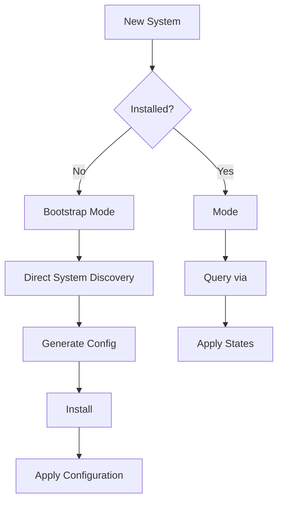

# Bootstrap Architecture for Eos

*Last Updated: 2025-01-14*

## Problem Statement

Eos is designed to orchestrate infrastructure through , but faces a chicken-and-egg problem:
- To configure  properly, we need to know about the system
- To query the system through ,  must already be installed and configured
- New machines don't have  installed

## Solution: Bootstrap Mode

### 1. Dual Execution Paths

All system discovery commands should support two execution modes:
- **Direct Mode**: Execute commands directly on the system (for bootstrap)
- ** Mode**: Execute commands through  (for managed systems)

### 2. Implementation Pattern


### 3. Bootstrap Workflow



### 4. System Discovery Tools

#### A. OSQuery Integration

OSQuery is ideal for bootstrap discovery because:
- SQL interface to system information
- No dependencies on configuration management
- Comprehensive system data collection
- Cross-platform support

Example queries:
```sql
-- Get disk information
SELECT * FROM block_devices;

-- Get network interfaces
SELECT * FROM interface_addresses;

-- Get system info
SELECT * FROM system_info;
```

#### B. Platform-Specific Tools

**Linux:**
- `lsblk` - Block devices
- `ip addr` - Network interfaces
- `dmidecode` - Hardware info
- `lscpu` - CPU information

**macOS:**
- `diskutil` - Disk management
- `system_profiler` - System information
- `networksetup` - Network configuration

### 5. Configuration Generation

Once system discovery is complete, generate:

1. ** Configuration**
   ```yaml
   # /etc//minion
   master: -master.example.com
   id: ${HOSTNAME}
   s:
     roles:
       - ${DETECTED_ROLE}
     datacenter: ${DETECTED_DC}
   ```

2. **Terraform Variables**
   ```hcl
   # terraform.tfvars
   hostname = "${HOSTNAME}"
   cpu_count = ${CPU_COUNT}
   memory_gb = ${MEMORY_GB}
   disk_devices = ${DISK_LIST}
   ```

### 6. Command Examples

```bash
# Bootstrap mode - direct execution
eos list disks --bootstrap
eos list network --bootstrap
eos read system-info --bootstrap

# Generate initial configuration
eos create bootstrap-config --output=/tmp/bootstrap

# Install  with generated config
eos create  --config=/tmp/bootstrap/-minion.conf

# After  installation, use  mode
eos list disks  # Now executes through 
```

### 7. Error Handling

The system should gracefully handle:
- Missing  installation
- Permission issues
- Platform differences
- Incomplete system information

### 8. Security Considerations

Bootstrap mode requires:
- Elevated privileges (sudo/root)
- Direct system access
- Careful validation of generated configurations
- Secure storage of credentials

## Implementation Checklist

- [x] Add bootstrap flag to discovery commands
- [x] Implement dual-mode execution in managers
- [ ] Create OSQuery integration package
- [ ] Add bootstrap config generator
- [ ] Create comprehensive system discovery module
- [ ] Add  installation validation
- [ ] Implement automatic mode detection
- [ ] Add security validations

## Future Enhancements

1. **Auto-Detection**: Automatically detect if  is available
2. **Progressive Enhancement**: Start with basic queries, add detail as tools become available
3. **Cloud Integration**: Detect cloud metadata (AWS, GCP, Azure)
4. **Container Detection**: Identify if running in container/VM
5. **Network Discovery**: Map network topology for multi-node setups