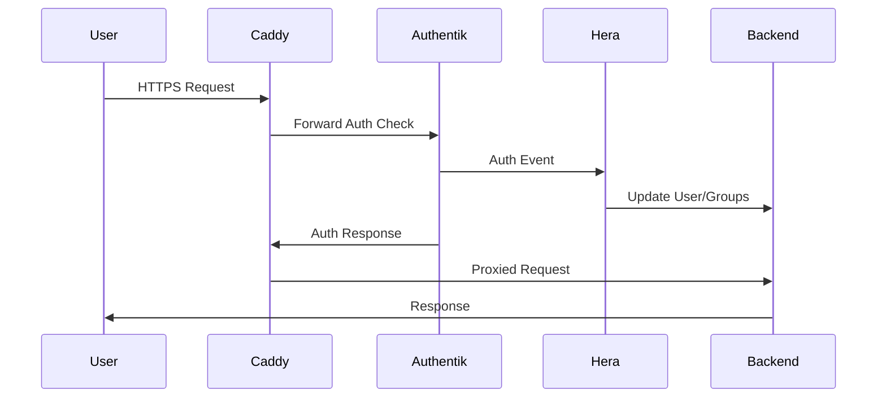

# Hecate Reverse Proxy Framework

*Last Updated: 2025-01-17*

## Table of Contents

1. [Overview](#overview)
2. [Architecture](#architecture)
3. [Component Implementation Details](#component-implementation-details)
4. [Installation & Setup](#installation--setup)
5. [Command Reference](#command-reference)
6. [Configuration Guide](#configuration-guide)
7. [Operations Guide](#operations-guide)
8. [Development & Extension](#development--extension)
9. [Troubleshooting](#troubleshooting)
10. [Security & Compliance](#security--compliance)
11. [Performance & Scaling](#performance--scaling)

## Overview

Hecate is a cloud-native, multi-tenant reverse proxy framework that provides:

- **Dynamic Route Management** - Create, update, and delete routes without downtime
- **Identity-Aware Proxy** - Deep integration with Authentik for SSO and policy-based access
- **Automated SSL/TLS** - Let's Encrypt integration with automatic certificate renewal
- **Multi-Protocol Support** - HTTP/HTTPS via Caddy, TCP/UDP streams via Nginx
- **State Management** - GitOps-friendly with automatic drift detection and reconciliation
- **Zero-Downtime Operations** - Rolling updates, canary deployments, and blue-green strategies
- **Secret Rotation** - Automated credential management with dual-secret strategy
- **Comprehensive Monitoring** - Built-in metrics, health checks, and distributed tracing

### Key Features

1. **Unified Management** - Single CLI interface for all reverse proxy operations
2. **Multi-Tenant Isolation** - Complete namespace and network separation
3. **Disaster Recovery** - Automated backups and cross-region failover
4. **Compliance Automation** - Policy enforcement for security headers, TLS versions
5. **Cost Management** - Resource tracking and optimization recommendations

## Architecture

### High-Level Architecture

```
┌─────────────────────────────────────────────────────────────────┐
│                         Load Balancer                            │
│                    (Hetzner LB / Cloudflare)                    │
└────────────────────┬───────────────────┬───────────────────────┘
                     │                   │
        ┌────────────▼────────┐ ┌───────▼────────┐
        │   Caddy Cluster     │ │  Nginx Stream  │
        │  (HTTP/HTTPS/H3)    │ │   (TCP/UDP)    │
        └────────────┬────────┘ └───────┬────────┘
                     │                   │
        ┌────────────▼───────────────────▼────────┐
        │            Authentik (SSO)              │
        │         Identity & Access Mgmt          │
        └─────────────────────────────────────────┘
                             │
        ┌────────────────────▼────────────────────┐
        │          Backend Services               │
        │    (Apps, APIs, Databases, etc.)        │
        └─────────────────────────────────────────┘

Control Plane:
┌─────────────┐ ┌─────────────┐ ┌─────────────┐ ┌─────────────┐
│   Eos CLI   │ │ Hecate API  │ │  Temporal   │ │   Consul    │
│  Framework  │ │   Service   │ │  Workflows  │ │State Store  │
└─────────────┘ └─────────────┘ └─────────────┘ └─────────────┘
       │                │                │               │
┌──────▼────────────────▼────────────────▼───────────────▼──────┐
│                        Message Bus (NATS)                      │
└────────────────────────────────────────────────────────────────┘
```

### Core Components

#### 1. **Caddy** (HTTP/HTTPS Reverse Proxy)
- Automatic HTTPS with Let's Encrypt
- HTTP/3 support
- Dynamic configuration via Admin API
- Forward authentication integration
- Built-in metrics and health checks

#### 2. **Nginx** (TCP/UDP Stream Proxy)
- Non-HTTP protocol support
- High-performance stream proxying
- Used for services like mail servers, databases
- Complementary to Caddy

#### 3. **Authentik** (Identity Provider)
- Single Sign-On (SSO)
- Multi-factor authentication
- Policy-based access control
- SAML, OAuth2, OpenID Connect support

#### 4. **Consul** (State Management)
- Distributed configuration storage
- Service discovery
- Health checking
- Distributed locking

#### 5. **Vault** (Secret Management)
- Certificate storage
- API key management
- Automatic secret rotation
- Encryption at rest

#### 6. **Temporal** (Workflow Orchestration)
- Complex operation coordination
- State reconciliation workflows
- Failure handling and retry logic
- Long-running processes

#### 7. **NATS/Benthos** (Event Processing)
- Real-time event streaming
- Webhook processing
- Metrics aggregation
- Alert generation

## Component Implementation Details

### Caddy Integration

**Location**: `/opt/eos/pkg/service_installation/caddy.go`

```go
// Main Caddy service installation and management
// Handles Caddy deployment, configuration, and lifecycle
```

**Hecate Integration**: `/opt/eos/pkg/hecate/phase2_caddy.go`
- Orchestrates Caddy deployment as part of Hecate setup
- Configures Caddy for dynamic route management
- Sets up Admin API access

**Type Definitions**: `/opt/eos/pkg/hecate/types_caddy.go`
```go
type CaddyRoute struct {
    Domain     string
    Upstreams  []Upstream
    AuthPolicy string
    Headers    map[string]string
    Middleware []string
}
```

** States**: `/opt/eos//states/hecate/caddy/`
- `init.sls` - Main Caddy installation
- `config.sls` - Configuration management
- `service.sls` - Service management

### Authentik Integration

**Auth Client**: 
- `/opt/eos/pkg/hecate/auth.go` - Basic auth operations
- `/opt/eos/pkg/hecate/auth_complete.go` - Full auth flow implementation

**Command Implementation**: `/opt/eos/cmd/create/hera.go`
```bash
# Creates Authentik instance
eos create hera --domain auth.example.com
```

** States**: `/opt/eos//states/hecate/authentik/`
- Database setup (PostgreSQL)
- Redis configuration
- Authentik deployment
- Provider configuration

### Nginx Stream Proxy

**Type Definitions**: `/opt/eos/pkg/hecate/types_nginx.go`
```go
type NginxStream struct {
    Listen     string
    Upstream   []string
    Protocol   string // tcp or udp
    ProxyPass  string
}
```

**Implementation**: `/opt/eos/pkg/hecate/phase3_nginx.go`
- Configures Nginx for TCP/UDP proxying
- Manages stream configurations

**Core Nginx Package**: 
- `/opt/eos/pkg/nginx/nginx.go` - Nginx service management
- `/opt/eos/pkg/nginx/config.go` - Configuration generation

**Predefined Streams**: `/opt/eos/pkg/shared/ports.go`
```go
// Example predefined stream configurations
var StreamConfigs = map[string]StreamConfig{
    "mailcow": {
        Ports: []int{25, 465, 587, 143, 993, 110, 995}, // SMTP, IMAP, POP3
    },
    "jenkins": {
        Ports: []int{50000}, // Agent connection port
    },
    "wazuh": {
        Ports: []int{1514, 1515}, // Manager ports
    },
}
```

### Hera Auth Plugin

**Package Location**: `/opt/eos/pkg/hera/`
- `keycloak_client.go` - Keycloak/Authentik client implementation
- `types.go` - Type definitions for auth events

**Purpose**: 
- Handles user registration events
- Manages group assignments between Authentik and other services
- Provides authentication event webhooks
- Synchronizes user data across systems

### Component Interaction Flow



## Installation & Setup

### Prerequisites

- Ubuntu 22.04/24.04
- Eos framework installed
- HashiCorp stack (Nomad, Consul, Vault)
- Docker or Podman
- PostgreSQL for Authentik
- Redis for caching

### Quick Start

```bash
# 1. Initialize Hecate infrastructure
eos create hecate --init

# 2. Deploy core components
eos create hecate deploy --components "caddy,authentik,nginx"

# 3. Create your first route
eos create hecate route --domain app.example.com --upstream localhost:3000

# 4. Set up authentication
eos create hecate auth-policy --name users --provider authentik --groups staff
```

### Detailed Installation

#### Step 1: Infrastructure Preparation

```bash
# Ensure  states are synchronized
-call state.apply hecate.prereqs

# Deploy database for Authentik
eos create postgres --name authentik-db --version 15
```

#### Step 2: Deploy Hecate Components

```bash
# Deploy using Terraform
cd /opt/eos/modules/hecate/terraform
terraform init
terraform plan -var-file=environments/production.tfvars
terraform apply

# Or deploy using Nomad jobs directly
nomad job run /opt/eos/modules/hecate/nomad/jobs/caddy-cluster.nomad
nomad job run /opt/eos/modules/hecate/nomad/jobs/authentik.nomad
```

#### Step 3: Configure Initial Settings

```bash
# Set up DNS provider
eos create hecate dns-provider --provider hetzner --api-token $HETZNER_TOKEN

# Configure default authentication
eos create hecate auth-provider --provider authentik --url https://auth.example.com
```

## Command Reference

### Route Management

#### Create Route
```bash
# Basic route
eos create hecate route --domain api.example.com --upstream backend:8080

# With authentication
eos create hecate route \
  --domain secure.example.com \
  --upstream backend:443 \
  --auth-policy employees \
  --require-mfa

# With health check
eos create hecate route \
  --domain app.example.com \
  --upstream backend:3000 \
  --health-check-path /health \
  --health-check-interval 30s

# With custom headers
eos create hecate route \
  --domain service.example.com \
  --upstream backend:8080 \
  --headers "X-Custom-Header=value" \
  --headers "X-Forwarded-Proto=https"
```

#### Update Route
```bash
# Change upstream
eos update hecate route api.example.com --upstream new-backend:8081

# Add middleware
eos update hecate route api.example.com --add-middleware rate-limit:100/min

# Update authentication
eos update hecate route api.example.com --auth-policy new-policy

# Canary deployment
eos update hecate route api.example.com \
  --canary-upstream new-version:8080 \
  --canary-percentage 10
```

#### Delete Route
```bash
# Basic deletion
eos delete hecate route api.example.com

# With cleanup
eos delete hecate route api.example.com --delete-dns --delete-certificate

# Force deletion
eos delete hecate route api.example.com --force
```

#### List Routes
```bash
# All routes
eos list hecate routes

# Filter by domain
eos list hecate routes --filter "domain=*.example.com"

# Show health status
eos list hecate routes --show-health
```

### Authentication Management

#### Create Auth Policy
```bash
# Basic policy
eos create hecate auth-policy \
  --name api-users \
  --provider authentik \
  --flow default-authentication

# With groups
eos create hecate auth-policy \
  --name admin-access \
  --provider authentik \
  --groups "admin,superuser" \
  --require-mfa

# With metadata requirements
eos create hecate auth-policy \
  --name partner-access \
  --provider authentik \
  --metadata "partner_id=required" \
  --metadata "contract_status=active"
```

#### Manage Auth Policies
```bash
# List policies
eos list hecate auth-policies

# Show policy details
eos read hecate auth-policy api-users

# Update policy
eos update hecate auth-policy api-users --add-group developers

# Delete policy
eos delete hecate auth-policy old-policy
```

### State Management

#### Reconciliation
```bash
# Reconcile all components
eos update hecate reconcile

# Dry run
eos update hecate reconcile --dry-run

# Specific component
eos update hecate reconcile --component routes

# From specific source
eos update hecate reconcile --from git --branch main
```

#### Backup & Restore
```bash
# Create backup
eos backup hecate --output /backups/hecate-$(date +%Y%m%d).tar.gz

# Restore from backup
eos restore hecate --from /backups/hecate-20240115.tar.gz

# Incremental backup
eos backup hecate --incremental --since "2024-01-01"
```

### Secret Management

#### Rotate Secrets
```bash
# Single secret rotation
eos update hecate rotate-secret authentik-api-token --strategy dual-secret

# Rotate all secrets
eos update hecate rotate-secrets --all --strategy dual-secret

# Emergency rotation
eos update hecate rotate-secret compromised-key --immediate
```

#### Secret Status
```bash
# Check rotation status
eos read hecate secret-status authentik-api-token

# List all secrets
eos list hecate secrets --show-age --show-rotation-status
```

### Stream Proxy Management (TCP/UDP)

#### Create Stream
```bash
# TCP stream
eos create hecate stream \
  --name postgres-proxy \
  --listen :5432 \
  --upstream db1.internal:5432,db2.internal:5432 \
  --protocol tcp

# UDP stream
eos create hecate stream \
  --name dns-proxy \
  --listen :53 \
  --upstream dns1.internal:53 \
  --protocol udp
```

#### Predefined Streams
```bash
# Enable mail server streams
eos create hecate stream --preset mailcow --upstream mail.internal

# Enable Jenkins agent streams
eos create hecate stream --preset jenkins --upstream jenkins.internal
```

### Monitoring & Health

#### Health Checks
```bash
# Overall health
eos read hecate health

# Specific route health
eos read hecate health --route app.example.com

# Continuous monitoring
eos read hecate monitor --interval 30s --alert-on-failure
```

#### Metrics
```bash
# Current metrics
eos read hecate metrics

# Historical metrics
eos read hecate metrics --from "2024-01-01" --to "2024-01-31"

# Export for Prometheus
eos read hecate metrics --format prometheus > metrics.txt
```

### Progressive Deployments

#### Canary Deployments
```bash
# Start canary (10% traffic)
eos update hecate route app.example.com \
  --canary-upstream new-backend:3001 \
  --canary-percentage 10

# Increase traffic
eos update hecate route app.example.com --canary-percentage 50

# Complete rollout
eos update hecate route app.example.com --promote-canary

# Rollback
eos update hecate route app.example.com --rollback-canary
```

#### Blue-Green Deployments
```bash
# Create green environment
eos create hecate route app-green.example.com --upstream green-backend:3000

# Test green environment
eos test hecate route app-green.example.com

# Switch traffic
eos update hecate route app.example.com --switch-to app-green.example.com
```

## Configuration Guide

### Route Configuration (YAML)

```yaml
# /etc/hecate/routes/app.yaml
apiVersion: hecate.io/v1
kind: Route
metadata:
  name: app-route
  labels:
    environment: production
    team: platform
spec:
  domain: app.example.com
  upstreams:
    - dial: backend-1:3000
      weight: 50
    - dial: backend-2:3000
      weight: 50
  authPolicy: standard-users
  tls:
    autoHTTPS: true
    forceHTTPS: true
    minVersion: "1.2"
  healthCheck:
    path: /health
    interval: 30s
    timeout: 5s
    unhealthyThreshold: 3
  headers:
    set:
      X-Frame-Options: DENY
      X-Content-Type-Options: nosniff
    remove:
      - Server
  middleware:
    - rate-limit:100/minute
    - compression
    - request-id
```

### Authentication Policy Configuration

```yaml
# /etc/hecate/policies/secure-access.yaml
apiVersion: hecate.io/v1
kind: AuthPolicy
metadata:
  name: secure-access
spec:
  provider: authentik
  flow: default-authentication-flow
  requirements:
    groups:
      - employees
      - contractors
    mfa: required
    sessionDuration: 4h
  metadata:
    required:
      - employee_id
      - department
  allowedMethods:
    - password
    - webauthn
    - totp
```

### Stream Proxy Configuration

```yaml
# /etc/hecate/streams/database.yaml
apiVersion: hecate.io/v1
kind: Stream
metadata:
  name: postgres-cluster
spec:
  protocol: tcp
  listen:
    address: 0.0.0.0
    port: 5432
  upstreams:
    - server: db-primary.internal:5432
      weight: 100
      maxFails: 3
      failTimeout: 30s
    - server: db-replica.internal:5432
      weight: 50
      backup: true
  healthCheck:
    interval: 10s
    timeout: 5s
    type: tcp
```

### Global Configuration

```yaml
# /etc/hecate/config.yaml
global:
  # DNS Provider
  dns:
    provider: hetzner
    apiToken: ${HETZNER_API_TOKEN}
    defaultTTL: 300
    
  # Certificate Management
  certificates:
    provider: letsencrypt
    email: admin@example.com
    storage: vault
    renewalWindow: 30d
    
  # Default Health Checks
  healthChecks:
    default:
      path: /health
      interval: 30s
      timeout: 5s
      
  # Monitoring
  monitoring:
    prometheus:
      enabled: true
      port: 9090
    tracing:
      enabled: true
      endpoint: jaeger:4317
      
  # Security Defaults
  security:
    tlsMinVersion: "1.2"
    headers:
      X-Frame-Options: DENY
      X-Content-Type-Options: nosniff
      Strict-Transport-Security: "max-age=31536000; includeSubDomains"
```

## Operations Guide

### Day 2 Operations

#### Daily Tasks
```bash
# Check system health
eos read hecate health --verbose

# Review error logs
eos logs hecate --level error --since 24h

# Check certificate expiration
eos list hecate certificates --expiring-within 30d
```

#### Weekly Tasks
```bash
# Run state reconciliation
eos update hecate reconcile --component all

# Review metrics and trends
eos read hecate report --period week

# Rotate non-critical secrets
eos update hecate rotate-secrets --type api-keys
```

#### Monthly Tasks
```bash
# Full backup
eos backup hecate --full --compress

# Security audit
eos audit hecate security --report pdf

# Performance review
eos analyze hecate performance --period month
```

### Disaster Recovery

#### Backup Procedures
```bash
# Automated daily backups
cat > /etc/cron.d/hecate-backup << EOF
0 2 * * * root /usr/local/bin/eos backup hecate --output s3://backups/hecate/
EOF

# Manual backup before changes
eos backup hecate --tag pre-upgrade-$(date +%Y%m%d)
```

#### Recovery Procedures
```bash
# Full recovery
eos restore hecate --from s3://backups/hecate/latest --validate

# Partial recovery
eos restore hecate --from backup.tar.gz --components "routes,policies"

# Point-in-time recovery
eos restore hecate --timestamp "2024-01-15T10:00:00Z"
```

#### Failover Procedures
```bash
# Manual failover
eos failover hecate --from us-east --to us-west

# Test failover
eos test hecate failover --dry-run

# Automatic failover (configured)
eos configure hecate failover --auto --threshold 3-failures
```

### Performance Tuning

#### Optimization Commands
```bash
# Analyze performance
eos analyze hecate performance --component caddy

# Apply optimizations
eos optimize hecate --recommendations apply

# Tune specific settings
eos configure hecate performance \
  --max-connections 10000 \
  --buffer-size 64kb \
  --timeout-idle 120s
```

### Debugging

#### Troubleshooting Commands
```bash
# Debug specific route
eos debug hecate route app.example.com --trace

# Test authentication flow
eos test hecate auth --user test@example.com --policy secure-access

# Validate configuration
eos validate hecate config --strict

# Check connectivity
eos test hecate connectivity --from caddy --to authentik
```

#### Common Issues

**Route Not Working**
```bash
# Check route status
eos read hecate route app.example.com --details

# Verify DNS
eos test hecate dns app.example.com

# Check upstream health
eos test hecate upstream backend:3000

# Review recent changes
eos history hecate route app.example.com
```

**Authentication Failures**
```bash
# Test auth provider
eos test hecate auth-provider authentik

# Check policy
eos validate hecate auth-policy secure-access

# Review auth logs
eos logs hecate auth --filter "user=john@example.com"
```

## Development & Extension

### Custom Middleware

```go
// /opt/eos/pkg/hecate/middleware/custom.go
package middleware

import (
    "net/http"
    "github.com/caddyserver/caddy/v2"
)

type CustomMiddleware struct {
    // Configuration fields
}

func (m *CustomMiddleware) ServeHTTP(w http.ResponseWriter, r *http.Request, next caddyhttp.Handler) error {
    // Middleware logic
    return next.ServeHTTP(w, r)
}
```

### Workflow Extensions

```go
// /opt/eos/temporal/workflows/custom_workflow.go
package workflows

import (
    "go.temporal.io/sdk/workflow"
)

func CustomDeploymentWorkflow(ctx workflow.Context, req CustomRequest) error {
    // Workflow implementation
    return nil
}
```

### API Extensions

```go
// /opt/eos/api/handlers/custom.go
package handlers

func (h *Handler) CustomEndpoint(w http.ResponseWriter, r *http.Request) {
    // API endpoint implementation
}
```

## Security & Compliance

### Security Best Practices

1. **Always use TLS 1.2+** for all routes
2. **Implement authentication** on all public-facing services
3. **Enable MFA** for administrative access
4. **Rotate secrets regularly** (monthly minimum)
5. **Use least-privilege** access policies
6. **Enable audit logging** for all changes
7. **Implement rate limiting** on APIs
8. **Use private networks** for backend communication
9. **Enable security headers** on all routes
10. **Regular security scans** and penetration testing

### Compliance Features

#### Security Headers
```bash
# Apply OWASP recommended headers
eos update hecate route app.example.com --security-headers owasp

# Custom security headers
eos update hecate route app.example.com \
  --header "Content-Security-Policy=default-src 'self'" \
  --header "Permissions-Policy=geolocation=()"
```

#### Audit Logging
```bash
# Enable comprehensive audit logging
eos configure hecate audit --level detailed --retain 90d

# Export audit logs
eos export hecate audit-logs --from "2024-01-01" --format json
```

#### Compliance Reports
```bash
# Generate compliance report
eos report hecate compliance --standard pci-dss

# Schedule regular reports
eos schedule hecate report --type compliance --frequency monthly
```

## Performance & Scaling

### Performance Baselines

```bash
# Establish baselines
eos baseline hecate performance --duration 7d

# Compare current performance
eos compare hecate performance --against baseline
```

### Scaling Operations

#### Horizontal Scaling
```bash
# Scale Caddy instances
eos scale hecate caddy --replicas 5

# Scale by metrics
eos autoscale hecate caddy \
  --min 3 \
  --max 10 \
  --metric cpu:70 \
  --metric requests:1000/s
```

#### Vertical Scaling
```bash
# Resize instances
eos resize hecate caddy --cpu 4 --memory 8G
```

### Performance Monitoring

```bash
# Real-time metrics
eos monitor hecate performance --real-time

# Generate performance report
eos report hecate performance --period month --format pdf
```

## Appendix

### Environment Variables

```bash
# Core Configuration
HECATE_API_ENDPOINT=https://api.hecate.local
HECATE_API_TOKEN=your-api-token

# Provider Tokens
HETZNER_API_TOKEN=your-hetzner-token
AUTHENTIK_TOKEN=your-authentik-token

# Storage Backends
CONSUL_HTTP_ADDR=consul.service.consul:8500
VAULT_ADDR=https://vault.service.consul:8200

# Monitoring
PROMETHEUS_ENDPOINT=http://prometheus:9090
JAEGER_ENDPOINT=http://jaeger:4317
```

### File Locations

```
/opt/eos/
├── cmd/
│   ├── create/
│   │   ├── hecate.go          # Main creation commands
│   │   └── hera.go            # Authentik creation
│   ├── read/
│   │   └── hecate*.go         # Read operations
│   ├── update/
│   │   └── hecate*.go         # Update operations
│   └── delete/
│       └── hecate*.go         # Delete operations
├── pkg/
│   ├── hecate/
│   │   ├── lifecycle_*.go     # Lifecycle management
│   │   ├── types_*.go         # Type definitions
│   │   ├── auth*.go           # Authentication
│   │   └── phase*.go          # Deployment phases
│   ├── nginx/                 # Nginx management
│   ├── caddy/                 # Caddy utilities
│   └── hera/                  # Auth plugin
├── /
│   └── states/
│       └── hecate/            #  states
├── terraform/
│   └── modules/
│       └── hecate/            # Terraform modules
└── nomad/
    └── jobs/
        └── hecate/            # Nomad job definitions
```

### Quick Reference Card

```bash
# Most Common Commands
eos create hecate route --domain <domain> --upstream <backend>
eos update hecate reconcile
eos read hecate health
eos backup hecate
eos restore hecate --from <backup>

# Emergency Commands
eos emergency hecate bypass-auth --duration 1h
eos emergency hecate failover --to <region>
eos emergency hecate rollback --to <timestamp>

# Useful Aliases
alias ehc='eos create hecate'
alias ehr='eos read hecate'
alias ehu='eos update hecate'
alias ehd='eos delete hecate'
```

---

This documentation serves as the comprehensive reference for the Hecate Reverse Proxy Framework. For the latest updates and community support, visit the [Eos project repository](https://github.com/openenterprise-io/eos).

## Do I really need Temporal and NATS/Benthos as a message/comms bus? 

You can simplify the architecture by using direct API calls from eos commands. Let me break down the trade-offs:

## Simplified Architecture (API-only approach)

### What You Can Do Without Temporal/NATS:

**Simple Operations** ✅
```bash
# Direct API calls work great for:
- Creating/updating/deleting routes
- Managing auth policies  
- Health checks
- Certificate management
- Most day-to-day operations
```

**Example Implementation**:
```go
// In eos command
func CreateRoute(domain, upstream string) error {
    // Direct API calls to Caddy Admin API
    caddyConfig := buildRouteConfig(domain, upstream)
    err := callCaddyAPI("POST", "/config/apps/http/servers/srv0/routes", caddyConfig)
    
    // Store in Consul
    if err == nil {
        consulClient.KV().Put(fmt.Sprintf("hecate/routes/%s", domain), routeData)
    }
    return err
}
```

### Where You Might Miss Temporal/NATS:

1. **Complex Multi-Step Operations**
   - Without Temporal: You'd need to handle this in your eos commands
   ```go
   func CreateRouteWithDNS(domain, upstream string) error {
       // Step 1: Create DNS
       if err := createDNSRecord(domain); err != nil {
           return err
       }
       
       // Step 2: Wait for propagation (blocking)
       if err := waitForDNS(domain, 300); err != nil {
           deleteDNSRecord(domain) // manual rollback
           return err
       }
       
       // Step 3: Create route
       if err := createRoute(domain, upstream); err != nil {
           deleteDNSRecord(domain) // manual rollback
           return err
       }
   }
   ```

2. **State Reconciliation**
   - Would need to implement comparison logic in eos
   - No automatic retries on partial failures

3. **Secret Rotation with Zero Downtime**
   - Dual-secret strategy would need careful synchronous coordination
   - No built-in rollback if something fails mid-rotation

## Recommended Simplified Approach

### Phase 1: Start Simple (No Temporal/NATS)

```yaml
# Simplified architecture
Components:
  - Caddy (with Admin API)
  - Authentik
  - Consul (for state storage)
  - Vault (for secrets)
  - Hecate API service (thin wrapper)
```

### Core API Service
```go
// Minimal API service that wraps operations
type HecateAPI struct {
    caddy    *CaddyClient
    consul   *ConsulClient
    vault    *VaultClient
    authentik *AuthentikClient
}

// Synchronous operations with built-in retry
func (h *HecateAPI) CreateRoute(ctx context.Context, req RouteRequest) error {
    // Transaction-like behavior using defer
    created := []string{}
    defer func() {
        if err != nil {
            h.rollback(created)
        }
    }()
    
    // Operations with retry logic
    err := retry.Do(func() error {
        return h.caddy.CreateRoute(req)
    }, retry.Attempts(3))
    
    return err
}
```

### Eos Command Implementation
```bash
# Simple wrapper around API calls
eos create hecate route --domain app.example.com --upstream backend:3000

# Which just calls:
curl -X POST https://hecate-api/routes \
  -d '{"domain": "app.example.com", "upstream": "backend:3000"}'
```

### When to Add Temporal/NATS

Add them when you need:

1. **Long-running operations** (>5 minutes)
2. **Complex workflows** with many dependent steps
3. **Async processing** of webhooks/events
4. **Distributed transactions** across multiple services
5. **Scheduled/recurring tasks**
6. **Advanced retry strategies** with exponential backoff
7. **Audit trail** of all state changes

## Migration Path

Start simple and add complexity as needed:

```bash
# Phase 1: Direct API calls
eos create hecate route --domain app.example.com --upstream backend:3000
# → Direct Caddy API call

# Phase 2: Add async for long operations (if needed)
eos create hecate route --domain app.example.com --upstream backend:3000 --wait-dns
# → Returns job ID, check status separately

# Phase 3: Full workflow orchestration (if needed)
eos create hecate deployment --complex-multi-step-operation
# → Temporal workflow with full state management
```

## Simplified Implementation Example

Here's how your core operations would work without Temporal/NATS:

```go
// pkg/hecate/simple_client.go
package hecate

type SimpleClient struct {
    caddy     *CaddyAdminClient
    consul    *api.Client
    vault     *vault.Client
    authentik *AuthentikClient
}

func (c *SimpleClient) CreateRoute(domain, upstream string, opts ...RouteOption) error {
    // Build configuration
    route := buildRoute(domain, upstream, opts...)
    
    // Apply to Caddy (with retry)
    err := c.applyCaddyConfig(route)
    if err != nil {
        return fmt.Errorf("failed to apply route: %w", err)
    }
    
    // Save to Consul for persistence
    err = c.saveRouteConfig(domain, route)
    if err != nil {
        // Rollback Caddy change
        c.removeCaddyRoute(domain)
        return fmt.Errorf("failed to save config: %w", err)
    }
    
    // Verify it's working
    if err := c.verifyRoute(domain); err != nil {
        return fmt.Errorf("route verification failed: %w", err)
    }
    
    return nil
}

func (c *SimpleClient) ReconcileState() error {
    // Get desired state from Consul
    desired, err := c.getDesiredState()
    if err != nil {
        return err
    }
    
    // Get current state from Caddy
    current, err := c.getCurrentState()
    if err != nil {
        return err
    }
    
    // Apply differences
    for _, diff := range calculateDiff(desired, current) {
        if err := c.applyDiff(diff); err != nil {
            return err // Could implement partial rollback
        }
    }
    
    return nil
}
```

## Bottom Line

**You don't need Temporal/NATS to start**. You can build a fully functional Hecate with just:
- Caddy + Admin API
- Authentik
- Consul (state storage)
- Vault (secrets)
- A thin API wrapper
- Eos CLI commands

This gives you:
- ✅ Route management
- ✅ Authentication
- ✅ State persistence
- ✅ Secret management
- ✅ Health checks
- ✅ Most operations you need

Add Temporal/NATS later if you need:
- ❓ Complex multi-region deployments
- ❓ Zero-downtime secret rotation workflows
- ❓ Async webhook processing
- ❓ Complex rollback scenarios
- ❓ Scheduled recurring tasks

The simpler approach will be easier to debug, deploy, and maintain for most use cases!